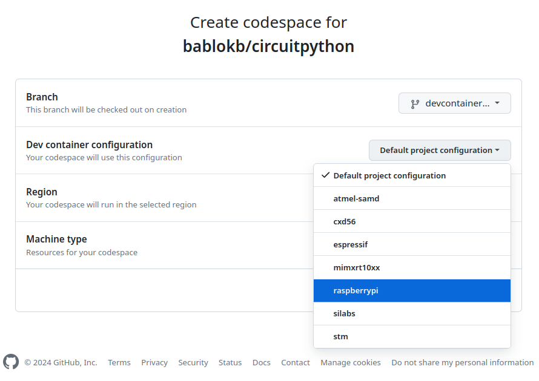

Build CircuitPython in a Github-Codespace
=========================================

To build CircuitPython within a Github codespace, you need to perform
the following steps.

  1. checkout the code to a codespace

  - click on the green "<> Code"-button
  - select the Codespaces-tab
  - choose "+ new with options..." from the "..."-menu
  - in the following screen select the branch and then
  - select the port instead of "Default project configuration"
    (unsupported: ports not using cortex-m or esp-idf)\
    
  - update region as necessary
  - finally, click on the green "Create codespace" button

  2. Your codespace is created. Cloning the image and the repo is quite fast,
     but preparing it for CircuitPython-development takes about 10 minutes.
     But this is a one-time task: once created, your codespace exists
     until you explicitly delete it or until it times out (default: 30 days).\
     (Technical note: due to a bug in codespace creation, the setup is
     triggered from `$HOME/.bashrc` and runs in the background).

  3. During creation, you can run the command
     `tail -f /workspaces/install_build_env.log.active`
     to see what is going on. Once finished the log file is available
     as `/workspaces/install_build_env.log`.

  4. To actually build CircuitPython, open a new terminal and run e.g.

         cd ports/raspberrypi
         make -j $(nproc) BOARD=whatever TRANSLATION=xx_XX

     This takes about 2m40s. The new terminal is necessary since the
     setup of the build environment also changes `$HOME/.bashrc` and
     sets important environment variables in that file.

As a normal user, you have 120 CPU-hours and 15GB per month free. Since
the smallest machine has two CPUs, you effectively have 60 hours active
time available.

All scripts are in `circuitpython/.devcontainer` and can also be executed
manually which should usually not be necessary. With small changes, they
should also work on a Linux-PC or laptop.
