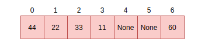
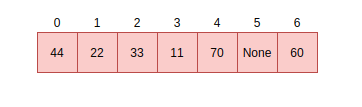

.. _maps:

Maps and Dictionaries
=====================

MicroPython dictionaries and maps use techniques called open addressing and linear probing.
This chapter details both of these methods.

Open addressing
---------------

`Open addressing <https://en.wikipedia.org/wiki/Open_addressing>`_ is used to resolve collisions.
Collisions are very common occurrences and happen when two items happen to hash to the same
slot or location. For example, given a hash setup as this:

If there is a request to fill slot ``0`` with ``70``, since the slot ``0`` is not empty, open addressing
finds the next available slot in the dictionary to service this request. This sequential search for an alternate
location is called *probing*. There are several sequence probing algorithms but MicroPython uses
linear probing that is described in the next section.

Linear probing
--------------

Linear probing is one of the methods for finding an available address or slot in a dictionary. In MicroPython,
it is used with open addressing. To service the request described above, unlike other probing algorithms,
linear probing assumes a fixed interval of ``1`` between probes. The request will therefore be serviced by
placing the item in the next free slot which is slot ``4`` in our example:

The same methods i.e open addressing and linear probing are used to search for an item in a dictionary.
Assume we want to search for the data item ``33``. The computed hash value will be 2. Looking at slot 2
reveals ``33``, at this point, we return ``True``. Searching for ``70`` is quite different as there was a
collision at the time of insertion. Therefore computing the hash value is ``0`` which is currently
holding ``44``. Instead of simply returning ``False``, we perform a sequential search starting at point
``1`` until the item ``70`` is found or we encounter a free slot. This is the general way of performing
look-ups in hashes:

.. code-block:: c

   // not yet found, keep searching in this table
   pos = (pos + 1) % set->alloc;

   if (pos == start_pos) {
       // search got back to starting position, so index is not in table
       if (lookup_kind & MP_MAP_LOOKUP_ADD_IF_NOT_FOUND) {
           if (avail_slot != NULL) {
               // there was an available slot, so use that
               set->used++;
               *avail_slot = index;
               return index;
           } else {
               // not enough room in table, rehash it
               mp_set_rehash(set);
               // restart the search for the new element
               start_pos = pos = hash % set->alloc;
           }
       }
   } else {
        return MP_OBJ_NULL;
   }
