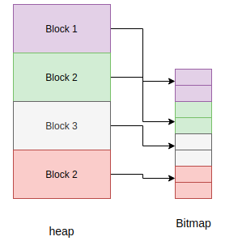

.. _memorymanagement:

Memory Management
=================

Unlike programming languages such as C/C++, MicroPython hides memory management
details from the developer by supporting automatic memory management.
Automatic memory management is a technique used by operating systems or applications to automatically manage
the allocation and deallocation of memory. This eliminates challenges such as forgetting to
free the memory allocated to an object. Automatic memory management also avoids the critical issue of using memory
that is already released. Automatic memory management takes many forms, one of them being
garbage collection (GC).

The garbage collector usually has two responsibilities;

#. Allocate new objects in available memory.
#. Free unused memory.

There are many GC algorithms but MicroPython uses the
`Mark and Sweep <https://en.wikipedia.org/wiki/Tracing_garbage_collection#Basic_algorithm>`_
policy for managing memory. This algorithm has a mark phase that traverses the heap marking all
live objects while the sweep phase goes through the heap reclaiming all unmarked objects.

Garbage collection functionality in MicroPython is available through the ``gc`` built-in
module:

.. code-block:: bash

   >>> x = 5
   >>> x
   5
   >>> import gc
   >>> gc.enable()
   >>> gc.mem_alloc()
   1312
   >>> gc.mem_free()
   2071392
   >>> gc.collect()
   19
   >>> gc.disable()
   >>>

Even when ``gc.disable()`` is invoked, collection can be triggered with ``gc.collect()``.

The object model
----------------

All MicroPython objects are referred to by the ``mp_obj_t`` data type.
This is usually word-sized (i.e. the same size as a pointer on the target architecture),
and can be typically 32-bit (STM32, nRF, ESP32, Unix x86) or 64-bit (Unix x64).
It can also be greater than a word-size for certain object representations, for
example ``OBJ_REPR_D`` has a 64-bit sized ``mp_obj_t`` on a 32-bit architecture.

An ``mp_obj_t`` represents a MicroPython object, for example an integer, float, type, dict or
class instance. Some objects, like booleans and small integers, have their value stored directly
in the ``mp_obj_t`` value and do not require additional memory. Other objects have their value
store elsewhere in memory (for example on the garbage-collected heap) and their ``mp_obj_t`` contains
a pointer to that memory. A portion of ``mp_obj_t`` is the tag which tells what type of object it is.

See ``py/mpconfig.h`` for the specific details of the available representations.

**Pointer tagging**

Because pointers are word-aligned, when they are stored in an ``mp_obj_t`` the
lower bits of this object handle will be zero.  For example on a 32-bit architecture
the lower 2 bits will be zero:

``********|********|********|******00``

These bits are reserved for purposes of storing a tag. The tag stores extra information as
opposed to introducing a new field to store that information in the object, which may be
inefficient.  In MicroPython the tag tells if we are dealing with a small integer, interned
(small) string or a concrete object, and different semantics apply to each of these.

For small integers the mapping is this:

``********|********|********|*******1``

Where the asterisks hold the actual integer value.  For an interned string or an immediate
object (e.g. ``True``) the layout of the ``mp_obj_t`` value is, respectively:

``********|********|********|*****010``

``********|********|********|*****110``

While a concrete object that is none of the above takes the form:

``********|********|********|******00``

The stars here correspond to the address of the concrete object in memory.

Allocation of objects
----------------------

The value of a small integer is stored directly in the ``mp_obj_t`` and will be
allocated in-place, not on the heap or elsewhere.  As such, creation of small
integers does not affect the heap.  Similarly for interned strings that already have
their textual data stored elsewhere, and immediate values like ``None``, ``False``
and ``True``.

Everything else which is a concrete object is allocated on the heap and its object structure is such that
a field is reserved in the object header to store the type of the object.

.. code-block:: bash

    +++++++++++
    +         +
    + type    + object header
    +         +
    +++++++++++
    +         + object items
    +         +
    +         +
    +++++++++++

The heap's smallest unit of allocation is a block, which is four machine words in
size (16 bytes on a 32-bit machine, 32 bytes on a 64-bit machine).
Another structure also allocated on the heap tracks the allocation of
objects in each block. This structure is called a *bitmap*.

The bitmap tracks whether a block is "free" or "in use" and use two bits to track this state
for each block.

The mark-sweep garbage collector manages the objects allocated on the heap, and also
utilises the bitmap to mark objects that are still in use.
See `py/gc.c <https://github.com/micropython/micropython/blob/master/py/gc.c>`_
for the full implementation of these details.

**Allocation: heap layout**

The heap is arranged such that it consists of blocks in pools. A block
can have different properties:

- *ATB(allocation table byte):* If set, then the block is a normal block
- *FREE:* Free block
- *HEAD:* Head of a chain of blocks
- *TAIL:* In the tail of a chain of blocks
- *MARK :* Marked head block
- *FTB(finaliser table byte):* If set, then the block has a finaliser
