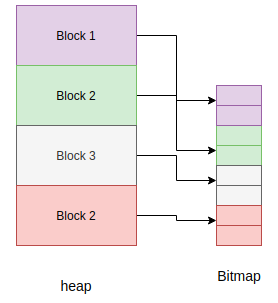

.. _memorymanagement:

Memory Management
=================

Unlike programming languages such as C/C++, MicroPython hides memory management
details from the developer by supporting automatic memory management of a
":ref:`Python heap<heap>`" that holds all Python objects. MicroPython uses
garbage collection (GC) for automatic memory management. The garbage collector
is responsible for freeing memory which is no longer in use.

Specifically, MicroPython uses a `Mark and Sweep
<https://en.wikipedia.org/wiki/Tracing_garbage_collection#Basic_algorithm>`_
garbage collection algorithm. This algorithm has a mark phase that scans the
heap marking all live objects, and then a sweep phase goes through the heap
reclaiming all unmarked objects.

The MicroPython garbage collector is by default automatic, but manual control is
available through the :mod:`gc` built-in module.

.. _python_memory_from_c:

MicroPython Memory from C code
------------------------------

Awareness of the garbage collector is needed when writing C code that allocates
memory from the "Python heap" (i.e. functions ``m_malloc()``, ``m_malloc0()``,
``m_free()``, etc).

The mark phase of the garbage collector scans for live pointers to heap memory
starting from the following roots:

- The stack of the main Python runtime (or REPL).
- The stacks of each "Python thread", for ports which implement Python threads
  on top of native operating system threads or tasks.
- The "root pointers" defined in C code using the macro
  ``MP_REGISTER_ROOT_POINTER``. These are the recommended way to have statically
  scoped pointers to the Python heap.
- Tracked allocations made with the ``m_tracked_calloc()``, ``m_tracked_realloc``
  and ``m_tracked_free()`` functions. These special functions allow allocating a
  block of memory which is always considered live by the garbage collector.
  Similar to memory allocation in C, this memory is only freed by calling
  ``m_tracked_free()`` or by soft reset. There is a small memory usage and
  runtime overhead to each tracked allocation. This feature is not enabled by
  default on all ports.

The garbage collector then recursively scans and marks all the memory pointed to
by the root pointers, until all addresses are exhausted. This is sufficient to
find all Python objects that are still in use by the MicroPython runtime.

However, the following memory will **not** be scanned by the garbage collector
and could be freed prematurely:

- Static or global C variables which contain pointers to heap memory.
- Pointers which don't point to the "head" of an allocated buffer (i.e. to the
  exact address returned by ``m_malloc()``), but instead to an address inside
  the allocated buffer (for example, a pointer to a nested struct). For
  performance reasons, the garbage collector doesn't mark the enclosing buffer
  in these cases.
- The stack of any thread or RTOS task which isn't running Python code or
  manually registered as a "Python thread" (for ports which support native
  threads or tasks).

Ways to avoid use-after-free in these scenarios:

- Use the tracked allocation API ``m_tracked_calloc()``, ``m_tracked_realloc()``
  and ``m_tracked_free()``.
- Register a root pointer (see above), instead of storing a pointer in a static
  variable.
- Restructure the code, for example by having an API where Python code
  initialises a singleton Python object (implemented in C) which holds all of the
  relevant pointers instead of having them in static variables.

.. note:: :ref:`soft_reset` always clears the Python heap and frees all memory.
          It's important not to hold any pointers to the heap after a soft
          reset, as they will become dangling pointers to freed memory.

          Some ports support a "C heap" as well (see `c_heap`), in which case
          you can allocate memory that will stay valid over soft reset by
          calling standard C functions ``malloc``, etc.

The object model
----------------

All MicroPython objects are referred to by the ``mp_obj_t`` data type.
This is usually word-sized (i.e. the same size as a pointer on the target architecture),
and can be typically 32-bit (STM32, nRF, ESP32, Unix x86) or 64-bit (Unix x64).
It can also be greater than a word-size for certain object representations, for
example ``OBJ_REPR_D`` has a 64-bit sized ``mp_obj_t`` on a 32-bit architecture.

An ``mp_obj_t`` represents a MicroPython object, for example an integer, float, type, dict or
class instance. Some objects, like booleans and small integers, have their value stored directly
in the ``mp_obj_t`` value and do not require additional memory. Other objects have their value
store elsewhere in memory (for example on the garbage-collected heap) and their ``mp_obj_t`` contains
a pointer to that memory. A portion of ``mp_obj_t`` is the tag which tells what type of object it is.

See ``py/mpconfig.h`` for the specific details of the available representations.

**Pointer tagging**

Because pointers are word-aligned, when they are stored in an ``mp_obj_t`` the
lower bits of this object handle will be zero.  For example on a 32-bit architecture
the lower 2 bits will be zero:

``********|********|********|******00``

These bits are reserved for purposes of storing a tag. The tag stores extra information as
opposed to introducing a new field to store that information in the object, which may be
inefficient.  In MicroPython the tag tells if we are dealing with a small integer, interned
(small) string or a concrete object, and different semantics apply to each of these.

For small integers the mapping is this:

``********|********|********|*******1``

Where the asterisks hold the actual integer value.  For an interned string or an immediate
object (e.g. ``True``) the layout of the ``mp_obj_t`` value is, respectively:

``********|********|********|*****010``

``********|********|********|*****110``

While a concrete object that is none of the above takes the form:

``********|********|********|******00``

The stars here correspond to the address of the concrete object in memory.

Allocation of objects
----------------------

The value of a small integer is stored directly in the ``mp_obj_t`` and will be
allocated in-place, not on the heap or elsewhere.  As such, creation of small
integers does not affect the heap.  Similarly for interned strings that already have
their textual data stored elsewhere, and immediate values like ``None``, ``False``
and ``True``.

Everything else which is a concrete object is allocated on the heap and its object structure is such that
a field is reserved in the object header to store the type of the object.

.. code-block:: bash

    +++++++++++
    +         +
    + type    + object header
    +         +
    +++++++++++
    +         + object items
    +         +
    +         +
    +++++++++++

The heap's smallest unit of allocation is a block, which is four machine words in
size (16 bytes on a 32-bit machine, 32 bytes on a 64-bit machine).
Another structure also allocated on the heap tracks the allocation of
objects in each block. This structure is called a *bitmap*.

The bitmap tracks whether a block is "free" or "in use" and use two bits to track this state
for each block.

The mark-sweep garbage collector manages the objects allocated on the heap, and also
utilises the bitmap to mark objects that are still in use.
See `py/gc.c <https://github.com/micropython/micropython/blob/master/py/gc.c>`_
for the full implementation of these details.

**Allocation: heap layout**

The heap is arranged such that it consists of blocks in pools. A block
can have different properties:

- *ATB(allocation table byte):* If set, then the block is a normal block
- *FREE:* Free block
- *HEAD:* Head of a chain of blocks
- *TAIL:* In the tail of a chain of blocks
- *MARK :* Marked head block
- *FTB(finaliser table byte):* If set, then the block has a finaliser
