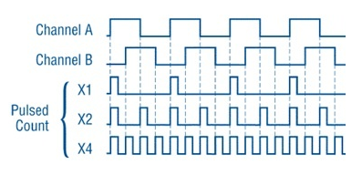

The Counter and Encoder uses the ESP32 Pulse Counter (PCNT) hardware peripheral,
see Espressif's `ESP-IDF Pulse Counter documentation.
<https://docs.espressif.com/projects/esp-idf/en/latest/esp32/api-reference/peripherals/pcnt.html>`_

For the counter not to miss any pulses, the pulse duration should be longer than one ESP32 APB_CLK cycle (1 / 80 MHz = 12.5 ns).
The pulses are sampled on the edges of the APB_CLK clock and may be missed, if fall between the edges.
With ideal input signal maximum frequency of measured pulses is APB_CLK / 2 = 80 MHz / 2 = 40 MHz.

The inputs have optional filters that can be used to discard unwanted glitches in the signal.
The length of ignored pulses is provided in APB_CLK clock cycles.
* Note: Filter value is a 10-bit value, so the maximum filter value should be limited to 1023.
Maximum filtered glitches delay is 1023 * 12.5 ns = 12.7875 us.
Big filter make cutbacks the input frequency: 1 / (12.7875 us * 2) = 39.1 kHz.
* Note: Do not neglect circuitry methods to reduce noise (right powering and grounding, filtering, shielding,
short conductors, twisted pair cable, differential signals, etc.).

There is only one interrupt for the peripheral, and that is managed inside the module.
The user has no interrupt interface, and no interrupts are generated on each pulse.
Interrupts arrive when the 16 bit hardware counter buffer overflows, so this module has a tiny interrupt footprint
while providing support for up to 8 simultaneous counters.

.. _pcnt.Counter:

Counter
=======

The Pulse Counter service.

Constructor
-----------

.. class:: Counter(pulse_pin, \*, direction=1, edge=Counter.RAISE, filter=12787, init=0, scale=1.0)

    Counter start to count immediately. Filtering is enabled.

    Keyword arguments:

      - *direction*\=value. Specifying the direction of counting. Suitable values are:

        - if value == 0 or False: count down
        - if value != 0 or True: count up
        - a :ref:`machine.Pin <machine.Pin>` object. The level at that pin controls
          the counting direction:

            - if Pin.value() == 0: count down
            - if Pin.value() == 1: count up

      - *edge*\=value.  Which edges of the input signal will be counted by Counter:

        - Counter.RAISE : raise edges
        - Counter.FALL : fall edges
        - Counter.RAISE | Counter.FALL : both edges

      - *filter*\=value. Specifies a ns-value for the minimal time a signal has to be stable
        at the input to be recognized. The largest value is 12787ns (1023 * 1000000000 / APB_CLK_FREQ).
        A value of 0 sets the filter is switched off.

      - *init*\=value. Sets the raw counter value. The start value is 0.

      - *scale*\=value. Sets the scale value. The default value is 1.

Methods
-------

.. method:: Counter.init(keyword_arguments)

   Modify settings for the Counter object.  See the above constructor for details
   about the parameters.

.. method:: Counter.deinit()

    Free the input pins and counter.

.. method:: Counter.value()

    Return current 64-bit signed counter value.

.. method:: Counter.pause()

.. method:: Counter.resume()

.. method:: Counter.filter([value])

    Set filter value. 0 disable filtering.
    Return current filter value.

.. _pcnt.Encoder:

Encoder
=======

This class provides an Quadrature Incremental Encoder service.
See `Quadrature encoder outputs.
<https://en.wikipedia.org/wiki/Incremental_encoder#Quadrature_outputs>`_

Constructor
-----------

.. class:: Encoder(a_pin, b_pin, \*, x124=2, filter=12787, init=0, scale=1.0)

    Encoder start to count immediately. Filtering is enabled.

    Keyword arguments:

      - *x124*\=value. Possible values is 1, 2, 4.
        When more Encoder resolution is needed, it is possible for the counter to count the leading
        and trailing edges of the quadrature encoder’s pulse train from one channel,
        which doubles (x2) the number of pulses. Counting both leading and trailing edges
        of both channels (A and B channels) of a quadrature encoder will quadruple (x4) the number of pulses:

          - 1 - count the leading(or trailing) edges from one channel.
          - 2 - count the leading and trailing edges from one channel.
          - 4 - count both leading and trailing edges of both channels.

    These keywords same as the Counter, see above:
      - *filter*\=value
      - *init*\=value
      - *scale*\=value

Methods
-------

.. method:: Encoder.init(keyword_arguments)

   Modify settings for the Encoder object.  See the above constructor for details
   about the parameters.

The Encoder has the same methods as the Counter and differs only
in the constructor and internal hardware PCNT counter initialization.

::

    from machine import Counter, Pin

    try:
        cnt = Counter(Pin(17, mode=Pin.IN), direction=Pin(16, mode=Pin.IN))

        flt = cnt.filter()  # return current filter value.
        cnt.filter(10_000)  # filter delay is 10ms

        _c = None
        while True:
            c = cnt.count()  # get the counter value
            if _c != c:
                _c = c
                print('Counter =', c)
    finally:
        cnt.deinit()  # free the input pins and counter.
