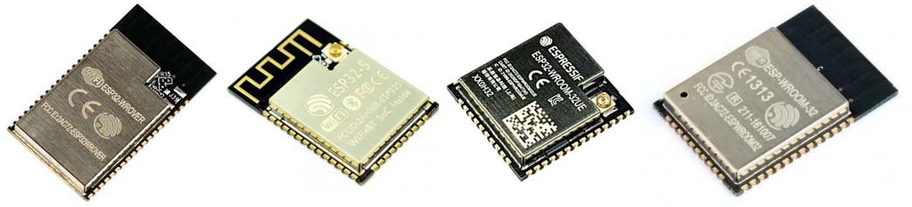

.. _esp32_quickref:

Quick reference for the ESP32
=============================

The Espressif ESP32 Development Board (image attribution: Adafruit).

Below is a quick reference for ESP32-based boards.  If it is your first time
working with this board it may be useful to get an overview of the microcontroller:

.. toctree::
   :maxdepth: 1

   general.rst
   tutorial/index.rst

Installing MicroPython
----------------------

See the corresponding section of tutorial: :ref:`esp32_intro`. It also includes
a troubleshooting subsection.

General board control
---------------------

The MicroPython REPL is on UART0 (GPIO1=TX, GPIO3=RX) at baudrate 115200.
Tab-completion is useful to find out what methods an object has.
Paste mode (ctrl-E) is useful to paste a large slab of Python code into
the REPL.

The :mod:`machine` module::

    import machine

    machine.freq()          # get the current frequency of the CPU
    machine.freq(240000000) # set the CPU frequency to 240 MHz

The :mod:`esp` module::

    import esp

    esp.osdebug(None)       # turn off vendor O/S debugging messages
    esp.osdebug(0)          # redirect vendor O/S debugging messages to UART(0)

    # low level methods to interact with flash storage
    esp.flash_size()
    esp.flash_user_start()
    esp.flash_erase(sector_no)
    esp.flash_write(byte_offset, buffer)
    esp.flash_read(byte_offset, buffer)

The :mod:`esp32` module::

    import esp32

    esp32.raw_temperature() # read the internal temperature of the MCU, in Fahrenheit
    esp32.ULP()             # access to the Ultra-Low-Power Co-processor

Note that the temperature sensor in the ESP32 will typically read higher than
ambient due to the IC getting warm while it runs.  This effect can be minimised
by reading the temperature sensor immediately after waking up from sleep.

Networking
----------

WLAN
^^^^

The :mod:`network` module::

    import network

    wlan = network.WLAN(network.STA_IF) # create station interface
    wlan.active(True)       # activate the interface
    wlan.scan()             # scan for access points
    wlan.isconnected()      # check if the station is connected to an AP
    wlan.connect('ssid', 'key') # connect to an AP
    wlan.config('mac')      # get the interface's MAC address
    wlan.ifconfig()         # get the interface's IP/netmask/gw/DNS addresses

    ap = network.WLAN(network.AP_IF) # create access-point interface
    ap.config(ssid='ESP-AP') # set the SSID of the access point
    ap.config(max_clients=10) # set how many clients can connect to the network
    ap.active(True)         # activate the interface

A useful function for connecting to your local WiFi network is::

    def do_connect():
        import network
        wlan = network.WLAN(network.STA_IF)
        wlan.active(True)
        if not wlan.isconnected():
            print('connecting to network...')
            wlan.connect('ssid', 'key')
            while not wlan.isconnected():
                pass
        print('network config:', wlan.ifconfig())

Once the network is established the :mod:`socket <socket>` module can be used
to create and use TCP/UDP sockets as usual, and the ``requests`` module for
convenient HTTP requests.

After a call to ``wlan.connect()``, the device will by default retry to connect
**forever**, even when the authentication failed or no AP is in range.
``wlan.status()`` will return ``network.STAT_CONNECTING`` in this state until a
connection succeeds or the interface gets disabled.  This can be changed by
calling ``wlan.config(reconnects=n)``, where n are the number of desired reconnect
attempts (0 means it won't retry, -1 will restore the default behaviour of trying
to reconnect forever).

LAN
^^^

To use the wired interfaces one has to specify the pins and mode ::

    import network

    lan = network.LAN(mdc=PIN_MDC, ...)   # Set the pin and mode configuration
    lan.active(True)                      # activate the interface
    lan.ifconfig()                        # get the interface's IP/netmask/gw/DNS addresses

The keyword arguments for the constructor defining the PHY type and interface are:

- mdc=pin-object    # set the mdc and mdio pins.
- mdio=pin-object
- power=pin-object  # set the pin which switches the power of the PHY device.
- phy_type=<type>   # Select the PHY device type. Supported devices are PHY_LAN8710,
  PHY_LAN8720, PH_IP101, PHY_RTL8201, PHY_DP83848 and PHY_KSZ8041
- phy_addr=number   # The address number of the PHY device.
- ref_clk_mode=mode # Defines, whether the ref_clk at the ESP32 is an input
  or output. Suitable values are Pin.IN and Pin.OUT.
- ref_clk=pin-object  # defines the Pin used for ref_clk.

These are working configurations for LAN interfaces of popular boards::

    # Olimex ESP32-GATEWAY: power controlled by Pin(5)
    # Olimex ESP32 PoE and ESP32-PoE ISO: power controlled by Pin(12)

    lan = network.LAN(mdc=machine.Pin(23), mdio=machine.Pin(18), power=machine.Pin(5),
                      phy_type=network.PHY_LAN8720, phy_addr=0,
                      ref_clk=machine.Pin(17), ref_clk_mode=machine.Pin.OUT)

    # Wireless-Tag's WT32-ETH01

    lan = network.LAN(mdc=machine.Pin(23), mdio=machine.Pin(18),
                      phy_type=network.PHY_LAN8720, phy_addr=1, power=None)

    # Wireless-Tag's WT32-ETH01 v1.4

    lan = network.LAN(mdc=machine.Pin(23), mdio=machine.Pin(18),
                      phy_type=network.PHY_LAN8720, phy_addr=1,
                      power=machine.Pin(16))

    # Espressif ESP32-Ethernet-Kit_A_V1.2

    lan = network.LAN(id=0, mdc=Pin(23), mdio=Pin(18), power=Pin(5),
                      phy_type=network.PHY_IP101, phy_addr=1)

Delay and timing
----------------

Use the :mod:`time <time>` module::

    import time

    time.sleep(1)           # sleep for 1 second
    time.sleep_ms(500)      # sleep for 500 milliseconds
    time.sleep_us(10)       # sleep for 10 microseconds
    start = time.ticks_ms() # get millisecond counter
    delta = time.ticks_diff(time.ticks_ms(), start) # compute time difference

Timers
------

The ESP32 port has four hardware timers. Use the :ref:`machine.Timer <machine.Timer>` class
with a timer ID from 0 to 3 (inclusive)::

    from machine import Timer

    tim0 = Timer(0)
    tim0.init(period=5000, mode=Timer.ONE_SHOT, callback=lambda t:print(0))

    tim1 = Timer(1)
    tim1.init(period=2000, mode=Timer.PERIODIC, callback=lambda t:print(1))

The period is in milliseconds.

Virtual timers are not currently supported on this port.

.. _Pins_and_GPIO:

Pins and GPIO
-------------

Use the :ref:`machine.Pin <machine.Pin>` class::

    from machine import Pin

    p0 = Pin(0, Pin.OUT)    # create output pin on GPIO0
    p0.on()                 # set pin to "on" (high) level
    p0.off()                # set pin to "off" (low) level
    p0.value(1)             # set pin to on/high

    p2 = Pin(2, Pin.IN)     # create input pin on GPIO2
    print(p2.value())       # get value, 0 or 1

    p4 = Pin(4, Pin.IN, Pin.PULL_UP) # enable internal pull-up resistor
    p5 = Pin(5, Pin.OUT, value=1) # set pin high on creation
    p6 = Pin(6, Pin.OUT, drive=Pin.DRIVE_3) # set maximum drive strength

Available Pins are from the following ranges (inclusive): 0-19, 21-23, 25-27, 32-39.
These correspond to the actual GPIO pin numbers of ESP32 chip.  Note that many
end-user boards use their own adhoc pin numbering (marked e.g. D0, D1, ...).
For mapping between board logical pins and physical chip pins consult your board
documentation.

Four drive strengths are supported, using the ``drive`` keyword argument to the
``Pin()`` constructor or ``Pin.init()`` method, with different corresponding
safe maximum source/sink currents and approximate internal driver resistances:

 - ``Pin.DRIVE_0``: 5mA / 130 ohm
 - ``Pin.DRIVE_1``: 10mA / 60 ohm
 - ``Pin.DRIVE_2``: 20mA / 30 ohm (default strength if not configured)
 - ``Pin.DRIVE_3``: 40mA / 15 ohm

The ``hold=`` keyword argument to ``Pin()`` and ``Pin.init()`` will enable the
ESP32 "pad hold" feature. When set to ``True``, the pin configuration
(direction, pull resistors and output value) will be held and any further
changes (including changing the output level) will not be applied. Setting
``hold=False`` will immediately apply any outstanding pin configuration changes
and release the pin. Using ``hold=True`` while a pin is already held will apply
any configuration changes and then immediately reapply the hold.

Notes:

* Pins 1 and 3 are REPL UART TX and RX respectively

* Pins 6, 7, 8, 11, 16, and 17 are used for connecting the embedded flash,
  and are not recommended for other uses

* Pins 34-39 are input only, and also do not have internal pull-up resistors

* See :ref:`Deep_sleep_Mode` for a discussion of pin behaviour during sleep

There's a higher-level abstraction :ref:`machine.Signal <machine.Signal>`
which can be used to invert a pin. Useful for illuminating active-low LEDs
using ``on()`` or ``value(1)``.

UART (serial bus)
-----------------

See :ref:`machine.UART <machine.UART>`. ::

    from machine import UART

    uart1 = UART(1, baudrate=9600, tx=33, rx=32)
    uart1.write('hello')  # write 5 bytes
    uart1.read(5)         # read up to 5 bytes

The ESP32 has three hardware UARTs: UART0, UART1 and UART2.
They each have default GPIO assigned to them, however depending on your
ESP32 variant and board, these pins may conflict with embedded flash,
onboard PSRAM or peripherals.

Any GPIO can be used for hardware UARTs using the GPIO matrix, except for
input-only pins 34-39 that can be used as ``rx``. To avoid conflicts simply
provide ``tx`` and ``rx`` pins when constructing. The default pins listed
below.

=====  =====  =====  =====
\      UART0  UART1  UART2
=====  =====  =====  =====
tx     1      10     17
rx     3      9      16
=====  =====  =====  =====

PWM (pulse width modulation)
----------------------------

PWM can be enabled on all output-enabled pins. The base frequency can
range from 1Hz to 40MHz but there is a tradeoff; as the base frequency
*increases* the duty resolution *decreases*. See
`LED Control <https://docs.espressif.com/projects/esp-idf/en/latest/api-reference/peripherals/ledc.html>`_
for more details.

Use the :ref:`machine.PWM <machine.PWM>` class::

    from machine import Pin, PWM

    pwm0 = PWM(Pin(0), freq=5000, duty_u16=32768) # create PWM object from a pin
    freq = pwm0.freq()         # get current frequency
    pwm0.freq(1000)            # set PWM frequency from 1Hz to 40MHz

    duty = pwm0.duty()         # get current duty cycle, range 0-1023 (default 512, 50%)
    pwm0.duty(256)             # set duty cycle from 0 to 1023 as a ratio duty/1023, (now 25%)

    duty_u16 = pwm0.duty_u16() # get current duty cycle, range 0-65535
    pwm0.duty_u16(2**16*3//4)  # set duty cycle from 0 to 65535 as a ratio duty_u16/65535, (now 75%)

    duty_ns = pwm0.duty_ns()   # get current pulse width in ns
    pwm0.duty_ns(250_000)      # set pulse width in nanoseconds from 0 to 1_000_000_000/freq, (now 25%)

    pwm0.deinit()              # turn off PWM on the pin

    pwm2 = PWM(Pin(2), freq=20000, duty=512)  # create and configure in one go
    print(pwm2)                               # view PWM settings

ESP chips have different hardware peripherals:

=====================================================  ========  ========  ========
Hardware specification                                    ESP32  ESP32-S2  ESP32-C3
-----------------------------------------------------  --------  --------  --------
Number of groups (speed modes)                                2         1         1
Number of timers per group                                    4         4         4
Number of channels per group                                  8         8         6
-----------------------------------------------------  --------  --------  --------
Different PWM frequencies (groups * timers)                   8         4         4
Total PWM channels (Pins, duties) (groups * channels)        16         8         6
=====================================================  ========  ========  ========

A maximum number of PWM channels (Pins) are available on the ESP32 - 16 channels,
but only 8 different PWM frequencies are available, the remaining 8 channels must
have the same frequency.  On the other hand, 16 independent PWM duty cycles are
possible at the same frequency.

See more examples in the :ref:`esp32_pwm` tutorial.

DAC (digital to analog conversion)
----------------------------------

On the ESP32, DAC functionality is available on pins 25, 26.
On the ESP32S2, DAC functionality is available on pins 17, 18.

Use the DAC::

    from machine import DAC, Pin

    dac = DAC(Pin(25))  # create an DAC object acting on a pin
    dac.write(128)      # set a raw analog value in the range 0-255, 50% now

ADC (analog to digital conversion)
----------------------------------

On the ESP32, ADC functionality is available on pins 32-39 (ADC block 1) and
pins 0, 2, 4, 12-15 and 25-27 (ADC block 2).

Use the :ref:`machine.ADC <machine.ADC>` class::

    from machine import ADC

    adc = ADC(pin)        # create an ADC object acting on a pin
    val = adc.read_u16()  # read a raw analog value in the range 0-65535
    val = adc.read_uv()   # read an analog value in microvolts

ADC block 2 is also used by WiFi and so attempting to read analog values from
block 2 pins when WiFi is active will raise an exception.

The internal ADC reference voltage is typically 1.1V, but varies slightly from
package to package. The ADC is less linear close to the reference voltage
(particularly at higher attenuations) and has a minimum measurement voltage
around 100mV, voltages at or below this will read as 0. To read voltages
accurately, it is recommended to use the ``read_uv()`` method (see below).

ESP32-specific ADC class method reference:

.. class:: ADC(pin, *, atten)

    Return the ADC object for the specified pin. ESP32 does not support
    different timings for ADC sampling and so the ``sample_ns`` keyword argument
    is not supported.

    To read voltages above the reference voltage, apply input attenuation with
    the ``atten`` keyword argument. Valid values (and approximate linear
    measurement ranges) are:

      - ``ADC.ATTN_0DB``: No attenuation (100mV - 950mV)
      - ``ADC.ATTN_2_5DB``: 2.5dB attenuation (100mV - 1250mV)
      - ``ADC.ATTN_6DB``: 6dB attenuation (150mV - 1750mV)
      - ``ADC.ATTN_11DB``: 11dB attenuation (150mV - 2450mV)

.. Warning::
   Note that the absolute maximum voltage rating for input pins is 3.6V. Going
   near to this boundary risks damage to the IC!

.. method:: ADC.read_uv()

    This method uses the known characteristics of the ADC and per-package eFuse
    values - set during manufacture - to return a calibrated input voltage
    (before attenuation) in microvolts. The returned value has only millivolt
    resolution (i.e., will always be a multiple of 1000 microvolts).

    The calibration is only valid across the linear range of the ADC. In
    particular, an input tied to ground will read as a value above 0 microvolts.
    Within the linear range, however, more accurate and consistent results will
    be obtained than using `read_u16()` and scaling the result with a constant.

The ESP32 port also supports the :ref:`machine.ADC <machine.ADCBlock>` API:

.. class:: ADCBlock(id, *, bits)

    Return the ADC block object with the given ``id`` (1 or 2) and initialize
    it to the specified resolution (9 to 12-bits depending on the ESP32 series)
    or the highest supported resolution if not specified.

.. method:: ADCBlock.connect(pin)
            ADCBlock.connect(channel)
            ADCBlock.connect(channel, pin)

    Return the ``ADC`` object for the specified ADC pin or channel number.
    Arbitrary connection of ADC channels to GPIO is not supported and so
    specifying a pin that is not connected to this block, or specifying a
    mismatched channel and pin, will raise an exception.

Legacy methods:

.. method:: ADC.read()

    This method returns the raw ADC value ranged according to the resolution of
    the block, e.g., 0-4095 for 12-bit resolution.

.. method:: ADC.atten(atten)

    Equivalent to ``ADC.init(atten=atten)``.

.. method:: ADC.width(bits)

    Equivalent to ``ADC.block().init(bits=bits)``.

For compatibility, the ``ADC`` object also provides constants matching the
supported ADC resolutions:

  - ``ADC.WIDTH_9BIT`` = 9
  - ``ADC.WIDTH_10BIT`` = 10
  - ``ADC.WIDTH_11BIT`` = 11
  - ``ADC.WIDTH_12BIT`` = 12

Software SPI bus
----------------

Software SPI (using bit-banging) works on all pins, and is accessed via the
:ref:`machine.SoftSPI <machine.SoftSPI>` class::

    from machine import Pin, SoftSPI

    # construct a SoftSPI bus on the given pins
    # polarity is the idle state of SCK
    # phase=0 means sample on the first edge of SCK, phase=1 means the second
    spi = SoftSPI(baudrate=100000, polarity=1, phase=0, sck=Pin(0), mosi=Pin(2), miso=Pin(4))

    spi.init(baudrate=200000) # set the baudrate

    spi.read(10)            # read 10 bytes on MISO
    spi.read(10, 0xff)      # read 10 bytes while outputting 0xff on MOSI

    buf = bytearray(50)     # create a buffer
    spi.readinto(buf)       # read into the given buffer (reads 50 bytes in this case)
    spi.readinto(buf, 0xff) # read into the given buffer and output 0xff on MOSI

    spi.write(b'12345')     # write 5 bytes on MOSI

    buf = bytearray(4)      # create a buffer
    spi.write_readinto(b'1234', buf) # write to MOSI and read from MISO into the buffer
    spi.write_readinto(buf, buf) # write buf to MOSI and read MISO back into buf

.. Warning::
   Currently *all* of ``sck``, ``mosi`` and ``miso`` *must* be specified when
   initialising Software SPI.

Hardware SPI bus
----------------

There are two hardware SPI channels that allow faster transmission
rates (up to 80Mhz). These may be used on any IO pins that support the
required direction and are otherwise unused (see :ref:`Pins_and_GPIO`)
but if they are not configured to their default pins then they need to
pass through an extra layer of GPIO multiplexing, which can impact
their reliability at high speeds. Hardware SPI channels are limited
to 40MHz when used on pins other than the default ones listed below.

=====  ===========  ============
\      HSPI (id=1)   VSPI (id=2)
=====  ===========  ============
sck    14           18
mosi   13           23
miso   12           19
=====  ===========  ============

Hardware SPI is accessed via the :ref:`machine.SPI <machine.SPI>` class and
has the same methods as software SPI above::

    from machine import Pin, SPI

    hspi = SPI(1, 10000000)
    hspi = SPI(1, 10000000, sck=Pin(14), mosi=Pin(13), miso=Pin(12))
    vspi = SPI(2, baudrate=80000000, polarity=0, phase=0, bits=8, firstbit=0, sck=Pin(18), mosi=Pin(23), miso=Pin(19))

Software I2C bus
----------------

Software I2C (using bit-banging) works on all output-capable pins, and is
accessed via the :ref:`machine.SoftI2C <machine.SoftI2C>` class::

    from machine import Pin, SoftI2C

    i2c = SoftI2C(scl=Pin(5), sda=Pin(4), freq=100000)

    i2c.scan()              # scan for devices

    i2c.readfrom(0x3a, 4)   # read 4 bytes from device with address 0x3a
    i2c.writeto(0x3a, '12') # write '12' to device with address 0x3a

    buf = bytearray(10)     # create a buffer with 10 bytes
    i2c.writeto(0x3a, buf)  # write the given buffer to the peripheral

Hardware I2C bus
----------------

There are two hardware I2C peripherals with identifiers 0 and 1.  Any available
output-capable pins can be used for SCL and SDA but the defaults are given
below.

=====  ===========  ============
\      I2C(0)       I2C(1)
=====  ===========  ============
scl    18           25
sda    19           26
=====  ===========  ============

The driver is accessed via the :ref:`machine.I2C <machine.I2C>` class and
has the same methods as software I2C above::

    from machine import Pin, I2C

    i2c = I2C(0)
    i2c = I2C(1, scl=Pin(5), sda=Pin(4), freq=400000)

I2S bus
-------

See :ref:`machine.I2S <machine.I2S>`. ::

    from machine import I2S, Pin

    i2s = I2S(0, sck=Pin(13), ws=Pin(14), sd=Pin(34), mode=I2S.TX, bits=16, format=I2S.STEREO, rate=44100, ibuf=40000) # create I2S object
    i2s.write(buf)             # write buffer of audio samples to I2S device

    i2s = I2S(1, sck=Pin(33), ws=Pin(25), sd=Pin(32), mode=I2S.RX, bits=16, format=I2S.MONO, rate=22050, ibuf=40000) # create I2S object
    i2s.readinto(buf)          # fill buffer with audio samples from I2S device

The I2S class is currently available as a Technical Preview.  During the preview period, feedback from
users is encouraged.  Based on this feedback, the I2S class API and implementation may be changed.

ESP32 has two I2S buses with id=0 and id=1

Real time clock (RTC)
---------------------

See :ref:`machine.RTC <machine.RTC>` ::

    from machine import RTC

    rtc = RTC()
    rtc.datetime((2017, 8, 23, 1, 12, 48, 0, 0)) # set a specific date and time
    rtc.datetime() # get date and time

WDT (Watchdog timer)
--------------------

See :ref:`machine.WDT <machine.WDT>`. ::

    from machine import WDT

    # enable the WDT with a timeout of 5s (1s is the minimum)
    wdt = WDT(timeout=5000)
    wdt.feed()

.. _Deep_sleep_mode:

Deep-sleep mode
---------------

The following code can be used to sleep, wake and check the reset cause::

    import machine

    # check if the device woke from a deep sleep
    if machine.reset_cause() == machine.DEEPSLEEP_RESET:
        print('woke from a deep sleep')

    # put the device to sleep for 10 seconds
    machine.deepsleep(10000)

Notes:

* Calling ``deepsleep()`` without an argument will put the device to sleep
  indefinitely
* A software reset does not change the reset cause

Some ESP32 pins (0, 2, 4, 12-15, 25-27, 32-39) are connected to the RTC during
deep-sleep and can be used to wake the device with the ``wake_on_`` functions in
the :mod:`esp32` module. The output-capable RTC pins (all except 34-39) will
also retain their pull-up or pull-down resistor configuration when entering
deep-sleep.

If the pull resistors are not actively required during deep-sleep and are likely
to cause current leakage (for example a pull-up resistor is connected to ground
through a switch), then they should be disabled to save power before entering
deep-sleep mode::

    from machine import Pin, deepsleep

    # configure input RTC pin with pull-up on boot
    pin = Pin(2, Pin.IN, Pin.PULL_UP)

    # disable pull-up and put the device to sleep for 10 seconds
    pin.init(pull=None)
    machine.deepsleep(10000)

Output-configured RTC pins will also retain their output direction and level in
deep-sleep if pad hold is enabled with the ``hold=True`` argument to
``Pin.init()``.

Non-RTC GPIO pins will be disconnected by default on entering deep-sleep.
Configuration of non-RTC pins - including output level - can be retained by
enabling pad hold on the pin and enabling GPIO pad hold during deep-sleep::

    from machine import Pin, deepsleep
    import esp32

    opin = Pin(19, Pin.OUT, value=1, hold=True) # hold output level
    ipin = Pin(21, Pin.IN, Pin.PULL_UP, hold=True) # hold pull-up

    # enable pad hold in deep-sleep for non-RTC GPIO
    esp32.gpio_deep_sleep_hold(True)

    # put the device to sleep for 10 seconds
    deepsleep(10000)

The pin configuration - including the pad hold - will be retained on wake from
sleep. See :ref:`Pins_and_GPIO` above for a further discussion of pad holding.

SD card
-------

See :ref:`machine.SDCard <machine.SDCard>`. ::

    import machine, os, vfs

    # Slot 2 uses pins sck=18, cs=5, miso=19, mosi=23
    sd = machine.SDCard(slot=2)
    vfs.mount(sd, '/sd') # mount

    os.listdir('/sd')    # list directory contents

    vfs.umount('/sd')    # eject

RMT
---

The RMT is ESP32-specific and allows generation of accurate digital pulses with
12.5ns resolution.  See :ref:`esp32.RMT <esp32.RMT>` for details.  Usage is::

    import esp32
    from machine import Pin

    r = esp32.RMT(0, pin=Pin(18), clock_div=8)
    r   # RMT(channel=0, pin=18, source_freq=80000000, clock_div=8)
    # The channel resolution is 100ns (1/(source_freq/clock_div)).
    r.write_pulses((1, 20, 2, 40), 0) # Send 0 for 100ns, 1 for 2000ns, 0 for 200ns, 1 for 4000ns

OneWire driver
--------------

The OneWire driver is implemented in software and works on all pins::

    from machine import Pin
    import onewire

    ow = onewire.OneWire(Pin(12)) # create a OneWire bus on GPIO12
    ow.scan()               # return a list of devices on the bus
    ow.reset()              # reset the bus
    ow.readbyte()           # read a byte
    ow.writebyte(0x12)      # write a byte on the bus
    ow.write('123')         # write bytes on the bus
    ow.select_rom(b'12345678') # select a specific device by its ROM code

There is a specific driver for DS18S20 and DS18B20 devices::

    import time, ds18x20
    ds = ds18x20.DS18X20(ow)
    roms = ds.scan()
    ds.convert_temp()
    time.sleep_ms(750)
    for rom in roms:
        print(ds.read_temp(rom))

Be sure to put a 4.7k pull-up resistor on the data line.  Note that
the ``convert_temp()`` method must be called each time you want to
sample the temperature.

NeoPixel and APA106 driver
--------------------------

Use the ``neopixel`` and ``apa106`` modules::

    from machine import Pin
    from neopixel import NeoPixel

    pin = Pin(0, Pin.OUT)   # set GPIO0 to output to drive NeoPixels
    np = NeoPixel(pin, 8)   # create NeoPixel driver on GPIO0 for 8 pixels
    np[0] = (255, 255, 255) # set the first pixel to white
    np.write()              # write data to all pixels
    r, g, b = np[0]         # get first pixel colour

The APA106 driver extends NeoPixel, but internally uses a different colour order::

    from apa106 import APA106
    ap = APA106(pin, 8)
    r, g, b = ap[0]

.. Warning::
   By default ``NeoPixel`` is configured to control the more popular *800kHz*
   units. It is possible to use alternative timing to control other (typically
   400kHz) devices by passing ``timing=0`` when constructing the
   ``NeoPixel`` object.

For low-level driving of a NeoPixel see `machine.bitstream`.
This low-level driver uses an RMT channel by default.  To configure this see
`RMT.bitstream_channel`.

APA102 (DotStar) uses a different driver as it has an additional clock pin.

Capacitive touch
----------------

Use the ``TouchPad`` class in the ``machine`` module::

    from machine import TouchPad, Pin

    t = TouchPad(Pin(14))
    t.read()              # Returns a smaller number when touched

``TouchPad.read`` returns a value relative to the capacitive variation. Small numbers (typically in
the *tens*) are common when a pin is touched, larger numbers (above *one thousand*) when
no touch is present. However the values are *relative* and can vary depending on the board
and surrounding composition so some calibration may be required.

There are ten capacitive touch-enabled pins that can be used on the ESP32: 0, 2, 4, 12, 13
14, 15, 27, 32, 33. Trying to assign to any other pins will result in a ``ValueError``.

Note that TouchPads can be used to wake an ESP32 from sleep::

    import machine
    from machine import TouchPad, Pin
    import esp32

    t = TouchPad(Pin(14))
    t.config(500)               # configure the threshold at which the pin is considered touched
    esp32.wake_on_touch(True)
    machine.lightsleep()        # put the MCU to sleep until a touchpad is touched

For more details on touchpads refer to `Espressif Touch Sensor
<https://docs.espressif.com/projects/esp-idf/en/latest/api-reference/peripherals/touch_pad.html>`_.

DHT driver
----------

The DHT driver is implemented in software and works on all pins::

    import dht
    import machine

    d = dht.DHT11(machine.Pin(4))
    d.measure()
    d.temperature() # eg. 23 (°C)
    d.humidity()    # eg. 41 (% RH)

    d = dht.DHT22(machine.Pin(4))
    d.measure()
    d.temperature() # eg. 23.6 (°C)
    d.humidity()    # eg. 41.3 (% RH)

WebREPL (web browser interactive prompt)
----------------------------------------

WebREPL (REPL over WebSockets, accessible via a web browser) is an
experimental feature available in ESP32 port. Download web client
from https://github.com/micropython/webrepl (hosted version available
at http://micropython.org/webrepl), and configure it by executing::

    import webrepl_setup

and following on-screen instructions. After reboot, it will be available
for connection. If you disabled automatic start-up on boot, you may
run configured daemon on demand using::

    import webrepl
    webrepl.start()

    # or, start with a specific password
    webrepl.start(password='mypass')

The WebREPL daemon listens on all active interfaces, which can be STA or
AP.  This allows you to connect to the ESP32 via a router (the STA
interface) or directly when connected to its access point.

In addition to terminal/command prompt access, WebREPL also has provision
for file transfer (both upload and download).  The web client has buttons for
the corresponding functions, or you can use the command-line client
``webrepl_cli.py`` from the repository above.

See the MicroPython forum for other community-supported alternatives
to transfer files to an ESP32 board.
