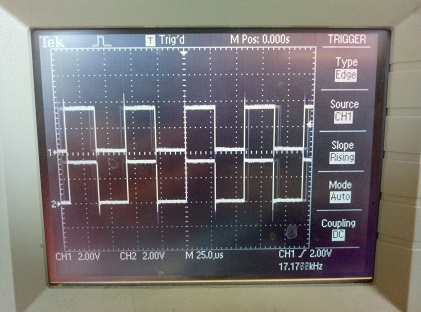

Accessing peripherals directly via registers
============================================

The ESP32's peripherals can be controlled via direct register reads and writes.
This requires reading the datasheet to know what registers to use and what
values to write to them.  The following example shows how to turn on and change
the prescaler of the MCPWM0 peripheral.

.. code-block:: python3

    from micropython import const
    from machine import mem32

    # Define the register addresses that will be used.
    DR_REG_DPORT_BASE = const(0x3FF00000)
    DPORT_PERIP_CLK_EN_REG = const(DR_REG_DPORT_BASE + 0x0C0)
    DPORT_PERIP_RST_EN_REG = const(DR_REG_DPORT_BASE + 0x0C4)
    DPORT_PWM0_CLK_EN = const(1 << 17)
    MCPWM0 = const(0x3FF5E000)
    MCPWM1 = const(0x3FF6C000)

    # Enable CLK and disable RST.
    print(hex(mem32[DPORT_PERIP_CLK_EN_REG] & 0xffffffff))
    print(hex(mem32[DPORT_PERIP_RST_EN_REG] & 0xffffffff))
    mem32[DPORT_PERIP_CLK_EN_REG] |= DPORT_PWM0_CLK_EN
    mem32[DPORT_PERIP_RST_EN_REG] &= ~DPORT_PWM0_CLK_EN
    print(hex(mem32[DPORT_PERIP_CLK_EN_REG] & 0xffffffff))
    print(hex(mem32[DPORT_PERIP_RST_EN_REG] & 0xffffffff))

    # Change the MCPWM0 prescaler.
    print(hex(mem32[MCPWM0])) # read PWM_CLK_CFG_REG (reset value = 0)
    mem32[MCPWM0] = 0x55      # change PWM_CLK_PRESCALE
    print(hex(mem32[MCPWM0])) # read PWM_CLK_CFG_REG

The specific addresses will be different on different ESP32
models. For example, ESP32-S3 uses these values:

.. code-block:: python3

    DR_REG_DPORT_BASE = const(0x600C_0000)
    DPORT_PERIP_CLK_EN0_REG = const(DR_REG_DPORT_BASE + 0x0018)
    DPORT_PERIP_RST_EN0_REG = const(DR_REG_DPORT_BASE + 0x0020)
    DPORT_PWM0_CLK_EN = const(1 << 17)
    MCPWM0 = const(0x6001_E000 + 0x0004)
    ...

Note that before a peripheral can be used its clock must be enabled and it must
be taken out of reset.  In the above example the following registers are used
for this:

- ``DPORT_PERI_CLK_EN_REG``: used to enable a peripheral clock

- ``DPORT_PERI_RST_EN_REG``: used to reset (or take out of reset) a peripheral

The MCPWM0 peripheral is in bit position 17 of the above two registers, hence
the value of ``DPORT_PWM0_CLK_EN``.

Synchronous access to pins directly via registers
-------------------------------------------------

The following code shows how to access pins directly via registers.  It has been
tested on a generic ESP32 board.  It configures pins 16, 17, 32 and 33 in output
mode via registers, and switches pin output values via registers.  Pins 16 and
17 are switched simultaneously.

.. code-block:: python3

    from micropython import const
    from machine import mem32, Pin

    GPIO_OUT_REG = const(0x3FF44004)  # GPIO 0-31 output register
    GPIO_OUT1_REG = const(0x3FF44010)  # GPIO 32-39 output register

    GPIO_ENABLE_REG = const(0x3FF44020)  # GPIO 0-31 output enable register
    GPIO_ENABLE1_REG = const(0x3FF4402C)  # GPIO 32-39 output enable register

    M16 = 1 << 16  # Pin(16) bit mask
    M17 = 1 << 17  # Pin(17) bit mask

    M32 = 1 << (32-32)  # Pin(32) bit mask
    M33 = 1 << (33-32)  # Pin(33) bit mask

    # Enable pin output mode like
    # p16 = Pin(16, mode=Pin.OUT)
    # p17 = Pin(17, mode=Pin.OUT)
    # p32 = Pin(32, mode=Pin.OUT)
    # p33 = Pin(33, mode=Pin.OUT)
    mem32[GPIO_ENABLE_REG] = mem32[GPIO_ENABLE_REG] | M16 | M17
    mem32[GPIO_ENABLE1_REG] = mem32[GPIO_ENABLE1_REG] | M32 | M33

    print(hex(mem32[GPIO_OUT_REG]), hex(mem32[GPIO_OUT1_REG]))

    # Set outputs to 1 like
    # p16(1)
    # p17(1)
    # p32(1)
    # p33(1)
    mem32[GPIO_OUT_REG] = mem32[GPIO_OUT_REG] | M16 | M17
    mem32[GPIO_OUT1_REG] = mem32[GPIO_OUT1_REG] | M32 | M33

    print(hex(mem32[GPIO_OUT_REG]), hex(mem32[GPIO_OUT1_REG]))

    # Set outputs to 0 like
    # p16(0)
    # p17(0)
    # p32(0)
    # p33(0)
    mem32[GPIO_OUT_REG] = mem32[GPIO_OUT_REG] & ~(M16 | M17)
    mem32[GPIO_OUT1_REG] = mem32[GPIO_OUT1_REG] & ~(M32 | M33)

    print(hex(mem32[GPIO_OUT_REG]), hex(mem32[GPIO_OUT1_REG]))

    while True:
        # Set outputs to 1
        mem32[GPIO_OUT_REG] = mem32[GPIO_OUT_REG] | M16 | M17
        mem32[GPIO_OUT1_REG] = mem32[GPIO_OUT1_REG] | M32 | M33

        # Set outputs to 0
        mem32[GPIO_OUT_REG] = mem32[GPIO_OUT_REG] & ~(M16 | M17)
        mem32[GPIO_OUT1_REG] = mem32[GPIO_OUT1_REG] & ~(M32 | M33)

Output is::

    0x0 0x0
    0x30000 0x3
    0x0 0x0

Pins 16 and 17 are switched synchronously:

Same image on pins 32 and 33.

Note that pins 34-36 and 39 are inputs only. Also pins 1 and 3 are Tx, Rx of the REPL UART,
pins 6-11 are connected to the built-in SPI flash.
