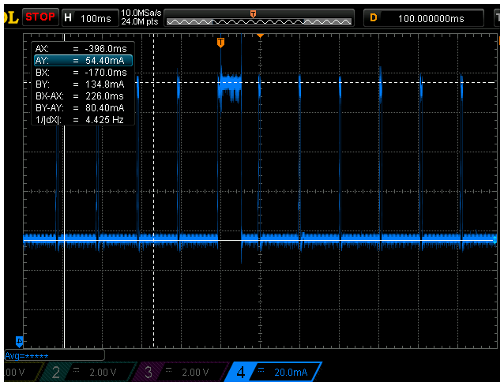
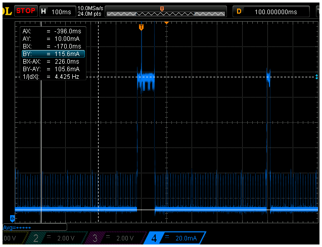
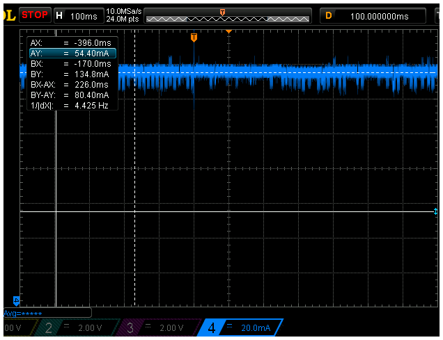

.. currentmodule:: esp32-lowpower

.. _esp32-lowpower:

:mod:`esp32-lowpower` --- low power options for the ESP32
=========================================================

The ``machine`` and ``network`` modules have a number of options that enable
low power operation on the ESP32. Overall, these options offer approximately a 2x reduction in
operating power while being connected to a WiFi access point by slowing the CPU when
it is idle and by listening to the access point's beacons less frequently. These low
power options are not without drawbacks, in particular, the ESP32 will respond
with more delay to incoming packets or connections as well as potentially to I/O
events.

Note that in addition to the options described below the ESP32 offers light-sleep
and deep-sleep modes
as part of the ``machine`` module: both modes consume less power than the
options presented here but they suspend normal operation of WiFi and I/O.

.. module:: machine
   :synopsis: functions related to the hardware

ESP32-specific low-power options in ``machine``
-----------------------------------------------

.. function:: freq(max_freq, [key=None, \*, ...])

    The ``machine.freq`` function may be used to set the frequency of the esp32's processor
    cores. *max_freq* sets the maximum frequency in Hz and accepts the values
    20000000, 40000000, 80000000, 160000000, and 240000000. The optional keyword parameter
    *min_freq* sets the minimum frequency, which causes FreeRTOS to reduce the
    clock rate when the processor is idle. It accepts the value 10000000 in addition
    to those accepted for *max_freq*.

    Note that allowing FreeRTOS to change the processor frequency dynamically by setting different
    max/min frequencies can affect some I/O peripherals:
    - UART, LEDC (``machine.PWM``): not affected
    - RMT: frequency varies, need to be fixed (TODO item)
    - SPI, I2C, I2S, SDMMC: not affected, they lock the frequency while active
    Please consult the ESP-IDF
    section on `Dynamic Frequency Scaling
    <https://docs.espressif.com/projects/esp-idf/en/latest/api-reference/system/power_management.html#dynamic-frequency-scaling-and-peripheral-drivers>` for more details.

    The optional and highly experimental *auto_light_sleep* keyword parameter allows automatic
    light sleep to be enabled in which case the system enters light-sleep mode
    automatically when idle (see the power management section of the ESP-IDF documentation).
    This setting is currently difficult to use because it causes most
    I/O peripherals to stop functioning, including the console UART and many GPIO
    pins. It is only provided for completeness and to enable further experimentation
    with low-power modes.

.. module:: network
   :synopsis: network configuration

ESP32-specific low-power options in ``network``
-----------------------------------------------

.. function:: AbstractNIC.connect([service_id, key=None, \*, ...])

    For the WLAN ``STA_IF`` the *connect* function supports an optional
    *listen_interval* keyword parameter which causes the WiFi driver to
    use the 802.11 power-save-mode (PSM) with the specified beacon-skip interval.

    The effect of the listen interval is that the ESP32 tells its access point to queue packets
    that are destined for it and to flag the presence of such packets in the standard
    WiFi beacon (typ. every 100ms). The ESP32 then enables the radio just in time to receive a
    beacon, check the flag, explicitly retrieve queued packets if there are any, and then
    it turns the radio off again.

    A *listen_interval* value of N >0 causes the ESP32 to wake up and listen every
    N beacons (e.g. a value of 5 can cause packets to be queued for up to about 500ms
    assuming the standard beacon interval of 100ms).
    A value of 0 enables PSM and uses the DTIM value broadcast by the access point as
    listen interval. A DTIM setting is available in many access points, but not all.
    A value of -1 disables PSM and causes the ESP32 to keep the radio on at all times.
    The default value is 1.

Low-power examples
------------------

The following scope capture shows the power consumption in default mode while connected
to Wifi that has DTIM=1 and being pinged once a second. This mode is equivalent to calling
``machine.freq(160000000)`` and ``connect(..., listen_interval=0)``.
(Because the AP's DTIM setting is 1 the same behavior could be observed by setting
*listen_interval=1*.)



The blue trace at the bottom shows power consumption in mA at 50mA per vertical division
and a time resolution of 100ms per horizontal division.
For the majority of the time the consumption hovers around 35mA to 60mA but every 100ms
it spikes up to about 120-140mA when the WiFi radio is turned on to receive the
access point's beacon. At the trigger point (500ms into the trace) the beacons indicates
that a packet is queued (presumably due to the pings) and the ESP32 picks-up the packet
and responds to the ping (the first thicker spike up to about 190mA), delays for approx
60ms, and then transmits to the AP that it is re-entering power-save-mode (the thinner
spike to ~190mA).

Sample output from the ping (running on a Linux box on the same network) shows delays
up to about 100ms::
    64 bytes from 192.168.0.124: icmp_seq=1 ttl=255 time=49.2 ms
    64 bytes from 192.168.0.124: icmp_seq=2 ttl=255 time=67.5 ms
    64 bytes from 192.168.0.124: icmp_seq=3 ttl=255 time=95.1 ms
    64 bytes from 192.168.0.124: icmp_seq=4 ttl=255 time=114 ms
    64 bytes from 192.168.0.124: icmp_seq=5 ttl=255 time=35.4 ms
    64 bytes from 192.168.0.124: icmp_seq=6 ttl=255 time=57.5 ms

The cyan trace at the top shows when the micropython interpreter sleeps, i.e. yields the
application processor core: while high the processor is yielded and while low micropython
runs. In this capture the interpreter is idle and just wakes up every 400ms to check
events and yield again.

The next scope capture shows the same situation but with
``machine.freq(80000000, min_freq=10000000)`` and ``connect(..., listen_interval=5)```.



In this capture the scope settings are identical to above. The idle power consumption is now reduced
to approx 12mA and when the radio is on the consumption is around 115mA. The trigger point
again shows an incoming ping and response with about the same timing as previously.
However the frequency at which the ESP32 listens to the access point's beacons is now
500ms as requested with the ``listen_interval`` parameter. One such listen period can be seen
20ms before the end of the trace.

Sample output from the ping shows irregular and sometimes long delays::
    64 bytes from 192.168.0.124: icmp_seq=44 ttl=255 time=86.9 ms
    64 bytes from 192.168.0.124: icmp_seq=45 ttl=255 time=110 ms
    64 bytes from 192.168.0.124: icmp_seq=46 ttl=255 time=136 ms
    64 bytes from 192.168.0.124: icmp_seq=47 ttl=255 time=399 ms
    64 bytes from 192.168.0.124: icmp_seq=48 ttl=255 time=76.5 ms
    64 bytes from 192.168.0.124: icmp_seq=49 ttl=255 time=97.8 ms

Averaged out these scope traces show a reduction of power consumption from around 63mA to
around 25mA, but this should be taken as a rough estimate only because the processor utilitzation
and WiFi traffic have a big impact on the average consumption.

For completeness, the following cropped capture shows power consumption with
PSM turned off, i.e., ``machine.freq(160000000)`` and ``connect(..., listen_interval=-1)``.



While the average power consumption is around 125mA the ping response times are better than with
power-save enabled::
    64 bytes from 192.168.0.124: icmp_seq=64 ttl=255 time=2.59 ms
    64 bytes from 192.168.0.124: icmp_seq=65 ttl=255 time=2.42 ms
    64 bytes from 192.168.0.124: icmp_seq=66 ttl=255 time=1.68 ms
    64 bytes from 192.168.0.124: icmp_seq=67 ttl=255 time=1.36 ms
    64 bytes from 192.168.0.124: icmp_seq=68 ttl=255 time=1.62 ms
    64 bytes from 192.168.0.124: icmp_seq=69 ttl=255 time=1.30 ms

