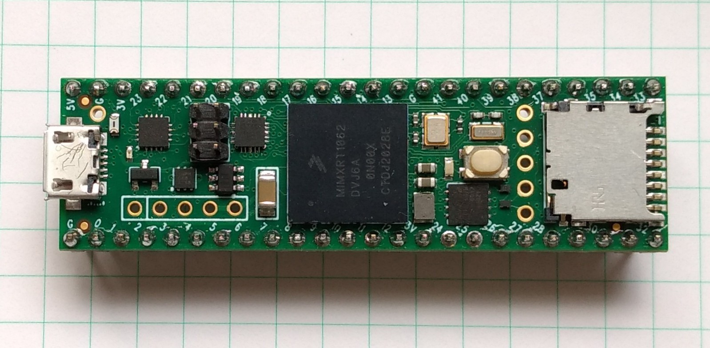

.. _mimxrt_quickref:

Quick reference for the i.MXRT family
=====================================



The Teensy 4.1 board.

Below is a quick reference for i.MXRT-based boards.  If it is your first time
working with this board it may be useful to get an overview of the microcontroller:

.. toctree::
   :maxdepth: 1

   general.rst
   tutorial/intro.rst
   pinout.rst


Installing MicroPython
----------------------

See the corresponding section of tutorial: :ref:`mimxrt_intro`. It also includes
a troubleshooting subsection.

General board control
---------------------

The MicroPython REPL is on the USB port, configured in VCP mode.
Tab-completion is useful to find out what methods an object has.
Paste mode (ctrl-E) is useful to paste a large slab of Python code into
the REPL.

The :mod:`machine` module::

    import machine

    machine.freq()          # get the current frequency of the CPU

Delay and timing
----------------

Use the :mod:`time <time>` module::

    import time

    time.sleep(1)           # sleep for 1 second
    time.sleep_ms(500)      # sleep for 500 milliseconds
    time.sleep_us(10)       # sleep for 10 microseconds
    start = time.ticks_ms() # get millisecond counter
    delta = time.ticks_diff(time.ticks_ms(), start) # compute time difference

Timers
------

The i.MXRT port supports virtual Timers. Example of usage::

    from machine import Timer

    tim0 = Timer(-1)
    tim0.init(period=5000, mode=Timer.ONE_SHOT, callback=lambda t:print(0))

    tim1 = Timer(-1)
    tim1.init(period=2000, mode=Timer.PERIODIC, callback=lambda t:print(1))

The period is in milliseconds.

.. _mimxrt_Pins_and_GPIO:

Pins and GPIO
-------------

Use the :ref:`machine.Pin <machine.Pin>` class::

    from machine import Pin

    p0 = Pin('D0', Pin.OUT) # create output pin on GPIO0
    p0.on()                 # set pin to "on" (high) level
    p0.off()                # set pin to "off" (low) level
    p0.value(1)             # set pin to on/high

    p2 = Pin('D2', Pin.IN)  # create input pin on GPIO2
    print(p2.value())       # get value, 0 or 1

    p4 = Pin('D4', Pin.IN, Pin.PULL_UP) # enable internal pull-up resistor
    p5 = Pin('D5', Pin.OUT, value=1) # set pin high on creation

    p6 = Pin(pin.cpu.GPIO_B1_15, Pin.OUT) # Use the cpu pin name.

Available Pins follow the ranges and labelling of the respective board, like:

- 'D0-Dxx', or 'A0-Ann' for Teensy 4.0, MIMXRT10xx-EVK ns Olimex board,
- 'J3_xx', 'J4_xx', 'J5_xx' for the Seeed ARCH MIX board,

or the pin names of the Pin.board or Pin.cpu classes.

Notes:

* The MIMXRT1xxx-EVK boards may have other on-board devices connected to these
  pins, limiting it's use for input or output.
* At the MIMXRT1010_EVK, pins D4, D5 and D9 of the Arduino connector are by
  default not connected to the MCU. For details refer to the schematics.
* At the MIMXRT1170_EVK board, the inner rows of the Arduino connectors are assigned as follows:
    - 'D16' - 'D23': J9, odd pin numbers; 'D17' is by default not connected.
    - 'D24' - 'D27': J26, odd pin numbers; J63-J66 have to be closed to enable these pins.
    - 'D29' - 'D36': J25, odd pin numbers; 'D29' and 'D30' are by default not connected.

There's a higher-level abstraction :ref:`machine.Signal <machine.Signal>`
which can be used to invert a pin.  Useful for illuminating active-low LEDs
using ``on()`` or ``value(1)``.

UART (serial bus)
-----------------

See :ref:`machine.UART <machine.UART>`. ::

    from machine import UART

    uart1 = UART(1, baudrate=115200)
    uart1.write('hello')  # write 5 bytes
    uart1.read(5)         # read up to 5 bytes

The i.MXRT has up to eight hardware UARTs, but not every board exposes all
TX and RX pins for users. For the assignment of Pins to UART signals,
refer to the :ref:`UART pinout <mimxrt_uart_pinout>`.

PWM (pulse width modulation)
----------------------------

The i.MXRT has up to four dedicated PWM modules with four FLEXPWM submodules each
and up to four QTMR modules with four channels, which can be used to generate
a PWM signal or signal pair.

The PWM functions are provided by the :ref:`machine.PWM <machine.PWM>` class.
It supports all basic methods listed for that class and a few additional methods for
handling signal groups. ::

    # Samples for Teensy
    #

    from machine import Pin, PWM

    # create PWM object from a pin and set the frequency and duty cycle
    pwm2 = PWM(Pin('D2'), freq=2000, duty_u16=32768)
    pwm2.freq()             # get the current frequency
    pwm2.freq(1000)         # set/change the frequency
    pwm2.duty_u16()         # get the current duty cycle, range 0-65535
    pwm2.duty_u16(200)      # set the duty cycle, range 0-65535
    pwm2.deinit()           # turn off PWM on the pin
    # create a complementary signal pair on Pin 2 and 3
    pwm2 = PWM(('D2', 'D3'), freq=2000, duty_ns=20000)

    # Create a group of four synchronized signals.
    # Start with Pin('D4') at submodule 0, which creates the sync pulse.
    pwm4 = PWM(Pin('D4'), freq=1000, align=PWM.HEAD)
    # Pins D5, D6, and D9 are pins at the same module
    pwm5 = PWM(Pin('D5'), freq=1000, duty_u16=10000, align=PWM.HEAD, sync=True)
    pwm6 = PWM(Pin('D6', freq=1000, duty_u16=20000, align=PWM.HEAD, sync=True)
    pwm9 = PWM(Pin('D9'), freq=1000, duty_u16=30000, align=PWM.HEAD, sync=True)

    pwm3                    # show the PWM objects properties


PWM Constructor
```````````````

.. class:: PWM(dest, freq, duty_u16, duty_ns, *, center, align, invert, sync, xor, deadtime)
  :noindex:

    Construct and return a new PWM object using the following parameters:

      - *dest* is the entity on which the PWM is output, which is usually a
        :ref:`machine.Pin <machine.Pin>` object, but a port may allow other values,
        like integers or strings, which designate a Pin in the machine.PIN class.
        *dest* is either a single object or a two element object tuple.
        If the object tuple is specified, the two pins act in complementary
        mode. These two pins must be the A/B channels of the same submodule.

    PWM objects are either provided by a FLEXPWM module or a QTMR module.
    The i.MXRT devices have either two or four FLEXPWM and QTMR modules.
    Each FLEXPWM module has four submodules with three channels, each,
    called A, B and X.  Each QTMR module has four channels.
    Each FLEXPWM submodule or QTMR channel may be set to different parameters.
    Not every channel is routed to a board pin.  Details are listed below.

    Setting *freq* affects the three channels of the same FLEXPWM submodule.
    Only one of *duty_u16* and *duty_ns* should be specified at a time.

    Keyword arguments:

      - *freq* should be an integer which sets the frequency in Hz for the
        PWM cycle. The valid frequency range is 15 Hz resp. 18Hz resp. 24Hz up to > 1 MHz.
      - *duty_u16* sets the duty cycle as a ratio ``duty_u16 / 65536``.
        The duty cycle of a X channel can only be changed, if the A and B channel
        of the respective submodule is not used. Otherwise the duty_16 value of the
        X channel is 32768 (50%).
      - *duty_ns* sets the pulse width in nanoseconds. The limitation for X channels
        apply as well.
      - *center*\=value. An integer sets the center of the pulse within the pulse period.
        The range is 0-65535. The resulting pulse will last from center - duty_u16/2 to
        center + duty_u16/2.
      - *align*\=value. Shortcuts for the pulse center setting, causing the pulse either at
        the center of the frame (value=0), the leading edge at the begin (value=1) or the
        trailing edge at the end of a pulse period (value=2).
      - *invert*\=value channel_mask. Setting a bit in the mask inverts the respective channel.
        Bit 0 inverts the first specified channel, bit 1 the second. The default is 0. For a
        PWM object with a single channel, True and False may be used as values.
      - *sync*\=True|False. If a channel of a module's submodule 0 is already active, other
        submodules of the same module can be forced to be synchronous to submodule 0. Their
        pulse period start then at at same clock cycle. The default is False.
      - *xor*\=0|1|2. If set to 1 or 2, the channel will output the XOR'd signal from channels
        A or B. If set to 1 on channel A or B, both A and B will show the same signal. If set
        to 2, A and B will show alternating signals. For details and an illustration, please
        refer to the MCU's reference manual, chapter "Double Switching PWMs".
      - *deadtime*\=time_ns. This setting affects complementary channels and defines a deadtime
        between an edge of a first channel and the edge of the next channel, in which both
        channels are set to low. That allows connected H-bridges to switch off one side
        of a push-pull driver before switching on the other side.

PWM Methods
```````````

The methods are identical to the generic :ref:`machine.PWM <machine.PWM>` class,
with additional keyword arguments to the init() method, matchings those of the constructor.

Each FLEX submodule or QTMR module may run at different frequencies.  The PWM signal
is created by dividing the pwm_clk signal by an integral factor, according to the formula::

    f = pwm_clk / (2**n * m)

with n being in the range of 0..7, and m in the range of 2..65536. pmw_clk is 125Mhz
for MIMXRT1010/1015/1020, 150 MHz for MIMXRT1050/1060/1064 and 160MHz for MIMXRT1170.
The lowest frequency is pwm_clk/2**23 (15, 18, 20Hz). The highest frequency with
U16 resolution is pwm_clk/2**16 (1907, 2288, 2441 Hz), the highest frequency
with 1 percent resolution is pwm_clk/100 (1.25, 1.5, 1.6 MHz). The highest achievable
frequency is pwm_clk/3 for the A/B channels, and pwm_clk/2 for the X channels and QTMR
signal.

PWM Pin Assignment
``````````````````

Pins are specified in the same way as for the Pin class.  For the assignment of Pins
to PWM signals, refer to the :ref:`PWM pinout <mimxrt_pwm_pinout>`.

ADC (analog to digital conversion)
----------------------------------

On the i.MXRT ADC functionality is available on Pins labeled 'Ann'.

Use the :ref:`machine.ADC <machine.ADC>` class::

    from machine import ADC

    adc = ADC(Pin('A2'))        # create ADC object on ADC pin
    adc.read_u16()              # read value, 0-65536 across voltage range 0.0v - 3.3v

The resolution of the ADC is 12 bit with 10 to 11 bit accuracy, irrespective of the
value returned by read_u16(). If you need a higher resolution or better accuracy, use
an external ADC.

Software SPI bus
----------------

Software SPI (using bit-banging) works on all pins, and is accessed via the
:ref:`machine.SoftSPI <machine.SoftSPI>` class. ::

    from machine import Pin, SoftSPI

    # construct a SoftSPI bus on the given pins
    # polarity is the idle state of SCK
    # phase=0 means sample on the first edge of SCK, phase=1 means the second
    spi = SoftSPI(baudrate=100000, polarity=1, phase=0, sck=Pin('D0'), mosi=Pin('D2'), miso=Pin('D4'))

    spi.init(baudrate=200000) # set the baudrate

    spi.read(10)            # read 10 bytes on MISO
    spi.read(10, 0xff)      # read 10 bytes while outputting 0xff on MOSI

    buf = bytearray(50)     # create a buffer
    spi.readinto(buf)       # read into the given buffer (reads 50 bytes in this case)
    spi.readinto(buf, 0xff) # read into the given buffer and output 0xff on MOSI

    spi.write(b'12345')     # write 5 bytes on MOSI

    buf = bytearray(4)      # create a buffer
    spi.write_readinto(b'1234', buf) # write to MOSI and read from MISO into the buffer
    spi.write_readinto(buf, buf) # write buf to MOSI and read MISO back into buf

The highest supported baud rate is 500000.

Hardware SPI bus
----------------

There are up to four hardware SPI channels that allow faster transmission
rates (up to 30Mhz).  Hardware SPI is accessed via the
:ref:`machine.SPI <machine.SPI>` class and has the same methods as software SPI above::

    from machine import SPI, Pin

    spi = SPI(0, 10000000)
    cs_pin = Pin('D6', Pin.OUT, value=1)
    cs_pin(0)
    spi.write('Hello World')
    cs_pin(1)

For the assignment of Pins to SPI signals, refer to
:ref:`Hardware SPI pinout <mimxrt_spi_pinout>`.
The keyword option cs=n can be used to enable the cs pin 0 or 1 for an automatic cs signal. The
default is cs=-1. Using cs=-1 the automatic cs signal is not created. 
In that case, cs has to be set by the script. Clearing that assignment requires a power cycle.

Notes:

1. Even if the highest reliable baud rate at the moment is about 30 Mhz,
   setting a baud rate will not always result in exactly that
   frequency, especially at high baud rates.

2. Sending at higher baud rate is possible. In the tests receiving
   worked up to 60 MHz, sending up to 90 MHz.

Software I2C bus
----------------

Software I2C (using bit-banging) works on all output-capable pins, and is
accessed via the :ref:`machine.SoftI2C <machine.SoftI2C>` class::

    from machine import Pin, SoftI2C

    i2c = SoftI2C(scl=Pin('D5'), sda=Pin('D4'), freq=100000)

    i2c.scan()              # scan for devices

    i2c.readfrom(0x3a, 4)   # read 4 bytes from device with address 0x3a
    i2c.writeto(0x3a, '12') # write '12' to device with address 0x3a

    buf = bytearray(10)     # create a buffer with 10 bytes
    i2c.writeto(0x3a, buf)  # write the given buffer to the slave

The highest supported freq is 400000.

Hardware I2C bus
----------------

There are up to four hardware I2C channels that allow faster transmission rates
and support the full I2C protocol.  The I2C signals have fixed assignments to GPIO pins.
For the assignment of Pins to I2C signals, refer to :ref:`Hardware I2C pinout <mimxrt_i2c_pinout>`.

Hardware I2C is accessed via the :ref:`machine.I2C <machine.I2C>` class and
has the same methods as software SPI above::

    from machine import I2C

    i2c = I2C(0, 400_000)
    i2c.writeto(0x76, b"Hello World")

I2S bus
-------

See :ref:`machine.I2S <machine.I2S>`. Example using a Teensy 4.1 board with a simple
external Codec like UDA1334.::

    from machine import I2S, Pin
    i2s = I2S(2, sck=Pin('D26'), ws=Pin('D27'), sd=Pin('D7'),
        mode=I2S.TX, bts=16,format=I2S.STEREO,
        rate=44100,ibuf=40000)
    i2s.write(buf)             # write buffer of audio samples to I2S device


Example for using I2S with a MIMXRT10xx_DEV board::

    from machine import I2S, I2C, Pin
    import wm8960

    i2c=I2C(0)

    wm=wm8960.WM8960(i2c, sample_rate=SAMPLE_RATE_IN_HZ,
        adc_sync=wm8960.sync_dac,
        swap=wm8960.swap_input)

    i2s = I2S(1, sck=Pin("SCK_TX"), ws=Pin("WS_TX"), sd=Pin("SD_RX"),
        mck=Pin("MCK),mode=I2S.RX, bts=16,format=I2S.MONO,
        rate=32000,ibuf=10000)
    i2s.readinto(buf)          # fill buffer with audio samples from I2S device

In this example, the input channels are swapped in the WM8960 driver, since the
on-board microphone is connected to the right channel, but mono audio is taken
from the left channel.  Note, that the sck and ws pins are connected to the TX
signals of the I2S bus.  That is intentional, since at the MW8960 codec these
signals are shared for RX and TX.

Example using the Teensy audio shield::

    from machine import I2C, I2S, Pin
    from sgtl5000 import CODEC
    i2s = I2S(1, sck=Pin('D21'), ws=Pin('D20'), sd=Pin('D7'), mck=Pin('D23'),
        mode=I2S.TX, bits=16,rate=44100,format=I2S.STEREO,
        ibuf=40000,
    )

    # configure the SGTL5000 codec
    i2c = I2C(0, freq=400000)
    codec = CODEC(0x0A, i2c)
    codec.mute_dac(False)
    codec.dac_volume(0.9, 0.9)
    codec.headphone_select(0)
    codec.mute_headphone(False)
    codec.volume(0.7, 0.7)

    i2s.write(buf)             # write buffer of audio samples to I2S device

The SGTL5000 codec used by the Teensy Audio shield uses the RX signals for both
RX and TX.  Note that the codec is initialized after the I2S device.  That is
essential since MCK is needed for its I2C operation and is provided by the I2S
controller.

MIMXRT boards may have 1 or 2 I2S buses available at the board connectors.
On MIMXRT1010 devices the bus numbers are 1 and 3. The I2S signals have
fixed assignments to GPIO pins. For the assignment of Pins to I2S signals,
refer to :ref:`I2S pinout <mimxrt_i2s_pinout>`.

Real time clock (RTC)
---------------------

See :ref:`machine.RTC <machine.RTC>`::

    from machine import RTC

    rtc = RTC()
    rtc.datetime((2017, 8, 23, 1, 12, 48, 0, 0)) # set a specific date and time
    rtc.datetime() # get date and time
    rtc.now() # return date and time in CPython format.

The i.MXRT MCU supports battery backup of the RTC.  By connecting a battery of
1.5-3.6V, time and date are maintained in the absence of the main power.  The
current drawn from the battery is ~20µA, which is rather high.  A CR2032 coin
cell will last for about one year.

SD card
-------

See :ref:`machine.SDCard <machine.SDCard>`::

    import machine, os, vfs

    sd = machine.SDCard()
    fs = vfs.VfsFat(sd)
    vfs.mount(fs, "/sd") # mount
    os.listdir('/sd')    # list directory contents
    vfs.umount('/sd')    # eject

Note: The i.mx-rt 1011 and 1015 based boards do not support the ``machine.SDCard``
class.  For these, the SPI based driver ``sdcard.py`` from the MicroPython drivers
can be used.  When using it, you have to overdrive the CS pin of the SPI hardware
module.  Example::

    import vfs, sdcard, machine

    cs_pin = "D10"
    spi = machine.SPI(0) # SPI0 with cs at Pin "D10" used for SDCARD
    cs = machine.Pin(cs_pin, machine.Pin.OUT, value=1)
    sd = sdcard.SDCard(spi, cs)
    fs = vfs.VfsFat(sd)
    vfs.mount(fs, "/sdcard")

OneWire driver
--------------

The OneWire driver is implemented in software and works on all pins::

    from machine import Pin
    import onewire

    ow = onewire.OneWire(Pin('D12')) # create a OneWire bus on GPIO12
    ow.scan()                     # return a list of devices on the bus
    ow.reset()                    # reset the bus
    ow.readbyte()                 # read a byte
    ow.writebyte(0x12)            # write a byte on the bus
    ow.write('123')               # write bytes on the bus
    ow.select_rom(b'12345678')    # select a specific device by its ROM code

There is a specific driver for DS18S20 and DS18B20 devices::

    import time, ds18x20
    ds = ds18x20.DS18X20(ow)
    roms = ds.scan()
    ds.convert_temp()
    time.sleep_ms(750)
    for rom in roms:
        print(ds.read_temp(rom))

Be sure to put a 4.7k pull-up resistor on the data line.  Note that
the ``convert_temp()`` method must be called each time you want to
sample the temperature.

DHT driver
----------

The DHT driver is implemented in software and works on all pins::

    import dht
    import machine

    d = dht.DHT11(machine.Pin('D4'))
    d.measure()
    d.temperature() # eg. 23 (°C)
    d.humidity()    # eg. 41 (% RH)

    d = dht.DHT22(machine.Pin('D4'))
    d.measure()
    d.temperature() # eg. 23.6 (°C)
    d.humidity()    # eg. 41.3 (% RH)

Be sure to have a 4.7k pull-up resistor on the data line.  Some
DHT modules may already have one.

Ethernet driver
---------------

All MIMXRT boards except the MIMXRT1011 based boards and Teensy 4.0 support
Ethernet.  Example usage::

    import network

    lan = network.LAN(0)
    lan.active(True)

If there is a DHCP server in the LAN, the IP address is supplied by that server.
Otherwise, the IP address can be set with lan.ifconfig().  The default address
is 192.168.0.1.

Teensy 4.1 does not have an Ethernet jack on the board, but PJRC offers an
adapter for self-assembly.  The Seeed ARCH MIX board has no PHY hardware on the
board, however you can attach external PHY interfaces.  By default, the firmware
for Seeed Arch Mix uses the driver for a LAN8720 PHY.  The MIMXRT1170_EVK is
equipped with two Ethernet ports, which are addressed as LAN(0) for the 100M
port and LAN(1) for the 1G port.

For details of the network interface refer to the class :ref:`network.LAN <network.LAN>`.

Transferring files
------------------

Files can be transferred to the i.MXRT devices for instance with the ``mpremote``
tool or using an SD card.  If Ethernet is available, you can also use ftp.
See the MicroPython forum for the FTP server or other community-supported
alternatives to transfer files to an i.MXRT board, like rshell or Thonny.
