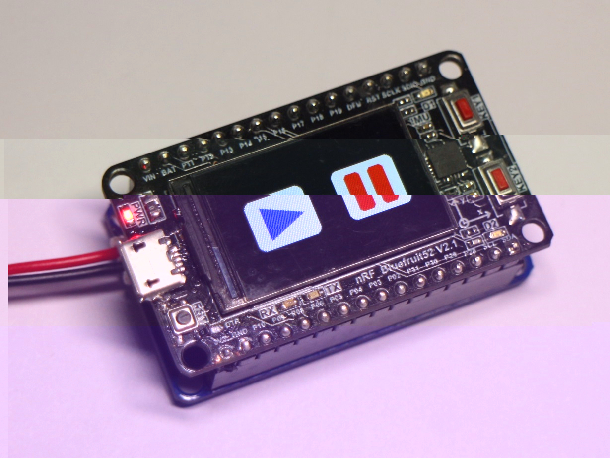

.. _nRF52832_quickref:

Quick reference for the nRF52832
=============================

The Afantor nRF52832 Bluefruit52 Development Board (image attribution: Afantor).

Below is a quick reference for nRF52832-based boards.  If it is your first time
working with this board it may be useful to get an overview of the microcontroller:

.. toctree::
   :maxdepth: 1

   general.rst
   tutorial/intro.rst

Installing MicroPython
----------------------

See the corresponding section of tutorial: :ref:`nrf52_intro`. It also includes
a troubleshooting subsection.

General board control
---------------------

The MicroPython REPL is on UART1 (GPIO0.06=TX, GPIO0.08=RX) at baudrate 115200.
Tab-completion is useful to find out what methods an object has.
Paste mode (ctrl-E) is useful to paste a large slab of Python code into
the REPL.

Machine
----------

.. py:module:: machine

The machine module contains specific functions related to the nRF52832 
hardware. Most functions in this module allow to achieve direct and 
unrestricted access to and control of hardware blocks on a system (like CPU, 
timers, buses, etc.). Used incorrectly, this can lead to malfunction, lockups, 
crashes of your board, and in extreme cases, hardware damage.

Functions

.. method:: machine.reset()

    Resets the device in a manner similar to pushing the external RESET button.

.. method:: machine.disable_irq()

    Disable interrupt requests. Returns the previous IRQ state which should be 
    considered an opaque value. This return value should be passed to the 
    :func:`machine.enable_irq()` function to restore interrupts to their 
    original state, before :func:`machine.disable_irq()` was called.

.. method:: machine.enable_irq()

    Re-enable interrupt requests. The *state* parameter should be the value 
    that was returned from the most recent call to the
    :func:`machine.disable_irq()` function.

.. method:: machine.deepsleep()

    in to deepsleep mode.

.. method:: machine.info()

    Return machine some information.

.. method:: machine.lightsleep()

    in to lightsleep mode.

.. method:: machine.reset_cause()

    Return machine reset cause countor.

.. method:: machine.sleep()

    in to lightsleep mode.

.. method:: machine.soft_reset()

    Resets the device in a manner similar to pushing the external RESET button.

The :mod:`machine` module::

    import machine

    machine.info()          # Return machine some information
    machine.enable_irq()    # Re-enable interrupt requests.
    machine.disable_irq()   # disable interrupt requests.
    machine.reset()         # Reset machine system
    machine.soft_reset()    # soft_reset machine system

Note that the temperature sensor in the nRF52832 will typically read higher than
ambient due to the IC getting warm while it runs.  This effect can be minimised
by reading the temperature sensor immediately after waking up from sleep.

Delay and timing
----------------

Use the :mod:`time <utime>` module::

    import time

    time.sleep_ms(500)      # sleep for 500 milliseconds
    time.sleep_us(10)       # sleep for 10 microseconds

Timers
------

Hardware timers are supported. Use the :ref:`machine.Timer <machine.Timer>` class
with timer ID of -1::

    from machine import Timer

    tim = Timer(4, callback=lambda t:print("tick"))
    tim.start()         #enable timer,start count.
    tim.time()          #return counter value(us)
    tim.period()        #return counter value(us)
    tim.stop()          #disable timer,stop count.
    tim.deinit()        #Free resources associated with the timer.

Constants

.. data:: Timer.ONESHOT
          Timer.PERIODIC

Pins and GPIO
-------------

Use the :ref:`machine.Pin <machine.Pin>` class::

    from machine import Pin

    p2 = Pin(2, Pin.OUT)    # create output pin on GPIO0.02
    p2.on()                 # set pin to "on" (high) level
    p2.off()                # set pin to "off" (low) level
    p2.value(1)             # set pin to on/high

    p3 = Pin(3, Pin.IN)     # create input pin on GPIO0.03
    print(p3.value())       # get value, 0 or 1

    p4 = Pin(4, Pin.IN, Pin.PULL_UP) # enable internal pull-up resistor
    p5 = Pin(5, Pin.OUT, value=1) # set pin high on creation

Constants

.. data:: Pin.IN
          Pin.OUT
          Pin.PULL_UP
          Pin.PULL_DOWN
          Pin.PULL_DISABLED
          Pin.IRQ_FALLING
          Pin.IRQ_RISING

Available Pins are from the following ranges (inclusive): 2-20, 23-31.
These correspond to the actual GPIO pin numbers of nRF52832 chip.  Note that many
end-user boards use their own adhoc pin numbering (marked e.g. D0, D1, ...).
For mapping between board logical pins and physical chip pins consult your board
documentation.

Notes:

* Pins 6 and 8 are REPL UART TX and RX respectively

* Pins 7, 16, 23, 24， and 27 are used for connecting the lcd screen driver,
  and are not recommended for other uses

* Pins 11 and 18 are used for connecting the button, and it have been pull up 10k to 3.3v

* Pins 17 and 19 are used for connecting the led.

LEDs (on board leds)
----------------------------

    nRF52832-Bluefruit52 board have two leds, connect to pin 17 and 19. Here are some function:

Use the ``board.LED`` class::
    import board
    led1 = board.LED(1)         #LED(1) connect pin17
    led2 = board.LED(2)         #LED(2) connect pin19
    led1.on()                   #LED(1) show on.
    led2.on()                   #LED(2) show on.
    led1.off()                  #LED(1) show off.
    led2.off()                  #LED(2) show off.
    led1.toggle()               #LED(1) toggle show.
    led2.toggle()               #LED(2) toggle show.

BUTTON (on board buttons)
----------------------------

    nRF52832-Bluefruit52 board have two buttons, connect to pin 11 and 18. Here are some function:

Use the ``board.BUTTON`` class::
    import board
    btn1 = board.BUTTON(1)      #BUTTON(1) connect pin18
    btn2 = board.BUTTON(2)      #BUTTON(2) connect pin11
    btn1.isPressed()            #check button is pressed, if pressed return True, else return False
    btn1.getPresses()           #get button pin level state. Default HIGH is 1, if button is pressed return 0.

example for button control led::
    import board
    led1 = board.LED(1)
    led2 = board.LED(2)
                         
    btn1 = board.BUTTON(1)
    btn2 = board.BUTTON(2)
                             
    while True:
        if btn1.isPressed():       #scan button 1
            led1.toggle()          #LED(1) toggle
                                        
        if btn2.isPressed():       #scan button 2
            led2.toggle()          #LED(2) toggle

PWM (pulse width modulation)
----------------------------

PWM can be enabled on all output-enabled pins. The base frequency can
range from 1Hz to 16MHz but there is a tradeoff; as the base frequency
*increases* the duty resolution *decreases*. 

PWM id optional is 0,1,2.

Use the ``machine.PWM`` class::

    from machine import Pin, PWM

    # create PWM object from id, pin, freq and set duty, period.
    # eg. use PWM(0) for P11 pin out, and set frequency is 1000Hz, duty is 90%.
    # if you want to change frequency, you need change 'freq' and 'period' parameter. freq_out = freq/period. 
    pwm0 = PWM(0,pin=Pin(11,Pin.OUT),freq=PWM.FREQ_16MHZ,duty=90,period=16000)     
    pwm0.init()             # start pwm out
    pwm0.freq(1000)         # nothing work
    pwm0.duty()             # nothing work
    pwm0.duty(200)          # nothing work
    pwm0.period()           # nothing work
    pwm0.deinit()           # turn off PWM on the pin,Free resources associated with the timer.

Constants

.. data:: PWM.FREQ_16MHZ
          PWM.FREQ_8MHZ
          PWM.FREQ_4MHZ
          PWM.FREQ_2MHZ
          PWM.FREQ_1MHZ
          PWM.FREQ_500KHZ
          PWM.FREQ_250KHZ
          PWM.FREQ_125KHZ
          PWM.MODE_LOW_HIGH
          PWM.MODE_HIGH_LOW

Available Pins are from the following ranges (inclusive): 2-5, 11-20, 25-31.

ADC (analog to digital conversion)
----------------------------------

On the nRF52832 ADC functionality is available 8 channels（0~7）. Note that, when
using the default configuration, input voltages on the ADC pin must be between
0.0v and 3.3v.  Attenuation must be applied in order to increase this usable voltage range.

Notes, Analog Pin:

* ADC(1)--->GPIO0.02
* ADC(2)--->GPIO0.03
* ADC(3)--->GPIO0.04
* ADC(4)--->GPIO0.05
* ADC(5)--->GPIO0.28
* ADC(6)--->GPIO0.29
* ADC(7)--->GPIO0.30

Use the :ref:`machine.ADC <machine.ADC>` class::

    from machine import ADC

    adc3 = ADC(3)                # create ADC object on ADC pin.(ADC(3)--->GPIO0.04)
    adc3.value()                 # read value, 0-255 across voltage range 0.0v - 3.3v

    ADC.battery_level()          # read battery value.

Software SPI bus
----------------

There are two SPI drivers. One is implemented in software (bit-banging)
and works on all pins, and is accessed via the :ref:`machine.SPI <machine.SPI>`
class::

    from machine import Pin, SPI

    # construct an SPI bus on the given pins
    # polarity is the idle state of SCK
    # phase=0 means sample on the first edge of SCK, phase=1 means the second
    spi = SPI(2,baudrate=100000, polarity=1, phase=0, sck=Pin(12), mosi=Pin(13), miso=Pin(14))

    spi.init(baudrate=200000) # set the baudrate

    spi.read(10)            # read 10 bytes on MISO
    spi.read(10, 0xff)      # read 10 bytes while outputing 0xff on MOSI

    buf = bytearray(50)     # create a buffer
    spi.readinto(buf)       # read into the given buffer (reads 50 bytes in this case)
    spi.readinto(buf, 0xff) # read into the given buffer and output 0xff on MOSI

    spi.write(b'12345')     # write 5 bytes on MOSI

    buf = bytearray(4)      # create a buffer
    spi.write_readinto(b'1234', buf) # write to MOSI and read from MISO into the buffer
    spi.write_readinto(buf, buf) # write buf to MOSI and read MISO back into buf

.. Warning::
   Currently *all* of ``sck``, ``mosi`` and ``miso`` *must* be specified when
   initialising Software SPI. 

Functions

.. method:: init(baudrate=1000000, bits=8, mode=0, sclk=pin12, mosi=pin13, miso=pin14)

    Initialize SPI communication with the specified parameters on the
    specified ``pins``. Note that for correct communication, the parameters
    have to be the same on both communicating devices.

    The ``baudrate`` defines the speed of communication.

    The ``bits`` defines the size of bytes being transmitted. Currently only
    ``bits=8`` is supported. However, this may change in the future.

    The ``mode`` determines the combination of clock polarity and phase
    according to the following convention, with polarity as the high order bit
    and phase as the low order bit:

    +----------+-----------------+--------------+
    | SPI Mode | Polarity (CPOL) | Phase (CPHA) |
    +==========+=================+==============+
    | 0        | 0               | 0            |
    +----------+-----------------+--------------+
    | 1        | 0               | 1            |
    +----------+-----------------+--------------+
    | 2        | 1               | 0            |
    +----------+-----------------+--------------+
    | 3        | 1               | 1            |
    +----------+-----------------+--------------+

    Polarity (aka CPOL) 0 means that the clock is at logic value 0 when idle
    and goes high (logic value 1) when active; polarity 1 means the clock is
    at logic value 1 when idle and goes low (logic value 0) when active. Phase
    (aka CPHA) 0 means that data is sampled on the leading edge of the clock,
    and 1 means on the trailing edge
    (viz. https://en.wikipedia.org/wiki/Signal_edge).

    The ``sclk``, ``mosi`` and ``miso`` arguments specify the pins to use for
    each type of signal.

.. method:: spi.read(nbytes)

   Read at most ``nbytes``. Returns what was read.

.. method:: spi.write(buffer)

   Write the ``buffer`` of bytes to the bus.

.. method:: spi.write_readinto(out, in)

   Write the ``out`` buffer to the bus and read any response into the ``in``
   buffer. The length of the buffers should be the same. The buffers can be
   the same object.

Hardware SPI bus
----------------

There is one hardware SPI channels that allow faster transmission rates, 
but are only supported on a subset of pins.

=====  ===========  
\      SPI (id=0)   
=====  ===========  
sck    12           
mosi   13           
miso   14           
=====  ===========  

Hardware SPI has the same methods as Software SPI above::

    from machine import Pin, SPI

    hspi = SPI(2, baudrate=10000000, polarity=0, phase=0, bits=8, firstbit=0,sck=Pin(12), mosi=Pin(13), miso=Pin(14))

I2C bus
-------

The I2C driver is implemented in software and works on all pins,
and is accessed via the :ref:`machine.I2C <machine.I2C>` class::

    from machine import Pin, I2C

    # construct an I2C bus
    i2c = I2C(0, scl=Pin(26), sda=Pin(25))

    i2c.scan()

    i2c.readfrom(0x3a, 4)   # read 4 bytes from slave device with address 0x3a
    i2c.writeto(0x3a, '12') # write '12' to slave device with address 0x3a

    buf = bytearray(10)     # create a buffer with 10 bytes
    i2c.writeto(0x3a, buf)  # write the given buffer to the slave

Connecting

You should connect the device's ``SCL`` pin to Bluefruit52 pin 26, and the
device's ``SDA`` pin to Bluefruit52 pin 25. You also must connect the device's
ground to the Bluefruit52 ground (pin ``GND``). You may need to power the device
using an external power supply or the Bluefruit52.

There are internal pull-up resistors on the I²C lines of the board, but with
particularly long wires or large number of devices you may need to add
additional pull-up resistors, to ensure noise-free communication.

Real time clock Counter (RTCounter)
---------------------

See :ref:`machine.RTCounter <machine.RTCounter>` ::

    from machine import RTCounter

    rtcount = RTCounter(2, callback=lambda t:print("tick"))
    # Start the RTCounter. Timeout occurs after number of periods
    # in the configured frequency has been reached.
    rtcount.start()
    # Return the current counter value. Wraps around after about 24 days
    # with the current prescaler (2^24 / 8 = 2097152 seconds).
    rtcount.counter()
    rtcount.stop()          # Stop the RTCounter.
    rtcount.deinit()        # Free resources associated with this RTC.

Constants

.. data:: RTCounter.ONESHOT
          RTCounter.PERIODIC
          RTCounter.FREQUENCY

Deep-sleep mode
---------------

The following code can be used to sleep, wake and check the reset cause::

    import machine

    # check if the device woke from a deep sleep
    if machine.reset_cause() == machine.DEEPSLEEP_RESET:
        print('woke from a deep sleep')

    # put the device to sleep
    machine.deepsleep()

Notes:

* Calling ``deepsleep()`` without an argument will put the device to sleep
  indefinitely
* A software reset does not change the reset cause

Temp
---------------

The following code can be used to read temperature from on-soc::

    import machine

    temp = machine.Temp()

    temp.read()         # Get temperature.

UART
---------------

.. py:module:: machine.UART

The ``UART`` module lets you talk to a device connected to your board using
a serial interface.

Functions

.. method:: UART(id=0,baudrate=115200)

    Initialize serial communication with the specified parameters on the
    specified ``tx`` and ``rx`` pins. Note that for correct communication, the parameters
    have to be the same on both communicating devices.

    .. warning::

        Initializing the UART on external pins will cause the Python console on
        USB to become unaccessible, as it uses the same hardware. To bring the
        console back you must reinitialize the UART without passing anything for
        ``tx`` or ``rx`` (or passing ``None`` to these arguments).  This means
        that calling ``uart.init(115200)`` is enough to restore the Python console.

    The ``baudrate`` defines the speed of communication. Common baud
    rates include:

        * 9600
        * 14400
        * 19200
        * 28800
        * 38400
        * 57600
        * 115200

    The ``bits`` defines the size of bytes being transmitted, and the board
    only supports 8. The ``parity`` parameter defines how parity is checked,
    and it can be ``None``, ``microbit.uart.ODD`` or ``microbit.uart.EVEN``.
    The ``stop`` parameter tells the number of stop bits, and has to be 1 for
    this board.

    If ``tx`` and ``rx`` are not specified then the internal USB-UART TX/RX pins
    are used which connect to the USB serial converter on the micro:bit, thus
    connecting the UART to your PC.  You can specify any other pins you want by
    passing the desired pin objects to the ``tx`` and ``rx`` parameters.

    .. note::

        When connecting the device, make sure you "cross" the wires -- the TX
        pin on your board needs to be connected with the RX pin on the device,
        and the RX pin -- with the TX pin on the device. Also make sure the
        ground pins of both devices are connected.

.. method:: uart.read([nbytes])

    Read bytes.  If ``nbytes`` is specified then read at most that many
    bytes, otherwise read as many bytes as possible.

    Return value: a bytes object or ``None`` on timeout.

    A bytes object contains a sequence of bytes. Because
    `ASCII <https://en.wikipedia.org/wiki/ASCII>`_ characters can fit in
    single bytes this type of object is often used to represent simple text
    and offers methods to manipulate it as such, e.g. you can display the text
    using the ``print()`` function.

    You can also convert this object into a string object, and if there are
    non-ASCII characters present the encoding can be specified::

        msg_bytes = uart.read()
        msg_str = str(msg, 'UTF-8')

    .. note::

        The timeout for all UART reads depends on the baudrate and is otherwise
        not changeable via Python. The timeout, in milliseconds, is given by:
        ``microbit_uart_timeout_char = 13000 / baudrate + 1``

    .. note::

        The internal UART RX buffer is 64 bytes, so make sure data is read
        before the buffer is full or some of the data might be lost.

    .. warning::

        Receiving ``0x03`` will stop your program by raising a Keyboard
        Interrupt. You can enable or disable this using
        :func:`micropython.kbd_intr()`.

.. method:: uart.readinto(buf[, nbytes])

   Read bytes into the ``buf``.  If ``nbytes`` is specified then read at most
   that many bytes.  Otherwise, read at most ``len(buf)`` bytes.

   Return value: number of bytes read and stored into ``buf`` or ``None`` on
   timeout.

.. method:: uart.readline()

   Read a line, ending in a newline character.

   Return value: the line read or ``None`` on timeout. The newline character is
   included in the returned bytes.

.. method:: uart.readchar()

   Read a char.

   Return value: the char read or ``None`` on timeout. 

.. method:: uart.writechar(buf)

    Write a ASCII char number to the bus::

        uart.writechar(31)  #write '!'

Music
---------------

.. py:module:: music

This is the ``music`` module. You can use it to play simple tunes, provided
that you connect a speaker to your board. By default the ``music`` module
expects the speaker to be connected via pin 30:

This arrangement can be overridden (as discussed below).

To access this module you need to::

    import music

We assume you have done this for the examples below.

Musical Notation

An individual note is specified thus::

    NOTE[octave][:duration]

For example, ``A1:4`` refers to the note "A" in octave 1 that lasts for four
ticks (a tick is an arbitrary length of time defined by a tempo setting
function - see below). If the note name ``R`` is used then it is treated as a
rest (silence).

Accidentals (flats and sharps) are denoted by the ``b`` (flat - a lower case b)
and ``#`` (sharp - a hash symbol). For example, ``Ab`` is A-flat and ``C#`` is
C-sharp.

**Note names are case-insensitive.**

The ``octave`` and ``duration`` parameters are states that carry over to
subsequent notes until re-specified. The default states are ``octave = 4``
(containing middle C) and ``duration = 4`` (a crotchet, given the default tempo
settings - see below).

For example, if 4 ticks is a crotchet, the following list is crotchet, quaver,
quaver, crotchet based arpeggio::

    ['c1:4', 'e:2', 'g', 'c2:4']

The opening of Beethoven's 5th Symphony would be encoded thus::

    ['r4:2', 'g', 'g', 'g', 'eb:8', 'r:2', 'f', 'f', 'f', 'd:8']

The definition and scope of an octave conforms to the table listed `on this
page about scientific pitch notation`_.  For example, middle "C" is ``'c4'`` and
concert "A" (440) is ``'a4'``. Octaves start on the note "C".

.. _on this page about scientific pitch notation: https://en.wikipedia.org/wiki/Scientific_pitch_notation#Table_of_note_frequencies

Functions

.. py:function:: set_tempo(ticks=4, bpm=120)

    Sets the approximate tempo for playback.

    A number of ticks (expressed as an integer) constitute a beat. Each beat is to be played at a certain frequency per minute (expressed as the more familiar BPM - beats per minute - also as an integer).

    Suggested default values allow the following useful behaviour:

    * ``music.set_tempo()`` - reset the tempo to default of ticks = 4, bpm = 120
    * ``music.set_tempo(ticks=8)`` - change the "definition" of a beat
    * ``music.set_tempo(bpm=180)`` - just change the tempo

    To work out the length of a tick in milliseconds is very simple arithmetic: ``60000/bpm/ticks_per_beat`` . For the default values that's ``60000/120/4 = 125 milliseconds`` or ``1 beat = 500 milliseconds``.

.. py:function:: get_tempo()

    Gets the current tempo as a tuple of integers: ``(ticks, bpm)``.

.. py:function:: play(music, pin=microbit.pin0, wait=True, loop=False)

    Plays ``music`` containing the musical DSL defined above.

    If ``music`` is a string it is expected to be a single note such as,
    ``'c1:4'``.

    If ``music`` is specified as a list of notes (as defined in the section on
    the musical DSL, above) then they are played one after the other to perform
    a melody.

    In both cases, the ``duration`` and ``octave`` values are reset to
    their defaults before the music (whatever it may be) is played.

    An optional argument to specify the output pin can be used to override the
    default of ``microbit.pin0``.

    If ``wait`` is set to ``True``, this function is blocking.

    If ``loop`` is set to ``True``, the tune repeats until ``stop`` is called
    (see below) or the blocking call is interrupted.

.. py:function:: pitch(frequency, duration=-1, pin=microbit.pin0, wait=True)

    Plays a pitch at the integer frequency given for the specified number of
    milliseconds. For example, if the frequency is set to 440 and the length to
    1000 then we hear a standard concert A for one second.

    Note that you can only play one pitch on one pin at any one time.

    If ``wait`` is set to ``True``, this function is blocking.

    If ``duration`` is negative the pitch is played continuously until either the
    blocking call is interrupted or, in the case of a background call, a new
    frequency is set or ``stop`` is called (see below).

.. py:function:: stop(pin=microbit.pin0)
    
    Stops all music playback on a given pin, eg. ``music.stop(pin1)``. 
    If no pin is given, eg. ``music.stop()`` pin0 is assumed.

.. py:function:: reset()

    Resets the state of the following attributes in the following way:

        * ``ticks = 4``
        * ``bpm = 120``
        * ``duration = 4``
        * ``octave = 4``

Built in Melodies

For the purposes of education and entertainment, the module contains several
example tunes that are expressed as Python lists. They can be used like this::

    >>> import music
    >>> music.play(music.NYAN)

All the tunes are either out of copyright, composed by Nicholas H.Tollervey and
released to the public domain or have an unknown composer and are covered by a
fair (educational) use provision.

They are:

    * ``DADADADUM`` - the opening to Beethoven's 5th Symphony in C minor.
    * ``ENTERTAINER`` - the opening fragment of Scott Joplin's Ragtime classic "The Entertainer".
    * ``PRELUDE`` - the opening of the first Prelude in C Major of J.S.Bach's 48 Preludes and Fugues.
    * ``ODE`` - the "Ode to Joy" theme from Beethoven's 9th Symphony in D minor.
    * ``NYAN`` - the Nyan Cat theme (http://www.nyan.cat/). The composer is unknown. This is fair use for educational porpoises (as they say in New York).
    * ``RINGTONE`` - something that sounds like a mobile phone ringtone. To be used to indicate an incoming message.
    * ``FUNK`` - a funky bass line for secret agents and criminal masterminds.
    * ``BLUES`` - a boogie-woogie 12-bar blues walking bass.
    * ``BIRTHDAY`` - "Happy Birthday to You..." for copyright status see: http://www.bbc.co.uk/news/world-us-canada-34332853
    * ``WEDDING`` - the bridal chorus from Wagner's opera "Lohengrin".
    * ``FUNERAL`` - the "funeral march" otherwise known as Frédéric Chopin's Piano Sonata No. 2 in B♭ minor, Op. 35.
    * ``PUNCHLINE`` - a fun fragment that signifies a joke has been made.
    * ``PYTHON`` - John Philip Sousa's march "Liberty Bell" aka, the theme for "Monty Python's Flying Circus" (after which the Python programming language is named).
    * ``BADDY`` - silent movie era entrance of a baddy.
    * ``CHASE`` - silent movie era chase scene.
    * ``BA_DING`` - a short signal to indicate something has happened.
    * ``WAWAWAWAA`` - a very sad trombone.
    * ``JUMP_UP`` - for use in a game, indicating upward movement.
    * ``JUMP_DOWN`` - for use in a game, indicating downward movement.
    * ``POWER_UP`` - a fanfare to indicate an achievement unlocked.
    * ``POWER_DOWN`` - a sad fanfare to indicate an achievement lost.

See the MicroPython forum for other community-supported alternatives
to transfer files to an nRF52832 board.

ble
---------------

.. py:module:: ble

The ble module contains specific functions related to the nRF52832 bluetooth
hardware. Used incorrectly, this can lead to malfunction, lockups, 
crashes of your board, and in extreme cases, hardware damage.

Functions

.. method:: ble.enable()

    Enable BLE softdevice.

.. method:: ble.disable()

    Disable BLE softdevice.

.. method:: ble.enabled()

    Get state of whether the softdevice is enabled or not.

.. method:: ble.address()

    Return device address as text string.

Example
---------------

.. method:: mountsd.py

    Example for nrf52832 to show how mount and list a sdcard connected over SPI::

        """
        Example for pca10040 / nrf52832 to show how mount and list a sdcard connected over SPI.

        Direct wireing on SD card (SPI):
         ______________________________
        |                              \
        |             9.      | NC    | \
        |             1.      | ~CS   | |
        |             2.      | MOSI  | |
        |             3.      | GND   | |
        |             4.      | VCC3.3| |
        |             5.      | SCK   | |
        |             6.      | GND   | |
        |             7.      | MISO  | |
        |             8.      | NC    | |
        |                               |
        ---------------------------------
        """

        import os
        from machine import SPI, Pin
        from sdcard import SDCard

        def mnt():
            cs = Pin("P11", mode=Pin.OUT)
            sd = SDCard(SPI(0), cs)
            os.mount(sd, '/')

        def list():
            files = os.listdir()
            print(files)

.. method:: musictest.py

    Example for nrf52832 to usage where "P3" is the Buzzer pin::

        """
        Example usage where "P3" is the Buzzer pin.

        from musictest import play
        play("P3")

        """

        from machine import Pin
        import music

        def play(pin_str):
            p = Pin(pin_str, mode=Pin.OUT)
            music.play(music.PRELUDE, pin=p)

.. method:: nrf52_pwm.py

    Example for nrf52832 to out pwm::

        import time
        from machine import PWM, Pin

        def pulse():
            for i in range(0, 101):
                p = PWM(0, Pin("P17", mode=Pin.OUT), freq=PWM.FREQ_16MHZ, duty=i, period=16000)
                p.init()
                time.sleep_ms(10)
                p.deinit()

            for i in range(0, 101):
                p = PWM(0, Pin("P17", mode=Pin.OUT), freq=PWM.FREQ_16MHZ, duty=100-i, period=16000)
                p.init()
                time.sleep_ms(10)
                p.deinit()

.. method:: nrf52_servo.py

    Example for nrf52832 to driver servo::

        import time
        from machine import PWM, Pin

        class Servo():
            def __init__(self, pin_name=""):
                if pin_name:
                    self.pin = Pin(pin_name, mode=Pin.OUT, pull=Pin.PULL_DOWN)
                else:
                    self.pin = Pin("P17", mode=Pin.OUT, pull=Pin.PULL_DOWN)
            def left(self):
                p = PWM(0, self.pin, freq=PWM.FREQ_125KHZ, pulse_width=105, period=2500, mode=PWM.MODE_HIGH_LOW)
                p.init()
                time.sleep_ms(200)
                p.deinit()
        
            def center(self):
                p = PWM(0, self.pin, freq=PWM.FREQ_125KHZ, pulse_width=188, period=2500, mode=PWM.MODE_HIGH_LOW)
                p.init()
                time.sleep_ms(200)
                p.deinit()
        
            def right(self):
                p = PWM(0, self.pin, freq=PWM.FREQ_125KHZ, pulse_width=275, period=2500, mode=PWM.MODE_HIGH_LOW)
                p.init()
                time.sleep_ms(200)
                p.deinit()

.. method:: powerup.py

    Examples is written for nrf52832, pca10040 using s132 bluetooth stack::

        # MicroPython controller for PowerUp 3.0 paper airplane
        # https://www.poweruptoys.com/products/powerup-v3
        #
        # Examples is written for nrf52832, pca10040 using s132 bluetooth stack.
        #
        # Joystick shield pin mapping:
        #  - analog stick x-direction - ADC0 - P0.02/"P2"
        #  - buttons P0.13 - P0.16 / "P13", "P14", "P15", "P16"
        #
        # Example usage:
        #
        #     from powerup import PowerUp3
        #     p = PowerUp3()

        import time
        from machine import ADC
        from machine import Pin
        from ubluepy import Peripheral, Scanner, constants

        def bytes_to_str(bytes):
            string = ""
            for b in bytes:
                string += chr(b)
            return string

        def get_device_names(scan_entries):
            dev_names = []
            for e in scan_entries:
                scan = e.getScanData()
                if scan:
                    for s in scan:
                        if s[0] == constants.ad_types.AD_TYPE_COMPLETE_LOCAL_NAME:
                            dev_names.append((e, bytes_to_str(s[2])))
            return dev_names

        def find_device_by_name(name):
            s = Scanner()
            scan_res = s.scan(500)

            device_names = get_device_names(scan_res)
            for dev in device_names:
                if name == dev[1]:
                    return dev[0]

        class PowerUp3:
            def __init__(self):
                self.x_adc = ADC(1)

                self.btn_speed_up = Pin("P13", mode=Pin.IN, pull=Pin.PULL_UP)
                self.btn_speed_down = Pin("P15", mode=Pin.IN, pull=Pin.PULL_UP)
                self.btn_speed_full = Pin("P14", mode=Pin.IN, pull=Pin.PULL_UP)
                self.btn_speed_off = Pin("P16", mode=Pin.IN, pull=Pin.PULL_UP)

                self.x_mid = 0

                self.calibrate()
                self.connect()
                self.loop()

            def read_stick_x(self):
                return self.x_adc.value()

            def button_speed_up(self):
                return not bool(self.btn_speed_up.value())

            def button_speed_down(self):
                return not bool(self.btn_speed_down.value())

            def button_speed_full(self):
                return not bool(self.btn_speed_full.value())

            def button_speed_off(self):
                return not bool(self.btn_speed_off.value())

            def calibrate(self):
                self.x_mid = self.read_stick_x()

            def __str__(self):
                return "calibration x: %i, y: %i" % (self.x_mid)

            def map_chars(self):
                s = self.p.getServices()

                service_batt = s[3]
                service_control = s[4]

                self.char_batt_lvl = service_batt.getCharacteristics()[0]
                self.char_control_speed = service_control.getCharacteristics()[0]
                self.char_control_angle = service_control.getCharacteristics()[2]

            def battery_level(self):
                return int(self.char_batt_lvl.read()[0])

            def speed(self, new_speed=None):
                if new_speed == None:
                    return int(self.char_control_speed.read()[0])
                else:
                    self.char_control_speed.write(bytearray([new_speed]))

            def angle(self, new_angle=None):
                if new_angle == None:
                    return int(self.char_control_angle.read()[0])
                else:
                    self.char_control_angle.write(bytearray([new_angle]))

            def connect(self):
                dev = None

                # connect to the airplane
                while not dev:
                    dev = find_device_by_name("TailorToys PowerUp")
                    if dev:
                        self.p = Peripheral()
                        self.p.connect(dev.addr())

                # locate interesting characteristics
                self.map_chars()

            def rudder_center(self):
                if self.old_angle != 0:
                    self.old_angle = 0
                    self.angle(0)

            def rudder_left(self, angle):
                steps = (angle // self.interval_size_left)
                new_angle = 60 - steps

                if self.old_angle != new_angle:
                    self.angle(new_angle)
                    self.old_angle = new_angle

            def rudder_right(self, angle):
                steps = (angle // self.interval_size_right)
                new_angle = -steps

                if self.old_angle != new_angle:
                    self.angle(new_angle)
                    self.old_angle = new_angle

            def throttle(self, speed):
                if (speed > 200):
                    speed = 200
                elif (speed < 0):
                    speed = 0

                if self.old_speed != speed:
                    self.speed(speed)
                    self.old_speed = speed

            def loop(self):
                adc_threshold = 10
                right_threshold = self.x_mid + adc_threshold
                left_threshold = self.x_mid - adc_threshold

                self.interval_size_left = self.x_mid // 60
                self.interval_size_right = (255 - self.x_mid) // 60

                self.old_angle = 0
                self.old_speed = 0

                while True:

                    time.sleep_ms(100)

                    # read out new angle
                    new_angle = self.read_stick_x()
                    if (new_angle < 256):
                        if (new_angle > right_threshold):
                            self.rudder_right(new_angle - self.x_mid)
                        elif (new_angle < left_threshold):
                            self.rudder_left(new_angle)
                        else:
                            self.rudder_center()

                    # read out new speed
                        new_speed = self.old_speed

                    if self.button_speed_up():
                        new_speed += 25
                    elif self.button_speed_down():
                        new_speed -= 25
                    elif self.button_speed_full():
                        new_speed = 200
                    elif self.button_speed_off():
                        new_speed = 0
                    else:
                        pass

                    self.throttle(new_speed)

                    p = PWM(0, self.pin, freq=PWM.FREQ_125KHZ, pulse_width=275, period=2500, mode=PWM.MODE_HIGH_LOW)
                    p.init()
                    time.sleep_ms(200)
                    p.deinit()

.. method:: ssd1306_oled.py

    Examples is written for nrf52832 driver ssd1306 oled displayer::

        # NOTE: Modified version to align with implemented I2C API in nrf port.
        #
        # Examples usage of SSD1306_SPI on pca10040
        #
        # from machine import Pin, SPI
        # from ssd1306 import SSD1306_SPI
        # spi = SPI(0, baudrate=40000000)
        # dc = Pin.board.PA11
        # res = Pin.board.PA12
        # cs = Pin.board.PA13
        # disp = SSD1306_SPI(128, 64, spi, dc, res, cs)
        #
        #
        # Example usage of SSD1306_I2C on pca10040
        #
        # from machine import Pin, I2C
        # from ssd1306_mod import SSD1306_I2C_Mod
        # i2c = I2C(0, Pin(26), Pin(25))
        # disp = SSD1306_I2C_Mod(128, 64, i2c)

        from ssd1306 import SSD1306_I2C

        SET_COL_ADDR        = const(0x21)
        SET_PAGE_ADDR       = const(0x22)

        class SSD1306_I2C_Mod(SSD1306_I2C):

            def show(self):
                x0 = 0
                x1 = self.width - 1
                if self.width == 64:
                    # displays with width of 64 pixels are shifted by 32
                    x0 += 32
                    x1 += 32
                self.write_cmd(SET_COL_ADDR)
                self.write_cmd(x0)
                self.write_cmd(x1)
                self.write_cmd(SET_PAGE_ADDR)
                self.write_cmd(0)
                self.write_cmd(self.pages - 1)

                chunk_size = 254 # 255, excluding opcode.
                num_of_chunks = len(self.buffer) // chunk_size
                leftover = len(self.buffer) - (num_of_chunks * chunk_size)

                for i in range(0, num_of_chunks):
                    self.write_data(self.buffer[chunk_size*i:chunk_size*(i+1)])
                if (leftover > 0):
                    self.write_data(self.buffer[chunk_size * num_of_chunks:])

            def write_data(self, buf):
                buffer = bytearray([0x40]) + buf # Co=0, D/C#=1
                self.i2c.writeto(self.addr, buffer)

.. method:: ubluepy_eddystone.py

    Examples is written for nrf52832 ubluepy module API example::

        from ubluepy import Peripheral, constants

        BLE_GAP_ADV_FLAG_LE_GENERAL_DISC_MODE       = const(0x02)
        BLE_GAP_ADV_FLAG_BR_EDR_NOT_SUPPORTED       = const(0x04)

        BLE_GAP_ADV_FLAGS_LE_ONLY_GENERAL_DISC_MODE = const(BLE_GAP_ADV_FLAG_LE_GENERAL_DISC_MODE | BLE_GAP_ADV_FLAG_BR_EDR_NOT_SUPPORTED)

        EDDYSTONE_FRAME_TYPE_URL                    = const(0x10)
        EDDYSTONE_URL_PREFIX_HTTP_WWW               = const(0x00) # "http://www".
        EDDYSTONE_URL_SUFFIX_DOT_COM                = const(0x01) # ".com"

        def string_to_binarray(text):
            b = bytearray([])
            for c in text:
                b.append(ord(c))
            return b

        def gen_ad_type_content(ad_type, data):
            b = bytearray(1)
            b.append(ad_type)
            b.extend(data)
            b[0] = len(b) - 1
            return b

        def generate_eddystone_adv_packet(url):
            # flags
            disc_mode = bytearray([BLE_GAP_ADV_FLAGS_LE_ONLY_GENERAL_DISC_MODE])
            packet_flags = gen_ad_type_content(constants.ad_types.AD_TYPE_FLAGS, disc_mode)

            # 16-bit uuid
            uuid = bytearray([0xAA, 0xFE])
            packet_uuid16 = gen_ad_type_content(constants.ad_types.AD_TYPE_16BIT_SERVICE_UUID_COMPLETE, uuid)

            # eddystone data
            rssi = 0xEE # -18 dB, approx signal strength at 0m.
            eddystone_data = bytearray([])
            eddystone_data.append(EDDYSTONE_FRAME_TYPE_URL)
            eddystone_data.append(rssi)
            eddystone_data.append(EDDYSTONE_URL_PREFIX_HTTP_WWW)
            eddystone_data.extend(string_to_binarray(url))
            eddystone_data.append(EDDYSTONE_URL_SUFFIX_DOT_COM)

            # service data
            service_data = uuid + eddystone_data
            packet_service_data = gen_ad_type_content(constants.ad_types.AD_TYPE_SERVICE_DATA, service_data)

            # generate advertisment packet
            packet = bytearray([])
            packet.extend(packet_flags)
            packet.extend(packet_uuid16)
            packet.extend(packet_service_data)

            return packet

        def start():
            adv_packet = generate_eddystone_adv_packet("micropython")  
            p = Peripheral()
            p.advertise(data=adv_packet, connectable=False)

.. method:: ubluepy_eddystone.py

    Examples is written for nrf52832 ubluepy module scan example::

        from ubluepy import Scanner, constants

        def bytes_to_str(bytes):
            string = ""
            for b in bytes:
                string += chr(b)
            return string

        def get_device_names(scan_entries):
            dev_names = []
            for e in scan_entries:
                scan = e.getScanData()
                if scan:
                    for s in scan:
                        if s[0] == constants.ad_types.AD_TYPE_COMPLETE_LOCAL_NAME:
                            dev_names.append((e, bytes_to_str(s[2])))
            return dev_names

        def find_device_by_name(name):
            s = Scanner()
            scan_res = s.scan(100)
    
            device_names = get_device_names(scan_res)
            for dev in device_names:
                if name == dev[1]:
                    return dev[0]

        # >>> res = find_device_by_name("micr")
        # >>> if res:
        # ...     print("address:", res.addr())
        # ...     print("address type:", res.addr_type())
        # ...     print("rssi:", res.rssi())
        # ...     
        # ...     
        # ... 
        # address: c2:73:61:89:24:45
        # address type: 1
        # rssi: -26

.. method:: ubluepy_eddystone.py

    Examples is written for nrf52832 ubluepy module temp example::

        from board import LED
        from machine import RTCounter, Temp
        from ubluepy import Service, Characteristic, UUID, Peripheral, constants

        def event_handler(id, handle, data):
            global rtc
            global periph
            global serv_env_sense
            global notif_enabled
 
            if id == constants.EVT_GAP_CONNECTED:
                # indicated 'connected'
                LED(1).on()

            elif id == constants.EVT_GAP_DISCONNECTED:
                # stop low power timer
                rtc.stop()
                # indicate 'disconnected'
                LED(1).off()
                # restart advertisment
                periph.advertise(device_name="micr_temp", services=[serv_env_sense])

            elif id == constants.EVT_GATTS_WRITE:
                # write to this Characteristic is to CCCD
                if int(data[0]) == 1:
                    notif_enabled = True
                    # start low power timer
                    rtc.start()
                else: 
                    notif_enabled = False
                    # stop low power timer
                    rtc.stop()

        def send_temp(timer_id):
            global notif_enabled
            global char_temp

            if notif_enabled:
                # measure chip temperature
                temp = Temp.read()
                temp =  temp * 100
                char_temp.write(bytearray([temp & 0xFF, temp >> 8]))

        # start off with LED(1) off
        LED(1).off()

        # use RTC1 as RTC0 is used by bluetooth stack 
        # set up RTC callback every 5 second
        rtc = RTCounter(1, period=50, mode=RTCounter.PERIODIC, callback=send_temp)

        notif_enabled = False

        uuid_env_sense = UUID("0x181A") # Environmental Sensing service
        uuid_temp = UUID("0x2A6E") # Temperature characteristic
 
        serv_env_sense = Service(uuid_env_sense)

        temp_props = Characteristic.PROP_NOTIFY | Characteristic.PROP_READ
        temp_attrs = Characteristic.ATTR_CCCD
        char_temp = Characteristic(uuid_temp, props = temp_props, attrs = temp_attrs)

        serv_env_sense.addCharacteristic(char_temp)

        periph = Peripheral()
        periph.addService(serv_env_sense)
        periph.setConnectionHandler(event_handler)
        periph.advertise(device_name="micr_temp", services=[serv_env_sense])

