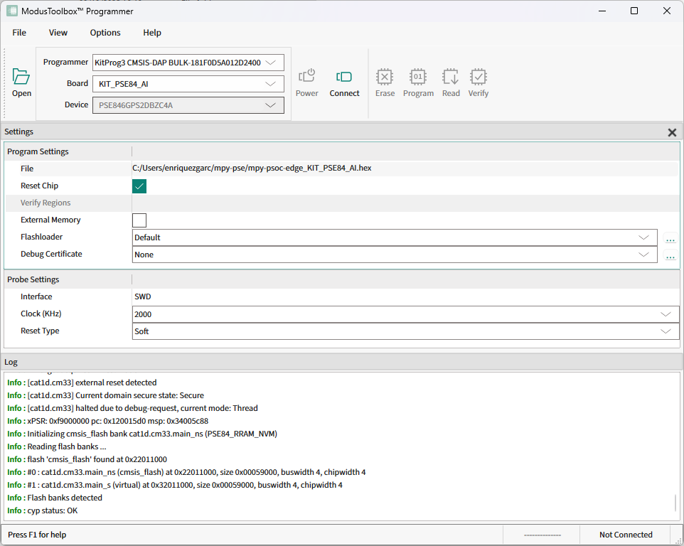

.. _pse_mpy_install:

Installing MicroPython 
======================

To facilitate the installation of the MicroPython PSOC™ Edge port, the ``mpy-pse.py`` Python script is provided. It is compatible with Windows,
Linux and MacOS.

Before downloading and running the script, it is recommended to create a new folder to keep all the related files together.
For example:

.. code-block:: bash
    
    $ mkdir mp-install
    $ cd mp-install

You can easily download the script from the terminal using the following command:

.. code-block:: bash
    
    $ curl -s -L https://raw.githubusercontent.com/infineon/micropython-psoc-edge/psoc-edge-main/tools/psoc-edge/mpy-pse.py > mpy-pse.py

Ensure you have a recent version of `Python3.x <https://www.python.org/downloads/>`_  installed and the `pip <https://pip.pypa.io/en/stable/installation/>`_ package installer.
Then install the following packages:

.. code-block:: bash                

    $ pip install requests

Find all available commands and options by running the script with the following command:

.. code-block:: bash
    
    $ python mpy-pse.py --help

.. _pse_device_setup:

Device setup
-------------

In order to setup MicroPython in a PSOC™ Edge board, the ``device-setup`` command of the ``mpy-pse.py``
utility can be executed. Follow the instructions to select the target PSOC™ Edge board, and deploy the latest
MicroPython firmware version:

.. code-block:: bash
    
    $ python mpy-pse.py device-setup

You can run this command whenever you want to upgrade to the latest MicroPython firmware version.
This command will take care of the following steps:

* Download and install openocd, which is the software required to deploy a firmware file on PSOC™ Edge controllers
* Download the latest ``.hex`` file for your selected board
* Deploy the latest version of MicroPython firmware on your board

Install a specific version
^^^^^^^^^^^^^^^^^^^^^^^^^^^

If you want to setup the device with a specific firmware version, you can check the list of available releases in the `GitHub release section <https://github.com/infineon/micropython-psoc-edge/releases>`_. 

The ``device-setup`` command can also assist you with this process. In this case, the board and the desired
version needs to be passed as arguments.

.. code-block:: bash
    
    $ python mpy-pse.py device-setup -b KIT_PSE84_AI -v v0.1.0

.. warning::
    
    Be sure to provide the board name as shown in the ``device-setup`` command when running in interactive mode.
    Also, provide a valid tag that exists in the release section, in the format *vx.y.z*.
    No fail-safe mechanisms or error verifications are (yet) implemented on the ``mpy-pse.py`` utility, and the script will fail to retrieve the necessary firmware file.

Direct binary deployment
^^^^^^^^^^^^^^^^^^^^^^^^^

Another way to program the board is by directly providing the binary file. This can be also done using the ``device-setup`` command.
Specify the board and the path and name of the ``.hex`` file using the ``-f`` flag as shown below:

.. code-block:: bash
    
    $ python mpy-pse.py firmware-deploy -b KIT_PSE84_AI -f pathtodir/mpy-psoc-edge_KIT_PSE84_AI.hex

Multiple devices deployment
^^^^^^^^^^^^^^^^^^^^^^^^^^^^

If you have multiple PSOC™ Edge boards connected to your computer, you can distinguish them by their serial number, and flash them one by one.
To do so, use the ``-n`` flag to provide the serial number of the target board as shown below:

.. code-block:: bash
    
    $ python mpy-pse.py device-setup -b KIT_PSE84_AI -n 181F0D5A01212300

Alternatively, you can deploy a firmware file to all connected boards if you have a device YAML file following the `etdevs <https://pypi.org/project/etdevs/>`_ specification.

.. note::

    This option is only supported on **Linux** and **MacOS** systems. etdevs is not currently enabled for Windows.

First, ensure that the etdevs package is installed:

.. code-block:: bash
    
    $ pip install etdevs

Then, create a YAML file (e.g., *devs.yaml*) with the board ``name`` and the ``uid`` (debugger serial number) for all the connected available boards:

.. code-block:: yaml

  - name: KIT_PSE84_AI
    uid: 181F0D5A01212300

  - name: KIT_PSE84_AI
    uid: 181F0D5A01212400
  
    ...
      

Finally, run the ``device-setup`` command providing the YAML file with the ``-d`` flag:

.. code-block:: bash
    
    $ python mpy-pse.py device-setup -b KIT_PSE84_AI -d devs.yml

Getting the firmware
^^^^^^^^^^^^^^^^^^^^

The binary *.hex* files are available in the `GitHub release section <https://github.com/infineon/micropython-psoc-edge/releases>`_. 
All PSOC™ Edge firmware versions for each of the supported boards can be found there. 

    .. image:: img/gh-releases.png
        :alt: GitHub MicroPython PSOC Edge Releases
        :width: 520px

Other installation methods
--------------------------

Cypress Programmer
^^^^^^^^^^^^^^^^^^

Alternatively, you can directly flash the firmware binary file with the `ModusToolbox™ Programming Tools
<https://softwaretools.infineon.com/tools/com.ifx.tb.tool.modustoolboxprogtools>`_ (minimum version required is 1.6.0).

It allows you to program the PSOC™ Edge microcontroller family with just a few clicks from your Windows, Linux, or MacOS machine.
Follow the instructions at the provided link to download and install the tool.

After that, select the downloaded MicroPython firmware *.hex* file to be deployed on the PSOC™ Edge. Then, in
the upper menu, select the connected *Board*, click on *Connect*, and finally click on *Program*.
The log section will show the progress and notify you when the firmware deployment on the controller is completed.

For a detailed description on how to use the ModusToolbox™ Programmer tool, please consult the `ModusToolbox™ Programmer User Guide
<https://www.infineon.com/assets/row/public/documents/30/44/infineon-modustoolbox-gui-user-guide-usermanual-en.pdf?fileId=8ac78c8c7fb5929e017ff76ada40103c>`_.

