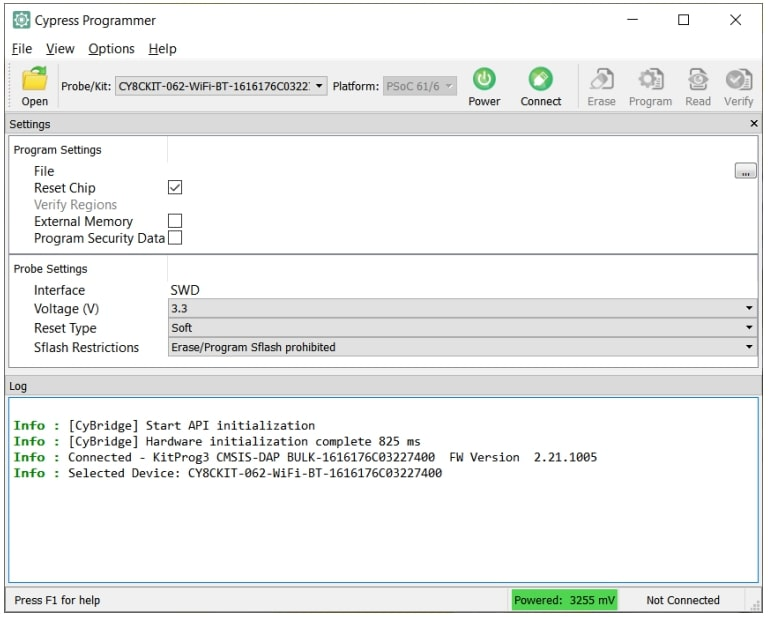

.. _psoc6_mpy_install:

Installing MicroPython 
======================

To support the MicroPython PSoC6™ port installation the ``mpy-psoc6`` utility script is provided for Windows and
Linux. Additionally, a python script is available also cross-platform for Linux and Windows.

.. warning::
    
    The plan is to replace the native bash and cmd line scripts for Linux and Windows by executable programs generated for each OS (including MacOS) from the python script in future releases.
    New features in the installation utility will be only added to the executable and python script versions, as the native OS scripts will be deprecated in the future.

You can easily download them terminal with the following command:

.. tabs::

    .. group-tab:: Linux

        Download the mpy-psoc6 utility script:

        .. code-block:: bash

            curl -s -L https://raw.githubusercontent.com/infineon/micropython/ports-psoc6-main/tools/psoc6/mpy-psoc6.sh > mpy-psoc6.sh 

        Add execution rights to the script:       
        
        .. code-block:: bash                
           
            chmod +x mpy-psoc6.sh 

    .. group-tab:: Windows
    
        Download the mpy-psoc6 utility script:

            .. code-block:: bash

                curl.exe -s -L https://raw.githubusercontent.com/infineon/micropython/ports-psoc6-main/tools/psoc6/mpy-psoc6.cmd > mpy-psoc6.cmd

    .. group-tab:: Python
            
            Download the mpy-psoc6 utility script:

            .. code-block:: bash
                
                curl.exe -s -L https://raw.githubusercontent.com/infineon/micropython/ports-psoc6-main/tools/psoc6/mpy-psoc6.py > mpy-psoc6.py

            Make sure you have a recent version on `Python3.x <https://www.python.org/downloads/>`_  installed and the `pip <https://pip.pypa.io/en/stable/installation/>`_ package installer.
            Then install the following packages:

            .. code-block:: bash                
           
                pip install requests

Find all the available commands and options by running the script with the command help:

.. tabs::

    .. group-tab:: Linux

        .. code-block:: bash

            ./mpy-psoc6.sh help

    .. group-tab:: Windows

            .. code-block:: bash
            
                .\mpy-psoc6.cmd help

    .. group-tab:: Python

            .. code-block:: bash
                
                python mpy-psoc6.py --help

.. _psoc6_quick_start:

Quick Start
------------

With the ``mpy-psoc6`` utility script downloaded, the fastest way to get you up and running with
micropython is to run the ``quick-start`` command of the script:

.. tabs::

    .. group-tab:: Linux
        
            .. code-block:: bash

                ./mpy-psoc6.sh quick-start

    .. group-tab:: Windows

            .. code-block:: bash
                
                .\mpy-psoc6.cmd quick-start

    .. group-tab:: Python

            .. code-block:: bash
                
                python mpy-psoc6.py quick-start

The command will take care of the following:

* Install all required software to work with MicroPython
* Deploy the latest version of MicroPython PSoC6 firmware on your board
* Launch Arduino Lab MicroPython IDE

This command is supporting the getting started tutorial for the first time. Once you get familiar
with MicroPython and its environment, the ``device-setup`` command will be more appropriate to
install MicroPython on PSoC6™ boards, and upgrade your device with the latest firmware. 

Device setup
-------------

In order to setup MicroPython in a PSoC6™ board, the ``device-setup`` command of the ``mpy-psoc6``
can be executed. Follow the instructions to select the target PSoC6™ board, and deploy the latest
MicropPython firmware version:

.. tabs::

    .. group-tab:: Linux
        
            .. code-block:: bash

                ./mpy-psoc6.sh device-setup

    .. group-tab:: Windows

            .. code-block:: bash
                
                .\mpy-psoc6.cmd device-setup

    .. group-tab:: Python

            .. code-block:: bash
                
                python mpy-psoc6.py device-setup

You can run any command any time you want to upgrade to the latest MicroPython firmware version.
This command will take care of the following steps:

* Download and install fw-loader, which will be used to update the board flasher firmware.
* Download and install openocd, which is the software required to deploy a firmware file on PSoC6™ controllers
* Download the latest ``.hex`` file for your select board
* Deploy the latest version of MicroPython firmware on your board

Install a previous version
^^^^^^^^^^^^^^^^^^^^^^^^^^^

If you want to setup the device with a previous firmware version, you can check the list of available release in the `GitHub release section <https://github.com/infineon/MicroPython/releases>`_. 

The ``device-setup`` command can as well assist you with this process. In this case the board and the desired
version need to be passed as arguments.

.. tabs::

    .. group-tab:: Linux
        
            .. code-block:: bash

                ./mpy-psoc6.sh device-setup CY8CPROTO-062-4343W v0.1.1

    .. group-tab:: Windows

            .. code-block:: bash
                
                .\mpy-psoc6.cmd device-setup CY8CPROTO-062-4343W v0.1.1

    .. group-tab:: Python

            .. code-block:: bash
                
                python mpy-psoc6.py device-setup -b CY8CPROTO-062-4343W -v v0.1.1

.. warning::
    
    Be sure to provide the board name as shown in the ``device-setup`` command when run in interactive mode.
    Equally, provide a valid tag existing in the release section with the format *v.x.y.z*. 
    No fail safe mechanisms or error verifications are (yet) implemented on the ``mpy-psoc6`` utility, and the script will fail to retrieve the necessary firmware file.

Updating the flasher firmware
^^^^^^^^^^^^^^^^^^^^^^^^^^^^^

The evaluation PSoC6™ boards include an integrated hardware programmer tool using `KitProg <https://www.infineon.com/cms/en/design-support/tools/programming-testing/psoc-programming-solutions/#collapse-703c72c0-50f2-11ec-9758-005056945905-3>`_ firmware. 
Some older boards will come preflashed with KitProg version 2. In MicroPython PSoC6™ port it is required to use KitProg version 3, and the setup process will fail for version 2.

By default, the device setup automatically updates the flasher firmware, ensuring compatibility with the rest of the flashing tools.
If you want to skip the KitProg firmware update step, you can use the flag ``-s`` or ``--skip-fw-update`` during the ``device-setup`` process. 

.. tabs::

    .. group-tab:: Python

            .. code-block:: bash
                
                python mpy-psoc6.py device-setup -s

        
.. warning::
    
    This option is only available in the python script utility.     

Direct binary flashing
----------------------

Another alternative to program the board is to directly provide the binary file. The ``firmware-deploy`` command is enabling this option. 
The board needs to be specified, and the path and name of the ``.hex`` file:

.. tabs::

    .. group-tab:: Linux
        
            .. code-block:: bash

                ./mpy-psoc6.sh firmware-deploy CY8CPROTO-062-4343W pathtodir/mpy-psoc6_CY8CPROTO-062-4343W.hex

    .. group-tab:: Windows

            .. code-block:: bash
                
                .\mpy-psoc6.cmd firmware-deploy CY8CPROTO-062-4343W pathtodir/mpy-psoc6_CY8CPROTO-062-4343W.hex

    .. group-tab:: Python

            .. code-block:: bash
                
                python mpy-psoc6.py firmware-deploy -b CY8CPROTO-062-4343W -f pathtodir/mpy-psoc6_CY8CPROTO-062-4343W.hex

Erasing the device (external) file system
-----------------------------------------

Some PSoC6™ boards include an external flash memory which is used by the MicroPython file system. This memory will not be erased when
reprogramming or erasing MicroPython firmware via ``device-setup`` or ``firmware-deploy``.
Use the ``device-erase`` command to erase of the external memory of your PSoC6™ device:

.. tabs::

    .. group-tab:: Linux
        
            .. code-block:: bash

                ./mpy-psoc6.sh device-erase

    .. group-tab:: Windows

            .. code-block:: bash
                
                .\mpy-psoc6.cmd device-erase

    .. group-tab:: Python

            .. code-block:: bash
                
                python mpy-psoc6.py device-erase 

.. warning::
    
    This command flashes the PSoC6™ controller with a custom program to delete the external memory. Thus, MicroPython will be removed from the
    microcontroller. Use any of the script commands described above to reinstall MicroPython. 

Getting the firmware
^^^^^^^^^^^^^^^^^^^^

The binary *.hex* files are available in the `GitHub release section <https://github.com/infineon/MicroPython/releases>`_. 
All PSoC6™ firmware versions for each of the supported boards can be found there. 

    .. image:: img/gh-releases.png
        :alt: GitHub MicroPython Releases
        :width: 520px

Other installation methods
--------------------------

Cypress Programmer
^^^^^^^^^^^^^^^^^^

Alternatively, you can use directly flash the firmware binary file with the `Cypress Programmer
<https://softwaretools.infineon.com/tools/com.ifx.tb.tool.cypressprogrammer>`_ 
It allows to program the PSoC6™ microcontrollers family in a few clicks from your Windows,
Linux or Mac OS machine. 
Follow the instructions on the provided link to download and install the tool.

After that, select the downloaded MicroPython firmware *.hex* file to be deployed on the PSoC6™. Then, in
the upper menu, select the connected *Probe/Kit*, click on *Connect*, and finally click on *Program*.
The log section will show the progress and inform when the firmware deployment on the controller is completed.

For a detailed description on how to use the Cypress Programmer tool, please consult the `Cypress
Programmer User Guide
<https://www.infineon.com/dgdl/Infineon-Infineon_Programmer_4.0_GUI_User_Guide-Software-v01_00-EN.pdf?fileId=8ac78c8c7e7124d1017ed9abca6e365c>`_.

