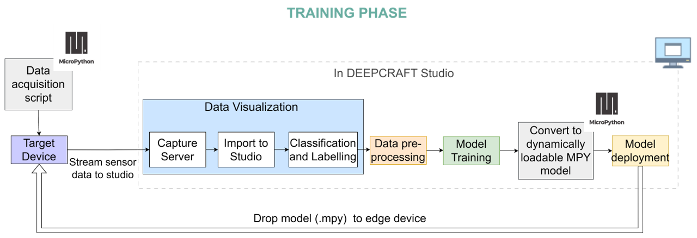
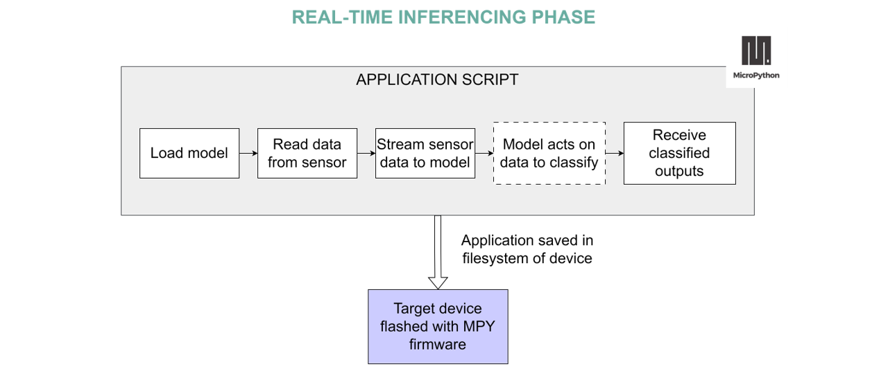

.. _psoc6_mpy_deepcraft_integration:

MicroPython - DEEPCRAFT™ Integration 
^^^^^^^^^^^^^^^^^^^^^^^^^^^^^^^^^^^^^^

`DEEPCRAFT™ <https://www.infineon.com/cms/en/design-support/software/deepcraft-edge-ai-solutions/>`_ is Infineon's comprehensive new Edge AI software & tools offering designed to fastrack edge machine learning 
application development.

`DEEPCRAFT™ Studio`_ is a development platform for AI on edge devices. It provides unique modeling capabilities 
to make custom edge AI models for PSOC-based hardware. Its integration with MicroPython allows an easy end-to-end 
application development and deployment journey. 

Follow along to build your first edge Machine Learning (ML) application with MicroPython and DEEPCRAFT™ Studio. 🚀

Overview
=========
This solution follows a standard edge ML application workflow, consisting of two primary phases: training and inferencing. 
The training phase is efficiently managed within DEEPCRAFT™ Studio.

The diagrams below provide a detailed overview of the workflows for both phases, highlighting the tools and steps involved, 
from data acquisition to model deployment.

During the training phase, the edge device executes a MicroPython script that streams raw sensor data to a host machine. A capture server running on the host 
receives this data and stores it as timestamped files. These files are then imported into DEEPCRAFT™ Studio, where they undergo labeling, preprocessing, 
and are used to train a machine learning model tailored to the specific application. With MicroPython integration, the trained model can be effortlessly converted 
into a runtime-loadable format and deployed to the device's filesystem. This streamlined workflow, which supports iterative tuning for optimal accuracy, 
greatly simplifies the model conversion and deployment process.

After achieving satisfactory accuracy, the model is ready for deployment in the final application. During this phase, a MicroPython script stored on the edge device's filesystem 
manages sensor data acquisition and feeds it to the dynamically loaded model. The pre-trained model processes the input data and generates class probabilities based on the learned patterns. 
These outputs can then be utilized to trigger actions through peripherals (e.g., LEDs, buzzers) or transmitted to external interfaces, such as a web dashboard, for visualization.

With this streamlined development workflow, let's proceed to build a complete edge ML application step by step.

Pre-requisites
================

Ensure the following tools are installed on your system:

1. `DEEPCRAFT™ Studio`_
2. `Capture Server cloned in your local <https://bitbucket.org/imagimob/captureserver/src/master/>`_

Supported Boards
==================
- `CY8CKIT-062S2-AI <https://www.infineon.com/cms/en/product/evaluation-boards/cy8ckit-062s2-ai/>`_

1. Data Acquisition
======================

This part is covered in the `data acquisition repository <https://github.com/Infineon/deepcraft-micropython-data-acquisition>`_, which provides 
instructions and examples for data acquisition using MicroPython.

2. Model Deployment
=====================

This part is covered in the `model converter repository <https://github.com/Infineon/deepcraft-micropython-converter>`_, which provides instructions 
on how to convert a DEEPCRAFT™ model into a MicroPython-compatible format and deploy it on the PSOC board.

.. note:: This is WIP and soon to be made available!

Example Projects
==================
- `Edge AI-based baby cry detector with Home Assistant integration <https://www.hackster.io/Infineon_Team/ai-baby-cry-detector-with-home-assistant-integration-05576f>`_

.. _DEEPCRAFT™ Studio: https://softwaretools.infineon.com/tools/com.ifx.tb.tool.deepcraftstudio