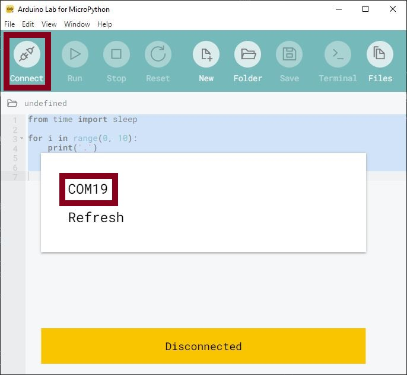
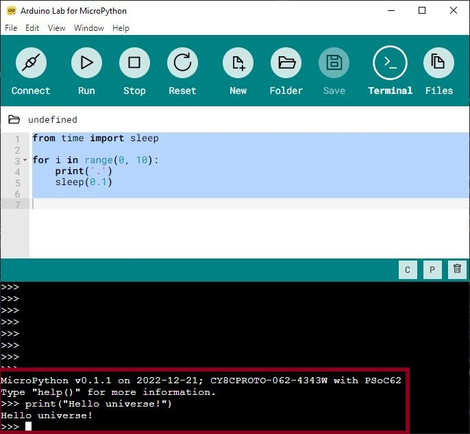
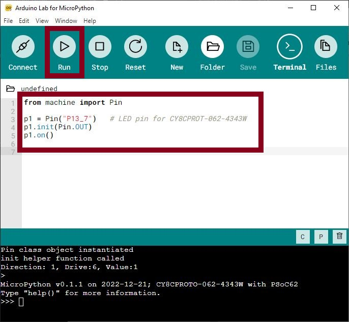

.. _psoc6_intro:

Getting started with MicroPython on the PSoC6™
==============================================

This tutorial will guide you to get started with running MicroPython on the PSoC6™ microcontrollers. 
There are only a few step keeping you away from enjoying the python programming experience together
with the possibilities of PSoC6™ microcontrollers.

Let's get started!

Requirements
------------

The only required hardware is:

* PSoC6™ board of the :ref:`Supported boards` list.
* A microUSB cable.

Power the board
------------------

Connect the USB cable to your computer and the micro USB to the board debugger. All the PSoC6™ boards
come with a on-board debugger required for flashing/debugging operations during development. Please refer to the
corresponding board manual of your board.

Install MicroPython
----------------------

In your computer terminal, type the following commands and follow the instructions:

.. tabs::

    .. group-tab:: Linux

        Download the mpy-psoc6 utility script:

        .. code-block:: bash

<<<<<<< HEAD
            curl -s -L https://raw.githubusercontent.com/infineon/micropython/ports-psoc6-main/tools/psoc6/mpy-psoc6.sh > mpy-psoc6.sh 
=======
            curl -s -L https://raw.githubusercontent.com/jaenrig-ifx/micropython/ports/psoc6/tools/psoc6/mpy-psoc6.sh > mpy-psoc6.sh 
>>>>>>> 2ec74ccc6 (docs: Added docs and docs conf for PSoC6 port.)

        Add execution rights to the script and run the script:       
        
        .. code-block:: bash                
           
            chmod +x mpy-psoc6.sh 
            ./mpy-psoc6.sh quick-start

    .. group-tab:: Windows
    
        Download the mpy-psoc6 utility script:

            .. code-block:: bash

<<<<<<< HEAD
                curl.exe -s -L https://raw.githubusercontent.com/infineon/micropython/ports-psoc6-main/tools/psoc6/mpy-psoc6.cmd > mpy-psoc6.cmd
=======
                curl.exe -s -L https://raw.githubusercontent.com/jaenrig-ifx/micropython/ports/psoc6/tools/psoc6/mpy-psoc6.cmd > mpy-psoc6.cmd
>>>>>>> 2ec74ccc6 (docs: Added docs and docs conf for PSoC6 port.)
        
        And run the script:

            .. code-block:: bash

                mpy-psoc6.cmd quick-start

These commands will download and run the :ref:`quick-start <psoc6_quick_start>` command of the mpy-psoc6 utility and take
care of all the necessary installation steps.

If everything went fine, your PSoC6™ board is now running MicroPython and Arduino IDE for
<<<<<<< HEAD
Micropython is now started. If you run into any trouble, please let us know `here <https://github.com/infineon/micropython/issues>`_ :) 
=======
Micropython is now started. If you run into any trouble, please let us know `here <https://github.com/jaenrig-ifx/micropython/issues>`_ :) 
>>>>>>> 2ec74ccc6 (docs: Added docs and docs conf for PSoC6 port.)

Select your serial port of your PSoC6™ board by clicking on the connect icon on the menu bar:

Interact with the MicroPython prompt
------------------------------------

As in python, you can use the prompt mode. Simply start typing some python commands:

Run your first script
---------------------

Let's try now to run a MicroPython script. As a first example, you will turn on the board LED. 

Copy the following code in the editor and click on run.

.. code-block:: python

    from machine import Pin

    p1 = Pin("P13_7")   # LED pin for CY8CPROT-062-4343W
    p1.init(Pin.OUT)
    p1.on()

The red LED in the board should be now on :D

Upload a script to your device
------------------------------

*Feature unavailable. Placeholder. To be completed.*

You are all set now to start programming with MicroPython!

Learn more about MicroPython in the following sections:

* :ref:`MicroPython libraries <micropython_lib>` . 
* :ref:`Quick reference for PSoC6™ <psoc6_quickref>`.
* :ref:`Working with MicroPython <psoc6_mpy_usage>`.
