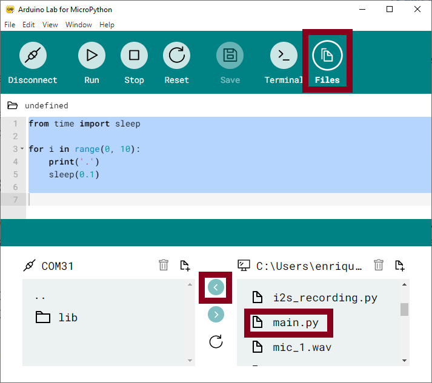

.. _psoc6_intro:

Getting started with MicroPython on the PSoC6™
==============================================

This tutorial will guide you on how to get started with running MicroPython on PSoC6™ microcontrollers. 
There are only a few steps keeping you away from enjoying the Python programming experience together
with the possibilities of PSoC6™ microcontrollers.

Let's get started!

Requirements
------------

The only required hardware is:

* A PSoC6™ board from the :ref:`Supported boards` list.
* A micro USB cable.

Power the board
------------------

Connect the USB cable to your computer and the micro USB end to the board debugger. All PSoC6™ boards come with an onboard debugger required for flashing and debugging operations during development. Please refer to your board's manual.

Install MicroPython on the board
--------------------------------

In your computer terminal, type the following commands and follow the instructions provided.

First, download the ``mpy-psoc6.py`` utility script:

.. code-block:: bash

    $ curl -s -L https://raw.githubusercontent.com/infineon/micropython/ports-psoc6-main/tools/psoc6/mpy-psoc6.py > mpy-psoc6.py

Ensure you have a recent version of `Python3.x <https://www.python.org/downloads/>`_  installed and the `pip <https://pip.pypa.io/en/stable/installation/>`_ package installer.
Then install the following packages:

.. code-block:: bash                

    $ pip install requests

Finally, run the script:

.. code-block:: bash                
    
    $ python mpy-psoc6.py device-setup

These commands will download and run the :ref:`device-setup <psoc6_device_setup>` command of the mpy-psoc6 utility and take
care of all the necessary installation steps.

If everything went fine, your PSoC6™ board is now running MicroPython. If you run into any trouble, please let us know `here <https://github.com/infineon/micropython/issues>`_ :) 

Use a MicroPython IDE
-------------------------

There are multiple ways to interact with and program your MicroPython device. You can find more information about it in this :ref:`section <psoc6_mpy_usage>`. 

For this getting started guide, we recommend using the minimalist `Arduino Lab For MicropPython <https://labs.arduino.cc/en/labs/micropython>`_. 

Once installed, open the application and select the serial port of your PSoC6™ board by clicking on the connect icon on the menu bar:

.. image:: img/mpy-ide-connect.jpg
    :alt: Arduino IDE connect
    :width: 520px

Interact with the MicroPython prompt
------------------------------------

As in Python, you can use the prompt mode. Simply start typing some Python commands:

.. image:: img/mpy-ide-prompt.jpg
    :alt: Arduino IDE prompt
    :width: 520px

Run your first script
---------------------

Let's try now to run a MicroPython script. As a first example, you will turn on the board LED. 

Copy the following code in the editor and click on run.

.. code-block:: python

    from machine import Signal, Pin
    pin = Pin("P13_7", Pin.OUT) # LED pin for CY8CPROTO-062-4343W
    led = Signal(pin, invert=True) # Onboard LED is active low, hence invert=True
    led.on()

.. image:: img/mpy-ide-script.jpg
    :alt: Arduino IDE script
    :width: 520px

The red LED on the board should now be on.

Upload a script to your device
------------------------------

Click on the ``Files`` tab to transfer files between your computer and the MicroPython device.
Like with any other storage, you can upload any type of file and format as required by your application, not just *.py* program files.

If you name a file ``main.py`` and save it in your device, it will be automatically executed during the boot of the MicroPython device.

You are all set now to start programming with MicroPython!

.. warning::

    Adding *indefinitely* blocking loops to the ``main.py`` program might block access to the storage device. It is recommended to use the ``main.py`` script only once it is stable, tested, and intended for standalone operation.
    
Learn more about MicroPython in the following sections:

* :ref:`MicroPython libraries <micropython_lib>` . 
* :ref:`Quick reference for PSoC6™ <psoc6_quickref>`.
* :ref:`Working with MicroPython <psoc6_mpy_usage>`.
