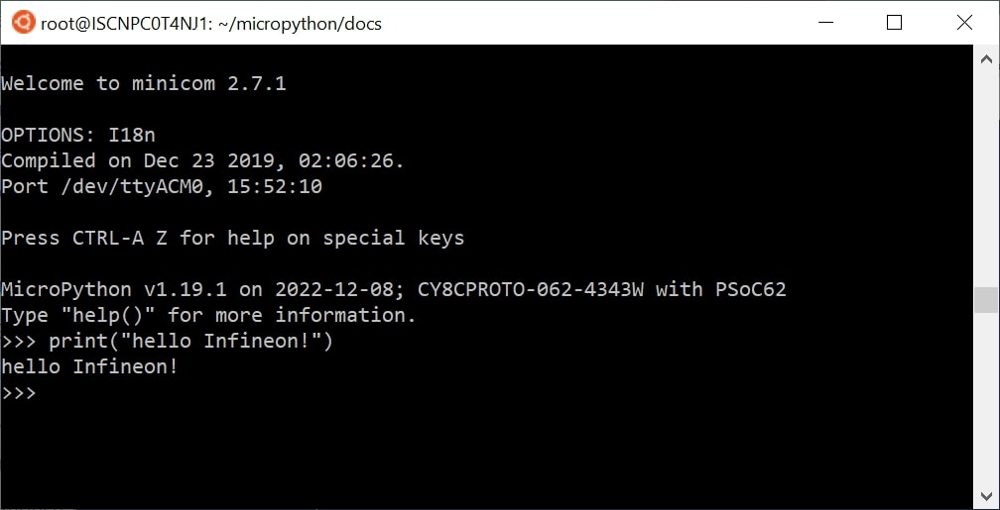
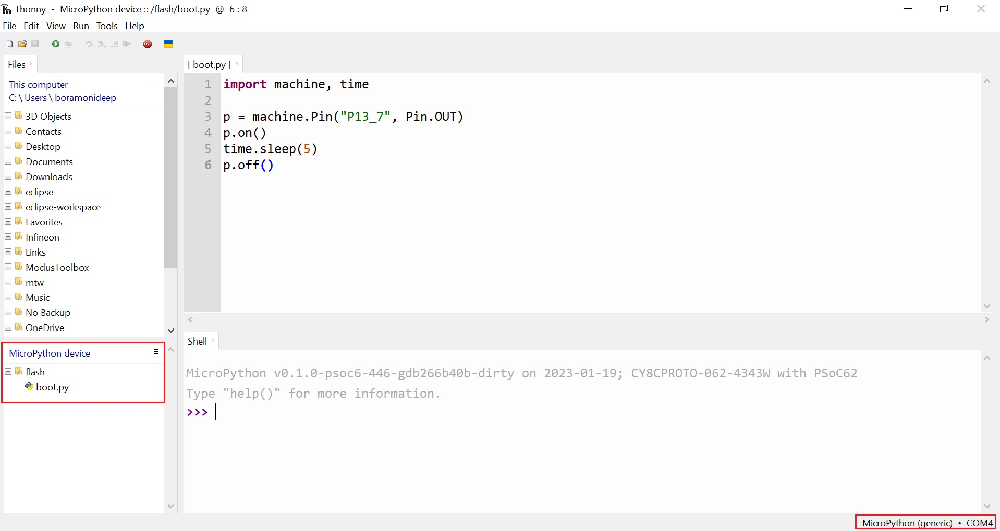

.. _psoc6_mpy_usage:

Working with MicroPython
=========================

With MicroPython already installed on your board, there are several flavors and tools to work with MicroPython. (:ref:`Installing MicroPython <psoc6_mpy_install>`). 
In this section, we introduce some of the ways you can work with MicroPython.

Serial prompt (REPL Mode)
-------------------------

With MicroPython deployed on your PSoC6™ board, you can access the REPL mode using
the USB-UART interface from the on-board debugger. 

REPL stands for Read Evaluate Print Loop and is the name given to the interactive MicroPython
prompt that you can access on the PSoC6™ board. Using the REPL is by far the easiest way to test out your
code and run commands. This is equivalent to running the *python* command (without passing a script) in the command line terminal of your machine.

Use your preferred serial terminal software to connect to the board. Examples of serial
terminal tools are `Putty <https://www.putty.org/>`_, which works for Windows and
Unix machines; or other platform-specific such as `Tera Term <https://teratermproject.github.io/index-en.html>`_, or `minicom <https://en.wikipedia.org/wiki/Minicom>`_. 

Configure the serial connection with **115200 bauds** and **8-N-1** (8 bits frame, no parity and 1 stop
bit), and connect to the board's serial port, the MicroPython REPL prompt will appear, and you can start
typing some Python code :) 

Running a script
----------------

To implement more elaborate programs, and use the embedded device stand-alone you can write
Python scripts.

There are several IDEs that you can install that integrate a text editor with the tools to run your
Python script on your MicroPython device, as well as handling the file system of your MicroPython
device. The most popular are:

* `Thonny <https://thonny.org/>`_
* `Mu Editor <https://codewith.mu/>`_
* `Arduino Lab for MicroPython <https://labs.arduino.cc/en/labs/micropython>`_

Alternatively, MicroPython offers :ref:`mpremote` as a command line tool that can be as well used for executing
scripts. Find more information in the provided link.

In MicroPython there are primarily two ways to execute a script:  

Host REPL mode 
~~~~~~~~~~~~~~

In this mode, the MicroPython PSoC6™ board is connected through the serial interface to the
host development machine. 
Each of the lines will be executed in the controller. Any output like print messages in your application or
exceptions will be sent through the serial connection to the host machine, which will display them
in the serial terminal console. 

The REPL mode is used, but the IDE or command line tool will take care of sending
each line of the script and process its output to show it in the terminal.
 
On-target file system mode
~~~~~~~~~~~~~~~~~~~~~~~~~~

When the board provides a file system and data storage, you will have the possibility to store your
scripts in the device. 

You can split your program into different files, and use ``import`` to make use of the provided features
in other scripts. 
To run a script in the device at boot, two scripts need to be present in the file
system: ``boot.py`` and ``main.py``. The scripts are executed in the sequence, first ``boot.py`` followed by ``main.py``. 

User-defined Python modules or code can also be converted into bytecode (:ref:`mpy files <mpy_files>`) by using the ``mpy-cross`` tool and then copied onto the
filesystem for getting speed benefits in execution. 

A more advanced and efficient mode of script execution is also available, where the scripts to be executed are :ref:`frozen <optimizations>` as part of the application. However, this is only possible if the user has access to the build flow of the specific port.      

The filesystem is described in the section below with some examples.

The MicroPython filesystem
---------------------------

The PSoC6™ port offers both ``FAT`` and ``LFS2`` filesystems, implemented in :ref:`MicroPython <filesystem>`. However, given its stability and reliability, the ``LFS2`` filesystem is selected as the default. The filesystem is located by default on the external flash, which has a capacity of 512 Mb (64 MB). 

The filesystem is mounted with the help of frozen scripts, located in the ``ports/psoc6/freeze`` directory. The default mount point of the filesystem is the ``/flash`` directory, which serves as its root. 

Given below are a few examples of various operations on the filesystem:

Creating and reading files
~~~~~~~~~~~~~~~~~~~~~~~~~~

MicroPython on the PSoC6™ supports the standard way of accessing files in
CPython, using the built-in ``open()`` function. The ``open()`` function returns a file pointer. The file is created if not already present and otherwise its contents are overwritten.

To create a file::

    >>> f = open('data.txt', 'w')
    >>> f.write('some data')
    9
    >>> f.close()

The number "9" returned from the function, is the number of bytes that were written with the ``write()`` method.
Then the user can read back the contents of this new file using::

    >>> f = open('data.txt')
    >>> f.read()
    'some data'
    >>> f.close()

Note that the default mode when opening a file is to open it in read-only mode
and as a text file.  Specify ``'wb'`` as the second argument to ``open()`` to
open for writing in binary mode, and ``'rb'`` to open for reading in binary
mode.

Listing files and more
~~~~~~~~~~~~~~~~~~~~~~

The ``os`` module can be used for further control over the filesystem. First,
the ``os`` module needs to be imported::

    >>> import os

Then the contents of the filesystem can be listed::

    >>> os.listdir()
    ['boot.py', 'port_config.py', 'data.txt']

New directories can be created::

    >>> os.mkdir('dir')

And entries can be removed::

    >>> os.remove('data.txt')

Also, entries can be renamed::

    >>> os.rename('data.txt','data_new.txt')  # os.rename('old_filepath','new_filepath')
    
Start-up scripts
~~~~~~~~~~~~~~~~

As mentioned above, two files are treated specially by the port when it starts up:
``boot.py`` and ``main.py``. The user can create these files and populate them with the code that can run at startup.

Using MicroPython remote control (mpremote) for filesystem operations
~~~~~~~~~~~~~~~~~~~~~~~~~~~~~~~~~~~~~~~~~~~~~~~~~~~~~~~~~~~~~~~~~~~~~

The :ref:`mpremote <mpremote>` tool can be used to transfer files located on the user's host filesystem into the MicroPython filesystem.

Resetting the board
-------------------

If something goes wrong, you can reset the board in two ways. 
The first way is to press CTRL-D at the MicroPython prompt, which performs a soft reset.

If that does not work, you can perform a hard reset by pressing the RESET button. 
This will end your session, disconnecting whatever program (PuTTY, Thonny, etc.) you used to connect to the board.

Boot modes
----------

There are 2 boot modes:

  * Normal boot mode
  * Safe boot mode

``boot.py`` and ``main.py`` are executed in "Normal boot mode".

``boot.py`` and ``main.py`` are **not** executed in "Safe boot mode".

Changing boot mode:

  * For normal boot mode, just press and release the RESET button on the board.

  * For safe boot mode, press and release the RESET button while pressing the USER button on the board. Release the USER button after the LED on the board flashes twice.

If you change the boot mode to safe boot mode, the MicroPython starts without
the execution of ``main.py``. Then you can remove the ``main.py`` by following command: ::
    
    import os
    os.remove('main.py')

Using third-party IDEs for filesystem operations
~~~~~~~~~~~~~~~~~~~~~~~~~~~~~~~~~~~~~~~~~~~~~~~~

Thonny
^^^^^^

The MicroPython port for PSoC6™ can be detected by the `Thonny IDE <https://thonny.org/>`_ when the ``MicroPython (generic)`` option is selected at the bottom right corner, as shown. Additionally, the filesystem is detected by the IDE, as shown in the lower left column. 
Using the GUI, you can perform file operations such as creating a new file, adding contents to it, and then saving it to the filesystem on the MicroPython device.

