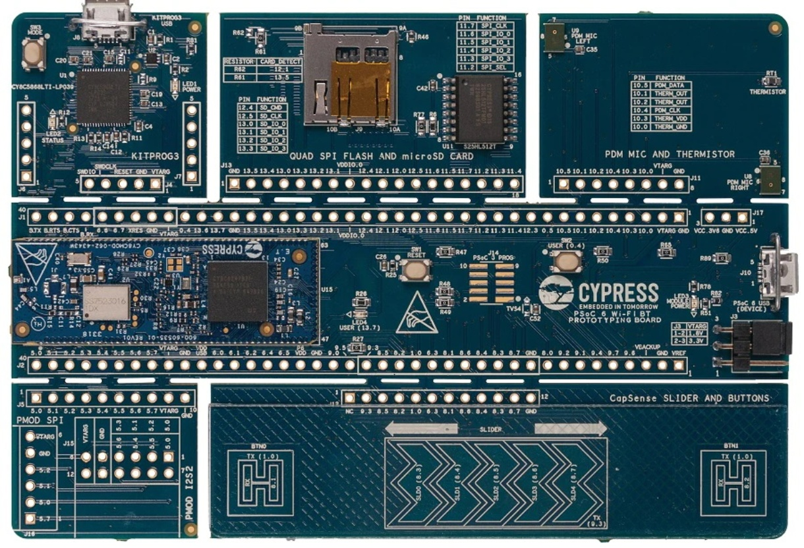

.. _psoc6_quickref:

Quick reference for the PSoC6™
==============================



The CY8CPROTO-062-4343W PSoC6™ Board.

Below is a quick reference for PSoC6™ boards. If it is your first time
working with this port it may be useful to get an overview of the microcontroller:

.. toctree::
   :maxdepth: 1
   :includehidden:

   general.rst
   intro.rst
   installation.rst
   mpy-usage.rst

.. warning::

    The PSoC6™ port is now a mature port and is expected any MicroPython built-in
    library to be supported, but not all libraries, modules and features may have been implemented yet.
    For those modules relying on platform and hardware dependencies, only the listed and documented in this
    quick reference are certainyly supported.
        
    Please, consider opening an `issue <https://github.com/infineon/micropython/issues>`_ or
    `discussion <https://github.com/infineon/micropython/discussionsh>`_ on GitHub for any clarification
    required on available features or requests for missing ones. 

General board control
---------------------

The MicroPython REPL is accessed via the USB serial port. Paste mode (ctrl-E) is useful to paste a
large slab of Python code into the REPL. 

This port implements most of the methods described in the :mod:`machine` module. Tab-completion is useful to
find out what methods an instantiated object has. 

The :mod:`machine` module::

    import machine

    machine.freq()          # get the current frequency of the CPU

::

    from machine import Bitstream
    
    timing = [1000, 7000, 5000, 2500]          #timing (high_time_0, low_time_0, high_time_1, low_time_1)in ns
    buf = bytearray([0xAB])                    #buffer data 
    bitstream('P13_6', 0, timing, buf)         # bitstrem buffer data with timing through pin P13_6

All timings greater than 1500 ns works and the accuracy of the timing is +/- 400ns. 
Supported timing_ns ranges below 1500 ns is [500, 1125, 800, 750]

..
    TODO: add more machine module examples when implemented.    
    machine.freq(240000000) # set the CPU frequency to 240 MHz

..
    TODO: add ``psoc6`` module when implemented.    


Delay and timing
----------------

Use the :mod:`time <time>` module::

    import time

    time.sleep(1)           # sleep for 1 second
    time.sleep_ms(500)      # sleep for 500 milliseconds
    time.sleep_us(10)       # sleep for 10 microseconds
    start = time.ticks_ms() # get millisecond counter
    delta = time.ticks_diff(time.ticks_ms(), start) # compute time difference
    start = time.ticks_us() # get microsecond counter
    delta = time.ticks_diff(time.ticks_us(), start) # compute time difference

Pins and GPIO
-------------

Most of the methods (functions) and constants given in the :ref:`machine.Pin <machine.Pin>` class have been implemented in this port. Any functions in addition to those or function calls with ambiguous list of parameters have been documented here with suitable examples. 

The constructor
^^^^^^^^^^^^^^^
The constructor can be called in different flavors and configurations based on the number of arguments (parameters) passed. 

An instance of the :mod:`machine.Pin` class can be created by invoking the constructor with all the necessary parameters to fully configure the ``Pin``. 

::

    from machine import Pin

    p0 = Pin('P13_7', Pin.OUT, Pin.PULL_DOWN, value=0)   # create output pin on pin P13_7, 
                                                         # with pull-down resistor enabled,
                                                         # with initial value 0 (low)     


Additionally, with any combination of parameters (except the Pin number or ``id`` which should be passed mandatorily), a :mod:`machine.Pin` object with various configuration levels can be instantiated. In these cases, the :meth:`Pin.init` function has to be called proactively to set the other necessary configurations, as needed.

Moreover, a pre-configured pin object can be repurposed by calling the :meth:`Pin.init` function.


::

    from machine import Pin

    p0 = Pin('P13_7')                    # create pin object for pin P13_7. 
    p0.init(Pin.OUT, Pin.PULL_DOWN)      # set pin as output and enable pull-down resistor.
    p0.low()                             # set value low.     


Similar to CPython, the parameters can be passed in any order if keywords are used. On the other hand, in case of a non-keyword assignment if a parameter is not to be set, a ``None`` is to be passed in its place.


::

    from machine import Pin

    p0 = Pin(id='P13_7', value=0, pull=Pin.PULL_DOWN, mode=Pin.OUT)     # create output pin on pin P13_7, 
                                                                        # with pull-down resistor enabled,
                                                                        # with initial value 0 (low) 


    p1 = Pin('P0_0', Pin.OUT, None, value=1)                           # create output pin on pin P0_0, 
                                                                       # with pull as NONE,
                                                                       # with initial value 1 (high)                                                                       

Note that the parameters such as ``value`` can only be passed as keyword arguments.  


.. note::

    The following constructor arguments are NOT supported in this port:
        * ``drive``. This configuration is automatically handled by the constructor and abstracted to the user.
        * ``alt``. Alternative functionality is directly handled by the respective machine peripherals classes.

Methods
^^^^^^^
.. method:: Pin.irq(handler=None, trigger=Pin.IRQ_FALLING | Pin.IRQ_RISING)

Here two arguments should be passed mandatorily. 
Trigger can be ``Pin.IRQ_FALLING`` or ``Pin.IRQ_RISING`` or ``PIN.IRQ_FALLING||PIN.IRQ_RISING``.

::
    
    from machine import Pin

    p0 = Pin('P0_4', value=1, pull=Pin.PULL_UP, mode=Pin.IN)          
    p1 = Pin('P13_7', value=0, pull=Pin.PULL_DOWN, mode=Pin.OUT)      

    p0.irq(handler=lambda t:p1.high(),trigger=Pin.IRQ_RISING) #configure an IRQ callback function P1.high() when there is a rising edge on pin object p0.
    

.. method:: Pin.toggle()

Set pin value to its complement.

Signal 
^^^^^^

There's a higher-level abstraction :ref:`machine.Signal <machine.Signal>`
which can be used to invert a pin. Useful for illuminating active-low LEDs
using ``on()`` or ``value(1)``.

.. warning::

    The :ref:`machine.Signal value()<machine.Signal>` getter functionality is not supported in this port, and the returned value is undefined. This is the same behavior as the :ref:`machine.Pin value()<machine.Pin>` for Pin.OUT mode, which is the object supporting the Signal object.

Software I2C bus
----------------
Software I2C (using bit-banging) works on all output-capable pins, and is
accessed via :ref:`machine.SoftI2C <machine.SoftI2C>` ::

    from machine import Pin, SoftI2C

    i2c = SoftI2C(scl='P5_0', sda='P5_1', freq=100000)

    i2c.scan()              # scan for devices

    i2c.readfrom(0x3a, 4)   # read 4 bytes from device with address 0x3a
    i2c.writeto(0x3a, '12') # write '12' to device with address 0x3a

    buf = bytearray(10)     # create a buffer with 10 bytes
    i2c.writeto(0x3a, buf)  # write the given buffer to the peripheral


Hardware I2C bus
----------------
The driver is accessed via :ref:`machine.I2C <machine.I2C>`

The constructor
^^^^^^^^^^^^^^^
An instance of the :mod:`machine.I2C` class can be created by invoking the constructor with all the 
necessary parameters to fully configure the ``I2C``. By invoking the constructor, I2C peripheral is 
initialized and configured to work in master mode. The maximum supported frequency is 1 MHz.

::
    
    from machine import I2C
    i2c = I2C(scl='P6_0', sda='P6_1', freq=400000)

The ``scl`` and ``sda`` pins are the only mandatory arguments. The frequency is optional, and if not passed will be set to 400KHz by default.

.. note::
    The ``timeout`` option is currently not implemented in this port.

::

    from machine import I2C
    i2c = I2C(scl='P6_0', sda='P6_1')  #I2C is initialized & configured with default frequency

::

    from machine import I2C
    i2c = I2C(scl='P9_0', sda='P9_1', freq=400000)  #I2C is initialised & configured with given scl, sda pins & frequency

Methods
^^^^^^^
All the methods(functions) given in :ref:`machine.I2C <machine.I2C>` class have been implemented in this port except:

.. method:: I2C.init()

All the initialization & configurations are handled by the constructor. Hence ``init()`` is not required.

Hardware I2C bus slave
----------------------

The PSoC6™ port offers an additional class to implement an I2C slave device. An I2C master node connected to the slave can exchange data over I2C for the configured slave address and frequency.

.. warning:: 
    This is not part of the core MicroPython libraries. Therefore, not mapping any existing machine class API and neither supported by other ports.

.. note:: 
    | Part of the functionality of the I2C slave is based on hardware interrupts and callbacks. 
    | As explained in this :ref:`section <isr_rules>`, writing interrupts handlers in MicroPython is subject to multiple considerations depending on the actual hardware capabilities and limitations, the specific port implementation, and the overall application design and implementation.
    | These must kept in mind when implementing accurate timing and event synchronization between master and slave. 

The constructor
^^^^^^^^^^^^^^^

.. class:: I2CSlave(scl, sda, addr, freq)

    Constructs and returns a new I2C slave object using the following parameters.
   
    Required arguments: 
      - *scl* should be a pin name supporting the SCL functionality.
      - *sda* should be a pin name supporting the SDA functionality.
      - *addr* should be an 8 bits unsigned integer. 

    Optional arguments:
      - *freq* should be an integer which sets the maximum frequency
        for SCL. If not passed, by default is set to 400KHz.

    Example:
        ::
            
            from machine import I2CSlave
            
            i2c_slave = I2CSlave(scl="P6_4", sda="P6_5", addr=0x45)

Methods
^^^^^^^

.. method:: I2CSlave.deinit()

    Deinitialises the I2C slave.

.. method:: I2CSlave.conf_receive_buffer(buf)

    Configures the reception *buf* on an I2C slave. This is the buffer to which the master writes data to. 
    The user needs to setup a new buffer every time the buffer has been used up.

.. method:: I2CSlave.conf_transmit_buffer(buf)

    Configures the transmission *buf* on an I2C slave. This is the buffer from which the master reads data from.
    The user needs to setup a new buffer every time the buffer has been used up.

.. method:: I2CSlave.irq(callback, events, priority)

    Enables interrupts and the function handlers to be called upon different I2C bus events.

    Required arguments: 
      - *callback* should be a function handler that will be executed upon an interrupt event. The callback takes one argument which is the event causing the interrupt.
      - *events* is the I2C bus events that will be triggering the interrupt. Multiple ones can be configured by ORing the following constants:

        .. data:: I2CSlave.RD_EVENT
                I2CSlave.WR_EVENT
                I2CSlave.RD_BUF_IN_FIFO_EVENT
                I2CSlave.RD_BUF_EMPTY_EVENT
                I2CSlave.RD_CMPLT_EVENT
                I2CSlave.WR_CMPLT_EVENT
                I2CSlave.ERR_EVENT

    Optional arguments:
      - *priority* should be an unsigned integer with the priority of the interrupt.

    Example:
        ::

            def cback(event):
                if event == (event & I2CSlave.WR_EVENT):
                    print("i2c wr event")

            i2c_slave.irq(callback=cback, events=(I2CSlave.WR_EVENT | I2CSlave.WR_CMPLT_EVENT), priority=1)

.. method:: I2CSlave.irq_disable()

    Disables the I2C slave interrupts.


Real time clock (RTC)
---------------------

See :ref:`machine.RTC <machine.RTC>` ::

    from machine import RTC
    import time

    irq_counter = 0

    def cback(event):
        global irq_counter
        irq_counter += 1

    rtc = RTC()
    rtc.init((2023, 1, 1, 0, 0, 0, 0, 0)) # initialize rtc with specific date and time,
                                          # eg. 2023/1/1 00:00:00
    rtc.datetime((2017, 8, 23, 2, 12, 48, 0, 0)) # set a specific date and
                                                 # time, eg. 2017/8/23 1:12:48
    rtc.datetime() # get date and time
    rtc.now() # get current date and time

    rtc.irq(trigger=RTC.ALARM0, handler=cback)
    rtc.alarm(1000, repeat=False) # set one-shot short alarm in ms
    rtc.alarm_left() # read the time left for alarm to expire
    time.sleep_ms(1008) # wait sufficient time
    print(irq_counter) # Check irq counter

    rtc.irq(trigger=RTC.ALARM0, handler=cback)
    rtc.alarm(3000, repeat=True) # set periodic short alarm in ms
    rtc.cancel() # cancel the alarm

    rtc.irq(trigger=RTC.ALARM0, handler=cback)
    rtc.alarm((2023, 1, 1, 0, 0, 1, 0, 0), repeat=False) # set one-shot longer duration alarm

    rtc.memory((2023, 1, 1, 0, 0, 1, 0, 0)) # Retains date time value post reset


.. note::
    Setting a random week day in 'wday' field is not valid. The underlying library implements the logic to always
    calculate the right weekday based on the year, date and month passed. However, datetime() will not raise an error 
    for this, but rather re-write the field with last calculated actual value.

.. warning::
    For setting a short time periodic alarm, the minimum precision possible is 3 secs. Anything less than this may 
    or may not work accurately. Also the PSoC6 RTC has a precision of sec. Hence for any alarm, the minimum period can be 1sec.


Watch dog timer (WDT)
---------------------

See :ref:`machine.WDT <machine.WDT>` ::

    from machine import WDT

    wdt = WDT()
    wdt.init(timeout=2000)  # initialize wdt with id = 0 (default),
                            # timeout in milliseconds
    wdt.feed() # feed the wdt periodically before the timeout.

.. note::
    The minimum timeout is 1 millisecond and the maximum timeout is 6000 milliseconds.

Network Module
--------------

The :mod:`network` module

See :ref:`network.WLAN <network.WLAN>`

For some methods and constants, the PSoC6 network port implements certain specialization and slightly different behavior. This is explained in this section.

Methods
^^^^^^^

.. method:: WLAN.scan(ssid=None, bssid=None)

    The scan option accepts the following filters as keyword arguments, removing from scan results any network not matching these parameters values:

    * ``ssid``
    * ``bssid``

.. method:: WLAN.status('param')

    .. warning:: 
        The function does not provide status of the connection. Use the ``active()`` for that purpose. Any errors or failure are communicated when using the corresponding enable/disable or connect/disconnect functions.

    The following query parameters are allowed:
        * ``rssi``. Only for STA.
        * ``stations``. List of connected stations (only for AP).

.. method:: WLAN.config('param')
            WLAN.config(param=value, ...)

    Among the suggested parameters of the general network WLAN API, for this port, only these are available:

    * AP & STA query parameters

        - ``channel``
        - ``ssid``
        - ``security```
        - ``key/password``. Only for default AP key.
        - ``mac``
    * AP set parameters

        - ``channel``
        - ``ssid``
        - ``security```
        - ``key/password``. Only for default AP key.
        
    * STA has no configurable parameter.

Constants
^^^^^^^^^

Security modes constants:

.. data:: WLAN.OPEN
        WLAN.WEP
        WLAN.WPA
        WLAN.WPA2
        WLAN.WPA3
        WLAN.WPA2_WPA_PSK
        WLAN.SEC_UNKNOWN

.. note::
    Power modes configuration not implemented.
     
Here is a function you can run (or put in your boot.py file) to automatically connect to your WiFi network:

::

    def network_connect() :
        import network
        from utime import sleep,sleep_ms
        wlan = network.WLAN(network.STA_IF)
        if wlan.isconnected():
            print('[Network] already connected')
            return

        # enable and connect wlan
        wlan.active(True)
        wlan.connect('<ssid>','<key>')

        # wait for connection to establish
        sleep(5)
        for i in range(0,100):
        if not wlan.isconnected() and wlan.status() >= 0:
            print("[Network] Waiting to connect..")
            sleep(2)

        # check connection
        if not wlan.isconnected():
            print("[Network] Connection failed!")
        else:
            print(wlan.ifconfig())

PWM (pulse width modulation)
----------------------------

PWM can be enabled on all output capable pins.The frequency can range from 1Hz to 100MHz. As the frequency
increases the PWM resolution decreases. Refer `PSoC 6 MCU: CY8C62x8, CY8C62xA Datasheet <https://www.infineon.com/dgdl/Infineon-PSOC_6_MCU_CY8C62X8_CY8C62XA-DataSheet-v18_00-EN.pdf?fileId=8ac78c8c7d0d8da4017d0ee7d03a70b1>`_
for additional details regarding board specific PWM.

Use the :ref:`machine.PWM <machine.PWM>` class: 

The constructor can be called by passing the required arguments. All initialization and the configurations are handled by the constructor. Create PWM object using 

::  

    pwm = PWM('P9_0', freq=50, duty_u16=8192) # PWM is initialised for the given pin with respective frequency & duty cycle given as raw value.
    pwm1 = PWM('P9_1', freq=50, duty_ns=1000)  # PWM is initialised for the given pin with respective frequency & duty cycle given in nanoseconds.

    All four arguments has to be passed manadatorily to create PWM object. duty_u16 or duty_ns should be specified at a time.  

::

    from machine import PWM

    pwm = PWM('P9_0', freq=50, duty_u16=8192) 
    print(pwm)                                # view PWM settings

    pwm.freq()                                # get current frequency
    pwm.freq(100)                             # set PWM frequency to 100 Hz

    pwm.duty_u16()                            # get current duty cycle, range 0-65535
    pwm.duty_u16(8192)                        # set duty cycle from 0 to 65535 as a ratio of duty_u16/65535, now 25%
    
    pwm.duty_ns()                             # get current pulse width in ns
    pwm.duty_ns(1000)                         # set the current pulse width in ns from 0 to 1000000000/freq

    pwm.init(freq=90,duty_us=100)             # Modify the settings of PWM object
    pwm.deinit()                              # Deinitialisation of PWM pin


.. note::
    invert functionality is not enabled in this port.

Software SPI bus
----------------

The :ref:`machine.SoftSPI <machine.SoftSPI>` class is **disabled** in this port.

Hardware SPI bus
----------------
Refer `PSoC 6 MCU: CY8C62x8, CY8C62xA Datasheet <https://www.infineon.com/dgdl/Infineon-PSOC_6_MCU_CY8C62X8_CY8C62XA-DataSheet-v18_00-EN.pdf?fileId=8ac78c8c7d0d8da4017d0ee7d03a70b1>`_
for details regarding all the SPI capable pins. The pins ``sck``, ``mosi`` and ``miso`` *must* be specified when
initialising SPI.

The driver is accessed via :ref:`machine.SPI <machine.SPI>`

.. note::
    Slave selection should be done at application end. An example of how to do so is explained :ref:`here <machine.SPI>`

The constructor
^^^^^^^^^^^^^^^
An instance of the :mod:`machine.SPI` class can be created by invoking the constructor with all the 
necessary parameters to fully configure and initialize the ``SPI``. By invoking the constructor with no additional parameters 
SPI object is created with default settings or settings of previous initialization if any.

::
    
    from machine import SPI
    spi = SPI(baudrate=1000000, polarity=0, phase=0, bits=8, firstbit=SPI.MSB, sck='P6_2', mosi='P6_0', miso='P6_1')

Methods
^^^^^^^
All the methods(functions) given in :ref:`machine.SPI <machine.SPI>` class have been implemented in this port.

Hardware SPI bus slave
----------------------

The PSoC6™ port offers an additional class to implement an SPI slave device. The SPI master node connected to the slave can exchange data over SPI.

.. warning:: 
    This is not part of the core MicroPython libraries. Therefore, not mapping any existing machine class API and neither supported by other ports.

The constructor
^^^^^^^^^^^^^^^

.. class:: SPISlave(baudrate, polarity, phase, bits, firstbit, ssel, sck, mosi, miso)

    Constructs and returns a new SPI slave object using the following parameters.
   
    Required arguments: 
      - *ssel* should be pin name supporting SSEL functionality. 
      - *sck* should be a pin name supporting the SCK functionality.
      - *mosi* should be a pin name supporting the MOSI functionality.
      - *miso* should be a pin name supporting the MISO functionality.

    Optional arguments:
      - *baudrate* should be an integer which sets the clock rate. If not passed, by default is set to 1000000 Hz.
      - *polarity* can be 0 or 1. Default is set to 0.
      - *phase* can be 0 or 1. Default set to 0.
      - *bits* is width in bits for each transfer. Only 8 is supported.
      - *firstbit* can be SPI.MSB or SPI.LSB. Default is SPI.MSB.

    Example:
        ::
            
            from machine import SPISlave
            
            spi_slave = spi = SPI(baudrate=1000000, polarity=0, phase=0, bits=8, firstbit=SPI.MSB, ssel="P6_3", sck='P6_2', mosi='P6_0', miso='P6_1')

Methods
^^^^^^^

.. method:: SPISlave.deinit()

    Deinitialises the SPI slave.


.. method:: SPISlave.write(buf)

    Write the bytes contained in ``buf``.

    Required arguments: 
      - *buf* should be a buffer with bytes of data to be written.
    
    Returns ``None``.


.. method:: SPISlave.read(buf)

    Reads the data in SPI bus to ``buf``.

    Required arguments: 
      - *buf* should be a buffer where data from bus needs to be stored.
    
    Returns ``None``.


Timers
------

Hardware timer is supported.

Use the :mod:`machine.Timer` class::

    from machine import Timer
    import time
    tim = Timer(0) #Default assignment: period=9999, frequency=10000
    tim.init(period=2000, mode=Timer.ONE_SHOT, callback=lambda t:print(2)) #mode=Timer.PERIODIC in case of periodic timer


Here id=0 should be passed mandatorily.

ADC (analog to digital conversion)
----------------------------------

On the PSoC6, a single ADC block with id - '0' is available. The ADC functionality is available on the
following pins : "P10_0" - "P10_5".

Use the :ref:`machine.ADC <machine.ADC>` class::

    from machine import ADC

    adc = ADC("P10_0")             # create an ADC object on ADC pin
    val = adc.read_u16()           # read a raw analog value in the range 0-65535
    val = adc.read_uv()            # read an analog value in micro volts

The PSoC6 port also supports :ref:`machine.ADCBlock <machine.ADCBlock>` API to have control over the ADC configuration. Currently 

PSoC6 supports only 1 SAR ADC with the channel to pin mapping available in respective pinout diagrams.

.. note::
    Arbitrary connection of ADC channels to GPIO is not supported. Specifying a pin that is not connected to this block, 
    or specifying a mismatched channel and pin, will raise an exception.

To use the APIs:
::
    
    from machine import ADCBlock

    adcBlock = ADCBlock(0, bits=11)             # create an ADCBlock 0 object
    adc = adcBlock.connect(0, "P10_0")          # connect channel 0 to pin P10_0
    val = adc.read_uv()                         # read an analog value in micro volts

.. note::
    The ADC block supports only 11 bits resolution. If bits are not passed, by default 11 bits is considered.

.. warning::
    When the input to ADC pin is connected to GND, it may not return value 0 as digitized output. This is a known issue and 
    needs fix in low-level API's.

I2S bus
-------

See :ref:`machine.I2S <machine.I2S>`. 

The following specialization applies to this port:

Constructor
^^^^^^^^^^^^

.. class:: I2S(id, *, sck, ws, sd, mck=None, mode, bits, format, rate, ibuf)

   Construct an I2S object of the given id:

   - ``id`` takes any integer (This value is ignored for PSoC6 port)

   Keyword-only parameters:

     - ``rate`` specifies audio sampling rate (Hz);
       this is the frequency of the ``ws`` signal. Supported sample rates are 8KHz, 16KHz, 32KHz, 48KHz, 22.05KHz, 44.1KHz.

     - ``mck`` is not implemented.

   The rest of the parameters match the reference API.

::

    from machine import I2S, Pin
    import array
    buf=bytearray(10) #Initialise buffer with required values for transmission & as empty buffer for reception

    audio_out = I2S(0, sck="P13_1", ws="P13_2", sd="P13_3", mode=I2S.TX, bits=16, format=I2S.STEREO, rate=22050, ibuf=20000) #create I2S object
    num_written = audio_out.write(buf) # write buffer of audio samples to I2S device 
    

    audio_in = I2S(0, sck="P5_4", ws="P5_5", sd="P5_6", mode=I2S.RX, bits=16, format=I2S.STEREO, rate=22050, ibuf=20000) # create I2S object
    num_read = audio_in.readinto(buf)# fill buffer with audio samples from I2S device


