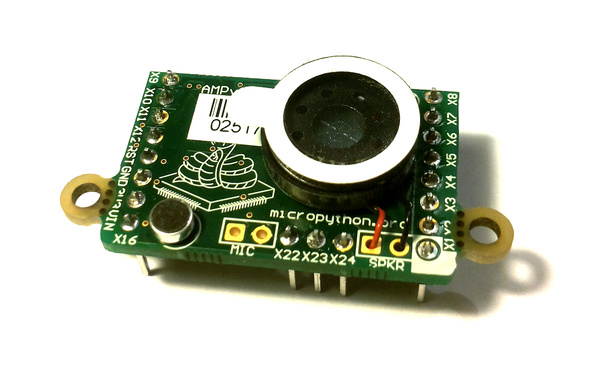
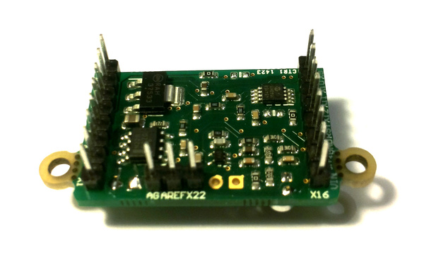

The AMP audio skin
==================

Soldering and using the AMP audio skin.

The following video shows how to solder the headers, microphone and speaker onto the AMP skin.

.. raw:: html

    <iframe style="margin-left:3em;" width="560" height="315" src="http://www.youtube.com/embed/fjB1DuZRveo?rel=0" frameborder="0" allowfullscreen></iframe>

For circuit schematics and datasheets for the components on the skin see :ref:`hardware_index`.

Example code
------------

The AMP skin has a speaker which is connected to ``DAC(1)`` via a small
power amplifier.  The volume of the amplifier is controlled by a digital
potentiometer, which is an I2C device with address 46 on the ``IC2(1)`` bus.

To set the volume, define the following function::

    import pyb
    def volume(val):
        pyb.I2C(1, pyb.I2C.MASTER).mem_write(val, 46, 0)

Then you can do::

    >>> volume(0)   # minimum volume
    >>> volume(127) # maximum volume

To play a sound, use the ``write_timed`` method of the ``DAC`` object.
For example::

    import math
    from pyb import DAC

    # create a buffer containing a sine-wave
    buf = bytearray(100)
    for i in range(len(buf)):
        buf[i] = 128 + int(127 * math.sin(2 * math.pi * i / len(buf)))

    # output the sine-wave at 400Hz
    dac = DAC(1)
    dac.write_timed(buf, 400 * len(buf), mode=DAC.CIRCULAR)

You can also play WAV files using the Python ``wave`` module.  You can get
the wave module `here <http://micropython.org/resources/examples/wave.py>`__ and you will also need
the chunk module available `here <http://micropython.org/resources/examples/chunk.py>`__.  Put these
on your pyboard (either on the flash or the SD card in the top-level directory).  You will need an
8-bit WAV file to play, such as `this one <http://micropython.org/resources/examples/test.wav>`_,
or to convert any file you have with the command::

    avconv -i original.wav -ar 22050 -codec pcm_u8 test.wav
    
Then you can do::

    >>> import wave
    >>> from pyb import DAC
    >>> dac = DAC(1)
    >>> f = wave.open('test.wav')
    >>> dac.write_timed(f.readframes(f.getnframes()), f.getframerate())

This should play the WAV file.
