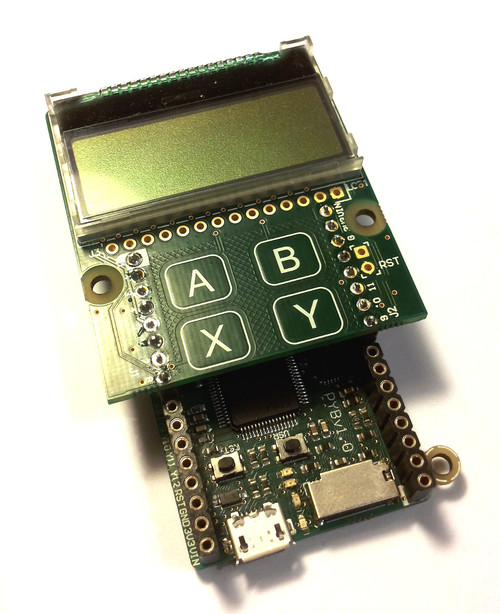

The LCD and touch-sensor skin
=============================

Soldering and using the LCD and touch-sensor skin.

.. image:: img/skin_lcd_2.jpg
    :alt: pyboard with LCD skin
    :width: 250px

The following video shows how to solder the headers onto the LCD skin.
At the end of the video, it shows you how to correctly connect the LCD skin to the pyboard.

.. raw:: html

    <iframe style="margin-left:3em;" width="560" height="315" src="http://www.youtube.com/embed/PowCzdLYbFM?rel=0" frameborder="0" allowfullscreen></iframe>

For circuit schematics and datasheets for the components on the skin see :ref:`hardware_index`.

Using the LCD
-------------

To get started using the LCD, try the following at the MicroPython prompt.
Make sure the LCD skin is attached to the pyboard as pictured at the top of this page. ::

    >>> import pyb
    >>> lcd = pyb.LCD('X')
    >>> lcd.light(True)
    >>> lcd.write('Hello MPy!\n')

You can make a simple animation using the code::

    import pyb
    lcd = pyb.LCD('X')
    lcd.light(True)
    for x in range(-80, 128):
        lcd.fill(0)
        lcd.text('Hello MPy!', x, 10, 1)
        lcd.show()
        pyb.delay(25)

Using the touch sensor
----------------------

To read the touch-sensor data you need to use the I2C bus.  The
MPR121 capacitive touch sensor has address 90.

To get started, try::

    >>> import pyb
    >>> i2c = pyb.I2C(1, pyb.I2C.CONTROLLER)
    >>> i2c.mem_write(4, 90, 0x5e)
    >>> touch = i2c.mem_read(1, 90, 0)[0]

The first line above makes an I2C object, and the second line
enables the 4 touch sensors.  The third line reads the touch
status and the ``touch`` variable holds the state of the 4 touch
buttons (A, B, X, Y).

There is a simple driver `here <http://micropython.org/resources/examples/mpr121.py>`__
which allows you to set the threshold and debounce parameters, and
easily read the touch status and electrode voltage levels.  Copy
this script to your pyboard (either flash or SD card, in the top
directory or ``lib/`` directory) and then try::

    >>> import pyb
    >>> import mpr121
    >>> m = mpr121.MPR121(pyb.I2C(1, pyb.I2C.CONTROLLER))
    >>> for i in range(100):
    ...   print(m.touch_status())
    ...   pyb.delay(100)
    ...

This will continuously print out the touch status of all electrodes.
Try touching each one in turn.

Note that if you put the LCD skin in the Y-position, then you need to
initialise the I2C bus using::

    >>> m = mpr121.MPR121(pyb.I2C(2, pyb.I2C.CONTROLLER))

There is also a demo which uses the LCD and the touch sensors together,
and can be found `here <http://micropython.org/resources/examples/lcddemo.py>`__.
