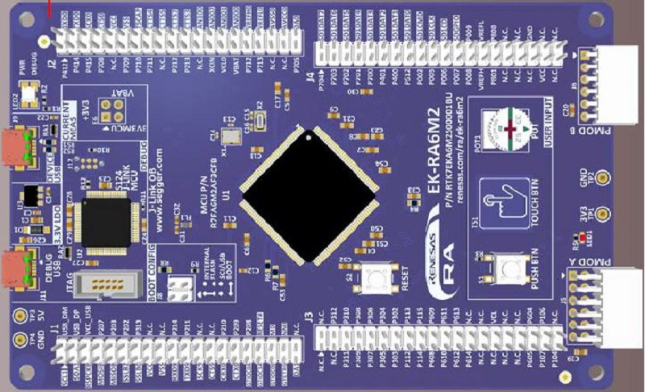

.. _renesas-ra_quickref:

Quick reference for the Renesas RA
==================================

The Renesas EK-RA6M2 board.

Below is a quick reference for the Renesas RA boards.  If it is your first time
working with this board, it may be useful to get an overview of the microcontroller and the board:

.. toctree::
   :maxdepth: 1

   general.rst
   tutorial/index.rst

Installing MicroPython
----------------------

See the corresponding section of tutorial: :ref:`renesas-ra_intro`. It also includes a troubleshooting subsection.

General board control
---------------------

The MicroPython REPL is accessed via the USB serial port. Tab-completion is useful to find out what methods an object has. Paste mode (ctrl-E) is useful to paste a large slab of Python code into the REPL.  Some of features are not implemented for Renesas RA boards yet, please refer to the tutorial for more details.

The :mod:`machine` module::

    import machine

    machine.freq()    # get the current frequency of the CPU

Following functions are supported::

    machine.freq()
    machine.reset()
    machine.soft_reset()
    machine.unique_id()

Following functions are not supported at the present::

    machine.reset_cause()
    machine.bootloader([value])
    machine.disable_irq()
    machine.enable_irq(state)
    machine.freq([hz])
    machine.idle()
    machine.sleep()
    machine.lightsleep()
    machine.lightsleep([time_ms])
    machine.deepsleep()
    machine.deepsleep([time_ms])
    machine.wake_reason()
    machine.time_pulse_us(pin, pulse_level, timeout_us=1000000,/)
    machine.bitstream(pin, encoding, timing, data, /)
    machine.rng()

Delay and timing
----------------

Use the :mod:`time <time>` module::

    import time

    time.sleep(1)           # sleep for 1 second
    time.sleep_ms(500)      # sleep for 500 milliseconds
    time.sleep_us(10)       # sleep for 10 microseconds
    start = time.ticks_ms() # get value of millisecond counter
    delta = time.ticks_diff(time.ticks_ms(), start) # compute time difference

Timers
------

The RA MCU's system timer peripheral provides a global microsecond timebase and generates interrupts for it. The software timer is available currently and there are unlimited number of them (memory permitting). There is no need to specify the timer id (id=-1 is supported at the moment) as it will default to this.

Use the :mod:`machine.Timer` class::

    from machine import Timer

    tim = Timer(-1)
    tim.init(period=5000, mode=Timer.ONE_SHOT, callback=lambda t:print(1))
    tim.init(period=2000, mode=Timer.PERIODIC, callback=lambda t: print(2))

Following functions are not supported at the present::
    Timer(id)  # hardware timer is not supported.

Pins and GPIO
-------------

Use the :ref:`machine.Pin <machine.Pin>` class::

    from machine import Pin

    p0 = Pin('P000', Pin.OUT)      # create output pin on P000
    p0.on()                        # set pin to "on" (high) level
    p0.off()                       # set pin to "off" (low) level
    p0.value(1)                    # set pin to on/high

    p2 = Pin(Pin.cpu.P002, Pin.IN) # create input pin on P002
    print(p2.value())              # get value, 0 or 1

    p4 = Pin('P004', Pin.PULL_UP)      # enable internal pull-up register
    p5 = Pin('P005', Pin.OUT, value=1) # set pin high on creation

Pin id is available corresponding to the RA MCU's pin name which are Pin.cpu.P106 and 'P106'. The RA MCU has many feature's pins. However, there are some cases that pin feature is fixed or not connected by the board. Please confirm the board manual for the pin mapping.

UART (serial bus)
-----------------

The RA MCU has some hardware UARTs called SCI (Serial Communication Interface).
UART id is available corresponding to the RA MCU's SCI number which are UART(0) as SCI0 and UART(1) as SCI1.

See :ref:`machine.UART <machine.UART>`. ::

    from machine import UART

    uart1 = UART(1, 115200)
    uart1.write('hello')    # write 5 bytes
    uart1.read(5)           # read up to 5 bytes

Available UARTs and pins on the board are fixed and follows. One of these UARTs is used for REPL.

=============  ==============  ==============  ==============
EK-RA4M1       UART0(REPL)     UART1           UART2
=============  ==============  ==============  ==============
tx             P411            P401            P302
rx             P410            P402            P301
=============  ==============  ==============  ==============

=============  ==============  ==============  ==============
EK-RA4W1       UART1           UART4(REPL)     UART9
=============  ==============  ==============  ==============
tx             P213            P204            P109
rx             P212            P206            P110
=============  ==============  ==============  ==============

=============  ==============  ==============  ==============
EK-RA6M1       UART0(REPL)     UART2           UART8
=============  ==============  ==============  ==============
tx             P411            P302            P105
rx             P410            P301            P104
=============  ==============  ==============  ==============

=============  ==============  ==============  ==============
EK-RA6M2       UART0(REPL)     UART7           UART9
=============  ==============  ==============  ==============
tx             P411            P401            P602
rx             P410            P402            P601
=============  ==============  ==============  ==============

=============  ==============  ==============
RA4M1-CLICKER  UART0           UART1(REPL)
=============  ==============  ==============
tx             P411            P401
rx             P410            P402
=============  ==============  ==============

Following functions are not supported at the present::

    UART.init(baudrate)   # now only 115200 is confirmed
    UART.init(cts, rts)   # Pins are fixed.
    UART.init(invert)
    UART.init(tx,rx)      # Pins are fixed.
    UART.init(txbuf)
    UART.init(flow)
    UART.irq(handler)
    UART.irq(trigger=RX_ANY)
    UART.irq(priority)
    UART.irq(wake=machine.IDLE)

Real time clock (RTC)
---------------------

See :ref:`machine.RTC <machine.RTC>` ::

    from machine import RTC

    rtc = RTC()
    rtc.datetime((2017, 8, 23, 1, 12, 48, 0, 0)) # set a specific date and time
                                                 # time, eg 2017/8/23 1:12:48
    rtc.datetime() # get date and time

Following functions are not supported at the present::

    RTC.init(datetime)
    RTC.now()
    RTC.deinit()
    RTC.alarm()
    RTC.alarm_left()
    RTC.cancel()
    RTC.irq()

ADC (analog to digital conversion)
----------------------------------

See :ref:`machine.ADC <machine.ADC>` ::

    from machine import ADC

    adc = ADC('P000')    # create an ADC object acting on a pin
    adc.read_u16()       # read a raw analog value in the range 0-65535

Pin id is available corresponding to the RA MCU's pin name which are 'P000' as AN000 (analog channel 000). The RA MCU has many analog channels. However, there are some cases that pin feature is fixed or not available by the board. Please confirm the MCU and board manual for the pin mapping.

Following functions are not supported at the present::

    ADC.init()
    ADC(sample_ns)
    ADC(atten)
    ADC.read_uv()
    ADC.block()

SPI bus
-------

The RA MCU has some hardware SPIs (Serial Peripheral Interface).
SPI id is available corresponding to the RA MCU's SPI number which are SPI(0) as SPI0 and SPI(1) as SPI1. If with no additional parameters, machine.SoftSPI() is called.

See :ref:`machine.SPI <machine.SPI>`. ::

    from machine import SPI, Pin

    spi = SPI(0, baudrate=500000)
    cs = Pin.cpu.P103
    cs(0)
    spi.write(b"12345678")
    cs(1)

Available SPIs and pins on the board are fixed and follows.

=============  ====
EK-RA4M1       SPI0
=============  ====
sck            P102
mosi           P101
miso           P100
cs             P206
=============  ====

=============  ====
EK-RA4W1       SPI0
=============  ====
sck            P102
mosi           P101
miso           P100
cs             P103
=============  ====

=============  ====
EK-RA6M1       SPI0
=============  ====
sck            P102
mosi           P101
miso           P100
cs             P103
=============  ====

=============  ====   ====
EK-RA6M2       SPI0   SPI1
=============  ====   ====
sck            P102   P702
mosi           P101   P701
miso           P100   P700
cs             P103   P703
=============  ====   ====

=============  ====
RA4M1-CLICKER  SPI0
=============  ====
sck            P102
mosi           P101
miso           P100
cs             P103
=============  ====

Following functions are not supported at the present::

    SPI.init(firstbit)    # now fixed with SPI.LSB
    SPI.init(baudrate)    # now confirmed only 500000

I2C bus
-------

The RA MCU has some hardware IIC (Inter-Integrated Circuit Bus).
I2C id is available corresponding to the RA MCU's I2C number which are I2C(0) as IIC0 and I2C(1) as IIC1. If with no additional parameters, machine.SoftI2C() is called.

See :ref:`machine.I2C <machine.I2C>` ::

    from machine import I2C

    i2c = I2C(0)

    i2c.scan()         # returns list of slave addresses
    i2c.readfrom_mem(0x50, 0x10, 2, addrsize=16)  # read 2 bytes from slave 0x50, slave memory 0x10

Available I2Cs and pins on the board are fixed and follows.

=============  =============
EK-RA4M1             -
=============  =============
scl            not supported
sda            not supported
=============  =============

=============  ====
EK-RA4W1       I2C0
=============  ====
scl            P204
sda            P407
=============  ====

=============  ====
EK-RA6M1       I2C0
=============  ====
scl            P400
sda            P401
=============  ====

=============  ====
EK-RA6M2       I2C2
=============  ====
scl            P512
sda            P511
=============  ====

=============  ====
RA4M1-CLICKER  I2C1
=============  ====
scl            P205
sda            P206
=============  ====

Following functions are not supported at the present::

    I2C.init(freq)    # now confirmed only 400000
    I2C.deinit()
    I2C.start()
    I2C.stop()

PWM (pulse width modulation)
----------------------------

PWM is not supported.

WDT (Watchdog timer)
--------------------

WDT is not supported.

SDCard
------

The frozen sdcard driver (drivers/sdcard/sdcard.py) is available by connecting microSD card device to hardware SPI0 pins.::

    from machine import Pin, SPI
    import os, sdcard

    spi = SPI(0, baudrate=500000)
    cs = Pin.cpu.P103
    sd = sdcard.SDCard(spi, cs)
    os.mount(sd, '/sd')
    os.listdir('/')
    os.chdir('/sd')
    os.umount('/sd')

OneWire driver
--------------

The OneWire driver is implemented in software and works on all pins::

    from machine import Pin
    import onewire

    ow = onewire.OneWire(Pin(P012)) # create a OneWire bus on P012
    ow.scan()               # return a list of devices on the bus
    ow.reset()              # reset the bus
    ow.readbyte()           # read a byte
    ow.writebyte(0x12)      # write a byte on the bus
    ow.write('123')         # write bytes on the bus
    ow.select_rom(b'12345678') # select a specific device by its ROM code

There is a specific driver for DS18S20 and DS18B20 devices::

    import time, ds18x20
    ds = ds18x20.DS18X20(ow)
    roms = ds.scan()
    ds.convert_temp()
    time.sleep_ms(750)
    for rom in roms:
        print(ds.read_temp(rom))

Be sure to put a 4.7k pull-up resistor on the data line.  Note that
the ``convert_temp()`` method must be called each time you want to
sample the temperature.

NeoPixel and APA106 driver
--------------------------

NeoPixel is not supported currently.
