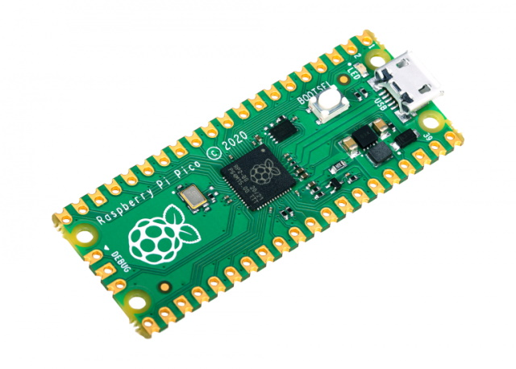

.. _rp2_quickref:

Quick reference for the RP2
===========================

The Raspberry Pi Pico Development Board (image attribution: Raspberry Pi Foundation).

Below is a quick reference for Raspberry Pi RP2xxx boards.  If it is your first time
working with this board it may be useful to get an overview of the microcontroller:

.. toctree::
   :maxdepth: 1

   general.rst
   tutorial/intro.rst

Installing MicroPython
----------------------

See the corresponding section of tutorial: :ref:`rp2_intro`. It also includes
a troubleshooting subsection.

General board control
---------------------

The MicroPython REPL is on the USB serial port.
Tab-completion is useful to find out what methods an object has.
Paste mode (ctrl-E) is useful to paste a large slab of Python code into
the REPL.

The :mod:`machine` module::

    import machine

    machine.freq()          # get the current frequency of the CPU
    machine.freq(240000000) # set the CPU frequency to 240 MHz

The :mod:`rp2` module::

    import rp2

Delay and timing
----------------

Use the :mod:`time <utime>` module::

    import time

    time.sleep(1)           # sleep for 1 second
    time.sleep_ms(500)      # sleep for 500 milliseconds
    time.sleep_us(10)       # sleep for 10 microseconds
    start = time.ticks_ms() # get millisecond counter
    delta = time.ticks_diff(time.ticks_ms(), start) # compute time difference

Timers
------

How do they work?

.. _rp2_Pins_and_GPIO:

Pins and GPIO
-------------

Use the :ref:`machine.Pin <machine.Pin>` class::

    from machine import Pin

    p0 = Pin(0, Pin.OUT)    # create output pin on GPIO0
    p0.on()                 # set pin to "on" (high) level
    p0.off()                # set pin to "off" (low) level
    p0.value(1)             # set pin to on/high

    p2 = Pin(2, Pin.IN)     # create input pin on GPIO2
    print(p2.value())       # get value, 0 or 1

    p4 = Pin(4, Pin.IN, Pin.PULL_UP) # enable internal pull-up resistor
    p5 = Pin(5, Pin.OUT, value=1) # set pin high on creation

UART (serial bus)
-----------------

See :ref:`machine.UART <machine.UART>`. ::

    from machine import UART

    uart1 = UART(1, baudrate=9600, tx=33, rx=32)
    uart1.write('hello')  # write 5 bytes
    uart1.read(5)         # read up to 5 bytes

PWM (pulse width modulation)
----------------------------

How does PWM work on the RPi RP2xxx?

Use the ``machine.PWM`` class::

    from machine import Pin, PWM

    pwm0 = PWM(Pin(0))      # create PWM object from a pin
    pwm0.freq()             # get current frequency
    pwm0.freq(1000)         # set frequency
    pwm0.duty_u16()         # get current duty cycle, range 0-65535
    pwm0.duty_u16(200)      # set duty cycle, range 0-65535
    pwm0.deinit()           # turn off PWM on the pin

ADC (analog to digital conversion)
----------------------------------

How does the ADC module work?

Use the :ref:`machine.ADC <machine.ADC>` class::

    from machine import ADC

    adc = ADC(Pin(32))          # create ADC object on ADC pin
    adc.read_u16()              # read value, 0-65535 across voltage range 0.0v - 3.3v

Software SPI bus
----------------

Software SPI (using bit-banging) works on all pins, and is accessed via the
:ref:`machine.SoftSPI <machine.SoftSPI>` class::

    from machine import Pin, SoftSPI

    # construct a SoftSPI bus on the given pins
    # polarity is the idle state of SCK
    # phase=0 means sample on the first edge of SCK, phase=1 means the second
    spi = SoftSPI(baudrate=100000, polarity=1, phase=0, sck=Pin(0), mosi=Pin(2), miso=Pin(4))

    spi.init(baudrate=200000) # set the baudrate

    spi.read(10)            # read 10 bytes on MISO
    spi.read(10, 0xff)      # read 10 bytes while outputting 0xff on MOSI

    buf = bytearray(50)     # create a buffer
    spi.readinto(buf)       # read into the given buffer (reads 50 bytes in this case)
    spi.readinto(buf, 0xff) # read into the given buffer and output 0xff on MOSI

    spi.write(b'12345')     # write 5 bytes on MOSI

    buf = bytearray(4)      # create a buffer
    spi.write_readinto(b'1234', buf) # write to MOSI and read from MISO into the buffer
    spi.write_readinto(buf, buf) # write buf to MOSI and read MISO back into buf

.. Warning::
   Currently *all* of ``sck``, ``mosi`` and ``miso`` *must* be specified when
   initialising Software SPI.

Hardware SPI bus
----------------

Hardware SPI is accessed via the :ref:`machine.SPI <machine.SPI>` class and
has the same methods as software SPI above::

    from machine import Pin, SPI

    spi = SPI(1, 10000000)
    spi = SPI(1, 10000000, sck=Pin(14), mosi=Pin(13), miso=Pin(12))
    spi = SPI(2, baudrate=80000000, polarity=0, phase=0, bits=8, firstbit=0, sck=Pin(18), mosi=Pin(23), miso=Pin(19))

Software I2C bus
----------------

Software I2C (using bit-banging) works on all output-capable pins, and is
accessed via the :ref:`machine.SoftI2C <machine.SoftI2C>` class::

    from machine import Pin, SoftI2C

    i2c = SoftI2C(scl=Pin(5), sda=Pin(4), freq=100000)

    i2c.scan()              # scan for devices

    i2c.readfrom(0x3a, 4)   # read 4 bytes from device with address 0x3a
    i2c.writeto(0x3a, '12') # write '12' to device with address 0x3a

    buf = bytearray(10)     # create a buffer with 10 bytes
    i2c.writeto(0x3a, buf)  # write the given buffer to the slave

Hardware I2C bus
----------------

The driver is accessed via the :ref:`machine.I2C <machine.I2C>` class and
has the same methods as software I2C above::

    from machine import Pin, I2C

    i2c = I2C(0)
    i2c = I2C(1, scl=Pin(5), sda=Pin(4), freq=400000)

Real time clock (RTC)
---------------------

See :ref:`machine.RTC <machine.RTC>` ::

    from machine import RTC

    rtc = RTC()
    rtc.datetime((2017, 8, 23, 1, 12, 48, 0, 0)) # set a specific date and time
    rtc.datetime() # get date and time

WDT (Watchdog timer)
--------------------

Is there a watchdog timer?

See :ref:`machine.WDT <machine.WDT>`. ::

    from machine import WDT

    # enable the WDT with a timeout of 5s (1s is the minimum)
    wdt = WDT(timeout=5000)
    wdt.feed()

Deep-sleep mode
---------------

Is there deep-sleep support for the rp2?

The following code can be used to sleep, wake and check the reset cause::

    import machine

    # check if the device woke from a deep sleep
    if machine.reset_cause() == machine.DEEPSLEEP_RESET:
        print('woke from a deep sleep')

    # put the device to sleep for 10 seconds
    machine.deepsleep(10000)

OneWire driver
--------------

The OneWire driver is implemented in software and works on all pins::

    from machine import Pin
    import onewire

    ow = onewire.OneWire(Pin(12)) # create a OneWire bus on GPIO12
    ow.scan()               # return a list of devices on the bus
    ow.reset()              # reset the bus
    ow.readbyte()           # read a byte
    ow.writebyte(0x12)      # write a byte on the bus
    ow.write('123')         # write bytes on the bus
    ow.select_rom(b'12345678') # select a specific device by its ROM code

There is a specific driver for DS18S20 and DS18B20 devices::

    import time, ds18x20
    ds = ds18x20.DS18X20(ow)
    roms = ds.scan()
    ds.convert_temp()
    time.sleep_ms(750)
    for rom in roms:
        print(ds.read_temp(rom))

Be sure to put a 4.7k pull-up resistor on the data line.  Note that
the ``convert_temp()`` method must be called each time you want to
sample the temperature.

NeoPixel and APA106 driver
--------------------------

Use the ``neopixel`` and ``apa106`` modules::

    from machine import Pin
    from neopixel import NeoPixel

    pin = Pin(0, Pin.OUT)   # set GPIO0 to output to drive NeoPixels
    np = NeoPixel(pin, 8)   # create NeoPixel driver on GPIO0 for 8 pixels
    np[0] = (255, 255, 255) # set the first pixel to white
    np.write()              # write data to all pixels
    r, g, b = np[0]         # get first pixel colour

The APA106 driver extends NeoPixel, but internally uses a different colour order::

    from apa106 import APA106
    ap = APA106(pin, 8)
    r, g, b = ap[0]

APA102 (DotStar) uses a different driver as it has an additional clock pin.
