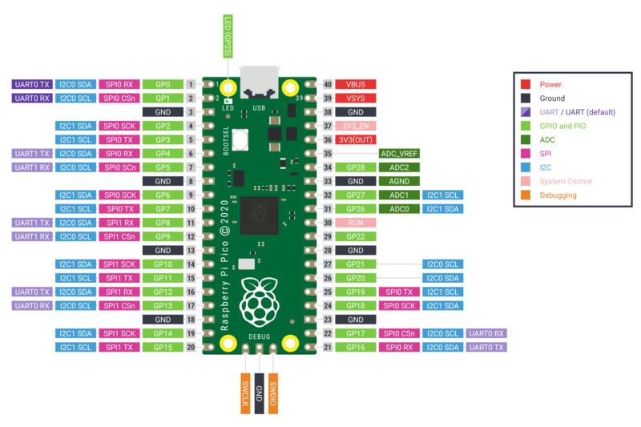

.. _rp2_quickref:

Quick reference for the RP2
===========================

The Raspberry Pi Pico Development Board (image attribution: Raspberry Pi Foundation).

Below is a quick reference for Raspberry Pi RP2xxx boards.  If it is your first time
working with this board it may be useful to get an overview of the microcontroller:

.. toctree::
   :maxdepth: 1

   general.rst
   tutorial/intro.rst

Installing MicroPython
----------------------

See the corresponding section of tutorial: :ref:`rp2_intro`. It also includes
a troubleshooting subsection.

General board control
---------------------

The MicroPython REPL is accessed via the USB serial port. Tab-completion is useful to
find out what methods an object has. Paste mode (ctrl-E) is useful to paste a
large slab of Python code into the REPL.

The :mod:`machine` module:

machine.freq() allows to change the MCU frequency and control the peripheral
frequency for UART and SPI. Usage::

    machine.freq(MCU_frequency[, peripheral_frequency=48_000_000])

The MCU frequency can be set in a range from less than 48 MHz to about 250MHz.
The default at boot time is 125 MHz. The peripheral frequency must be either
48 MHz or identical to the MCU frequency, with 48 MHz as the default.
If the peripheral frequency is changed, any already existing instance of
UART and SPI will change it's baud rate and may have to be re-configured::

    import machine

    machine.freq()          # get the current frequency of the CPU
    machine.freq(240000000) # set the CPU frequency to 240 MHz and keep
                            # the UART frequency at 48MHz
    machine.freq(125000000, 125000000) # set the CPU and UART frequency to 125 MHz

The :mod:`rp2` module::

    import rp2

Networking
----------

WLAN
^^^^

.. note::
   This section applies only to devices that include WiFi support, such as the `Pico W`_ and `Pico 2 W`_.

The :class:`network.WLAN` class in the :mod:`network` module::

    import network

    wlan = network.WLAN()       # create station interface (the default, see below for an access point interface)
    wlan.active(True)           # activate the interface
    wlan.scan()                 # scan for access points
    wlan.isconnected()          # check if the station is connected to an AP
    wlan.connect('ssid', 'key') # connect to an AP
    wlan.config('mac')          # get the interface's MAC address
    wlan.ipconfig('addr4')      # get the interface's IPv4 addresses

    ap = network.WLAN(network.WLAN.IF_AP) # create access-point interface
    ap.config(ssid='RP2-AP')              # set the SSID of the access point
    ap.config(max_clients=10)             # set how many clients can connect to the network
    ap.active(True)                       # activate the interface

A useful function for connecting to your local WiFi network is::

    def do_connect():
        import machine, network
        wlan = network.WLAN()
        wlan.active(True)
        if not wlan.isconnected():
            print('connecting to network...')
            wlan.connect('ssid', 'key')
            while not wlan.isconnected():
                machine.idle()
        print('network config:', wlan.ipconfig('addr4'))

Once the network is established the :mod:`socket <socket>` module can be used
to create and use TCP/UDP sockets as usual, and the ``requests`` module for
convenient HTTP requests.

After a call to ``wlan.connect()``, the device will by default retry to connect
**forever**, even when the authentication failed or no AP is in range.
``wlan.status()`` will return ``network.STAT_CONNECTING`` in this state until a
connection succeeds or the interface gets disabled.

.. _Pico W: https://www.raspberrypi.com/documentation/microcontrollers/pico-series.html#picow-technical-specification
.. _Pico 2 W: https://www.raspberrypi.com/documentation/microcontrollers/pico-series.html#pico2w-technical-specification

Delay and timing
----------------

Use the :mod:`time <time>` module::

    import time

    time.sleep(1)           # sleep for 1 second
    time.sleep_ms(500)      # sleep for 500 milliseconds
    time.sleep_us(10)       # sleep for 10 microseconds
    start = time.ticks_ms() # get millisecond counter
    delta = time.ticks_diff(time.ticks_ms(), start) # compute time difference

Timers
------

RP2040's system timer peripheral provides a global microsecond timebase and
generates interrupts for it.  The software timer is available currently,
and there are unlimited number of them (memory permitting). There is no need
to specify the timer id (id=-1 is supported at the moment) as it will default
to this.

Use the :mod:`machine.Timer` class::

    from machine import Timer

    tim = Timer(period=5000, mode=Timer.ONE_SHOT, callback=lambda t:print(1))
    tim.init(period=2000, mode=Timer.PERIODIC, callback=lambda t:print(2))

.. _rp2_Pins_and_GPIO:

Pins and GPIO
-------------

Use the :ref:`machine.Pin <machine.Pin>` class::

    from machine import Pin

    p0 = Pin(0, Pin.OUT)    # create output pin on GPIO0
    p0.on()                 # set pin to "on" (high) level
    p0.off()                # set pin to "off" (low) level
    p0.value(1)             # set pin to on/high

    p2 = Pin(2, Pin.IN)     # create input pin on GPIO2
    print(p2.value())       # get value, 0 or 1

    p4 = Pin(4, Pin.IN, Pin.PULL_UP) # enable internal pull-up resistor
    p5 = Pin(5, Pin.OUT, value=1) # set pin high on creation

Programmable IO (PIO)
---------------------

PIO is useful to build low-level IO interfaces from scratch.  See the :mod:`rp2` module
for detailed explanation of the assembly instructions.

Example using PIO to blink an LED at 1Hz::

    from machine import Pin
    import rp2

    @rp2.asm_pio(set_init=rp2.PIO.OUT_LOW)
    def blink_1hz():
        # Cycles: 1 + 7 + 32 * (30 + 1) = 1000
        set(pins, 1)
        set(x, 31)                  [6]
        label("delay_high")
        nop()                       [29]
        jmp(x_dec, "delay_high")

        # Cycles: 1 + 7 + 32 * (30 + 1) = 1000
        set(pins, 0)
        set(x, 31)                  [6]
        label("delay_low")
        nop()                       [29]
        jmp(x_dec, "delay_low")

    # Create and start a StateMachine with blink_1hz, outputting on Pin(25)
    sm = rp2.StateMachine(0, blink_1hz, freq=2000, set_base=Pin(25))
    sm.active(1)

UART (serial bus)
-----------------

There are two UARTs, UART0 and UART1. UART0 can be mapped to GPIO 0/1, 12/13
and 16/17, and UART1 to GPIO 4/5 and 8/9.

See :ref:`machine.UART <machine.UART>`. ::

    from machine import UART, Pin
    uart1 = UART(1, baudrate=9600, tx=Pin(4), rx=Pin(5))
    uart1.write('hello')  # write 5 bytes
    uart1.read(5)         # read up to 5 bytes

.. note::

    REPL over UART is disabled by default. You can see the :ref:`rp2_intro` for
    details on how to enable REPL over UART.

PWM (pulse width modulation)
----------------------------

There are 8 independent PWM generators called slices, which each have two
channels making it 16 PWM channels in total which can be clocked from
8Hz to 62.5Mhz at a machine.freq() of 125Mhz. The two channels of a
slice run at the same frequency, but can have a different duty rate.
The two channels are usually assigned to adjacent GPIO pin pairs with
even/odd numbers. So GPIO0 and GPIO1 are at slice 0, GPIO2 and GPIO3
are at slice 1, and so on. A certain channel can be assigned to
different GPIO pins (see Pinout). For instance slice 0, channel A can be assigned
to both GPIO0 and GPIO16.

Use the ``machine.PWM`` class::

    from machine import Pin, PWM

    # create PWM object from a pin and set the frequency of slice 0
    # and duty cycle for channel A
    pwm0 = PWM(Pin(0), freq=2000, duty_u16=32768)
    pwm0.freq()             # get the current frequency of slice 0
    pwm0.freq(1000)         # set/change the frequency of slice 0
    pwm0.duty_u16()         # get the current duty cycle of channel A, range 0-65535
    pwm0.duty_u16(200)      # set the duty cycle of channel A, range 0-65535
    pwm0.duty_u16(0)        # stop the output at channel A
    print(pwm0)             # show the properties of the PWM object.
    pwm0.deinit()           # turn off PWM of slice 0, stopping channels A and B

ADC (analog to digital conversion)
----------------------------------

RP2040 has five ADC channels in total, four of which are 12-bit SAR based
ADCs: GP26, GP27, GP28 and GP29. The input signal for ADC0, ADC1, ADC2 and
ADC3 can be connected with GP26, GP27, GP28, GP29 respectively (On Pico board,
GP29 is connected to VSYS). The standard ADC range is 0-3.3V. The fifth
channel is connected to the in-built temperature sensor and can be used for
measuring the temperature.

Use the :ref:`machine.ADC <machine.ADC>` class::

    from machine import ADC, Pin
    adc = ADC(Pin(26))     # create ADC object on ADC pin
    adc.read_u16()         # read value, 0-65535 across voltage range 0.0v - 3.3v

The argument of the constructor ADC specifies either a Pin by number, name of as
Pin object, or a channel number in the range 0 - 3 or ADC.CORE_TEMP for the
internal temperature sensor. If a pin is specified,
the pin is initialized in high-Z mode. If a channel number is used, the pin
is not initialized and configuring is left to the user code. After hard reset,
RP2040 pins operate in current sink mode at about 60µA. If the pin is not
otherwise configured, that may lead to wrong ADC readings.

Software SPI bus
----------------

Software SPI (using bit-banging) works on all pins, and is accessed via the
:ref:`machine.SoftSPI <machine.SoftSPI>` class::

    from machine import Pin, SoftSPI

    # construct a SoftSPI bus on the given pins
    # polarity is the idle state of SCK
    # phase=0 means sample on the first edge of SCK, phase=1 means the second
    spi = SoftSPI(baudrate=100_000, polarity=1, phase=0, sck=Pin(0), mosi=Pin(2), miso=Pin(4))

    spi.init(baudrate=200000) # set the baudrate

    spi.read(10)            # read 10 bytes on MISO
    spi.read(10, 0xff)      # read 10 bytes while outputting 0xff on MOSI

    buf = bytearray(50)     # create a buffer
    spi.readinto(buf)       # read into the given buffer (reads 50 bytes in this case)
    spi.readinto(buf, 0xff) # read into the given buffer and output 0xff on MOSI

    spi.write(b'12345')     # write 5 bytes on MOSI

    buf = bytearray(4)      # create a buffer
    spi.write_readinto(b'1234', buf) # write to MOSI and read from MISO into the buffer
    spi.write_readinto(buf, buf) # write buf to MOSI and read MISO back into buf

.. Warning::
   Currently *all* of ``sck``, ``mosi`` and ``miso`` *must* be specified when
   initialising Software SPI.

Hardware SPI bus
----------------

The RP2040 has 2 hardware SPI buses which is accessed via the
:ref:`machine.SPI <machine.SPI>` class and has the same methods as software
SPI above::

    from machine import Pin, SPI

    spi = SPI(1, 10_000_000)  # Default assignment: sck=Pin(10), mosi=Pin(11), miso=Pin(8)
    spi = SPI(1, 10_000_000, sck=Pin(14), mosi=Pin(15), miso=Pin(12))
    spi = SPI(0, baudrate=80_000_000, polarity=0, phase=0, bits=8, sck=Pin(6), mosi=Pin(7), miso=Pin(4))

Software I2C bus
----------------

Software I2C (using bit-banging) works on all output-capable pins, and is
accessed via the :ref:`machine.SoftI2C <machine.SoftI2C>` class::

    from machine import Pin, SoftI2C

    i2c = SoftI2C(scl=Pin(5), sda=Pin(4), freq=100_000)

    i2c.scan()              # scan for devices

    i2c.readfrom(0x3a, 4)   # read 4 bytes from device with address 0x3a
    i2c.writeto(0x3a, '12') # write '12' to device with address 0x3a

    buf = bytearray(10)     # create a buffer with 10 bytes
    i2c.writeto(0x3a, buf)  # write the given buffer to the peripheral

Hardware I2C bus
----------------

The driver is accessed via the :ref:`machine.I2C <machine.I2C>` class and
has the same methods as software I2C above::

    from machine import Pin, I2C

    i2c = I2C(0)   # default assignment: scl=Pin(9), sda=Pin(8)
    i2c = I2C(1, scl=Pin(3), sda=Pin(2), freq=400_000)

I2S bus
-------

See :ref:`machine.I2S <machine.I2S>`. ::

    from machine import I2S, Pin

    i2s = I2S(0, sck=Pin(16), ws=Pin(17), sd=Pin(18), mode=I2S.TX, bits=16, format=I2S.STEREO, rate=44100, ibuf=40000) # create I2S object
    i2s.write(buf)             # write buffer of audio samples to I2S device

    i2s = I2S(1, sck=Pin(0), ws=Pin(1), sd=Pin(2), mode=I2S.RX, bits=16, format=I2S.MONO, rate=22050, ibuf=40000) # create I2S object
    i2s.readinto(buf)          # fill buffer with audio samples from I2S device

The ``ws`` pin number must be one greater than the ``sck`` pin number.

The I2S class is currently available as a Technical Preview.  During the preview period, feedback from
users is encouraged.  Based on this feedback, the I2S class API and implementation may be changed.

Two I2S buses are supported with id=0 and id=1.

Real time clock (RTC)
---------------------

See :ref:`machine.RTC <machine.RTC>` ::

    from machine import RTC

    rtc = RTC()
    rtc.datetime((2017, 8, 23, 0, 1, 12, 48, 0)) # set a specific date and
                                                 # time, eg. 2017/8/23 1:12:48
                                                 # the day-of-week value is ignored
    rtc.datetime() # get date and time

WDT (Watchdog timer)
--------------------

The RP2040 has a watchdog which is a countdown timer that can restart
parts of the chip if it reaches zero.

See :ref:`machine.WDT <machine.WDT>`. ::

    from machine import WDT

    # enable the WDT with a timeout of 5s (1s is the minimum)
    wdt = WDT(timeout=5000)
    wdt.feed()

The maximum value for timeout is 8388 ms.

OneWire driver
--------------

The OneWire driver is implemented in software and works on all pins::

    from machine import Pin
    import onewire

    ow = onewire.OneWire(Pin(12)) # create a OneWire bus on GPIO12
    ow.scan()               # return a list of devices on the bus
    ow.reset()              # reset the bus
    ow.readbyte()           # read a byte
    ow.writebyte(0x12)      # write a byte on the bus
    ow.write('123')         # write bytes on the bus
    ow.select_rom(b'12345678') # select a specific device by its ROM code

There is a specific driver for DS18S20 and DS18B20 devices::

    import time, ds18x20
    ds = ds18x20.DS18X20(ow)
    roms = ds.scan()
    ds.convert_temp()
    time.sleep_ms(750)
    for rom in roms:
        print(ds.read_temp(rom))

Be sure to put a 4.7k pull-up resistor on the data line.  Note that
the ``convert_temp()`` method must be called each time you want to
sample the temperature.

NeoPixel and APA106 driver
--------------------------

Use the ``neopixel`` and ``apa106`` modules::

    from machine import Pin
    from neopixel import NeoPixel

    pin = Pin(0, Pin.OUT)   # set GPIO0 to output to drive NeoPixels
    np = NeoPixel(pin, 8)   # create NeoPixel driver on GPIO0 for 8 pixels
    np[0] = (255, 255, 255) # set the first pixel to white
    np.write()              # write data to all pixels
    r, g, b = np[0]         # get first pixel colour

The APA106 driver extends NeoPixel, but internally uses a different colour order::

    from apa106 import APA106
    ap = APA106(pin, 8)
    r, g, b = ap[0]

APA102 (DotStar) uses a different driver as it has an additional clock pin.
