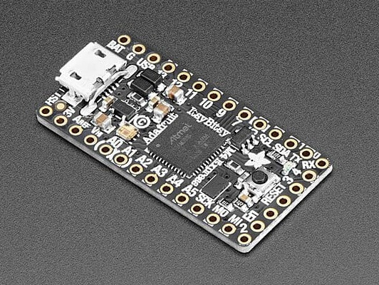

.. _samd_quickref:

Quick reference for the SAMD21/SAMD51 family
============================================



The Adafruit ItsyBitsy M4 Express board.

Below is a quick reference for SAMD21/SAMD51-based boards.  If it is your first time
working with this board it may be useful to get an overview of the microcontroller:

.. toctree::
   :maxdepth: 1

   general.rst
   tutorial/intro.rst
   pinout.rst


Installing MicroPython
----------------------

See the corresponding section of tutorial: :ref:`samd_intro`. It also includes
a troubleshooting subsection.

General board control
---------------------

The MicroPython REPL is on the USB port, configured in VCP mode.
Tab-completion is useful to find out what methods an object has.
Paste mode (Ctrl-E) is useful to paste a large slab of Python code into
the REPL.

The :mod:`machine` module::

    import machine

    machine.freq()            # get the current frequency of the CPU
    machine.freq(96_000_000)  # set the CPU frequency to 96 MHz

The range accepted by the function call is 1_000_000 to 200_000_000 (1 MHz to 200 MHz)
for SAMD51 and 1_000_000 to 54_000_000 (1 MHz to 54 MHz) for SAMD21. The safe
range for SAMD51 according to the data sheet is up to 120 MHz, for the SAMD21 up to 48Mhz.
Frequencies below 48Mhz are set by dividing 48Mhz by an integer, limiting the number of
discrete frequencies to 24Mhz, 16Mhz, 12MHz, and so on.
At frequencies below 8 MHz USB will be disabled. Changing the frequency below 48 MHz
impacts the baud rates of UART, I2C and SPI. These have to be set again after
changing the CPU frequency. The ms and µs timers are not affected by the frequency
change.


Delay and timing
----------------

Use the :mod:`time <time>` module::

    import time

    time.sleep(1)           # sleep for 1 second
    time.sleep_ms(500)      # sleep for 500 milliseconds
    time.sleep_us(10)       # sleep for 10 microseconds
    start = time.ticks_ms() # get millisecond counter
    delta = time.ticks_diff(time.ticks_ms(), start) # compute time difference

Note that :func:`time.sleep_us()` delays by busy waiting. During that time, other tasks are
not scheduled.

Clock and time
--------------

Two groups of functions are provided for time information. All boards have the
datetime(), mktime() and time() functions. Boards with a 32kHz crystal also
provide an RTC() module. The epoch start date is 1.1.2000.

Use the :mod:`time <time>` module::

    import time

    date_time = time.localtime()        # Show the actual date/time information
    date_time = time.localtime(seconds) # decode the date/time form the seconds value
    seconds = time.mktime(date_time_tuple) # Convert seconds to a datetime tuple
    second = time.time()                # Return the actual system time.

The format of the date_time tuple follows the standard. The µs value of the date_time
tuple is ignored. On boards without the RTC module, time.localtime(seconds) sets the
system time. Use of the Use the :mod:`RTC <RTC>` module::

    from machine import RTC
    rtc = RTC()
    date_time = rtc.datetime()      # return the actual date & time.
    rtc.datetime(date_time_tuple)   # Set date & time, ignoring weekday
    date_time = rtc.now()           # Return date & time in Unix order.
    rtc.calibration(value)          # Set a calibration factor

The weekday value set will be ignored and calculated in the returned tuple from the
actual date. rtc.now() is only provided at SAMD51 boards. The value used in the
rtc.calibration() call has a range from -127 - 127. It defines roughly a
ppm quantity, by which the clock can run faster or slower.


Timers
------

The SAMD21/SAMD51 uses software timers. Use the :ref:`machine.Timer <machine.Timer>` class::

    from machine import Timer

    tim0 = Timer()
    tim0.init(period=5000, mode=Timer.ONE_SHOT, callback=lambda t:print(0))

    tim1 = Timer()
    tim1.init(period=2000, mode=Timer.PERIODIC, callback=lambda t:print(1))

The period is in milliseconds.

.. _samd_Pins_and_GPIO:

Pins and GPIO
-------------

Use the :ref:`machine.Pin <machine.Pin>` class::

    from machine import Pin

    p0 = Pin('D0', Pin.OUT) # create output pin on GPIO0
    p0.on()                 # set pin to "on" (high) level
    p0.off()                # set pin to "off" (low) level
    p0.value(1)             # set pin to on/high

    p2 = Pin('D2', Pin.IN)  # create input pin on GPIO2
    print(p2.value())       # get value, 0 or 1

    p4 = Pin('D4', Pin.IN, Pin.PULL_UP) # enable internal pull-up resistor
    p7 = Pin('PA07', Pin.OUT, value=1) # set pin high on creation

Pins can be denoted by a string or a number. The string is either the
pin label of the respective board, like "D0" or "SDA", or in the form
"Pxnn", where x is A,B,C or D, and nn a two digit number in the range 0-31.
Examples: "PA03", PD31".

Pin numbers are the MCU port numbers in the range::

    PA0..PA31:  0..31
    PB0..PB31: 32..63
    PC0..PC31: 64..95
    PD0..PD31: 96..127

Note: On Adafruit Feather and ItsyBity boards, pin D5 is connected to an external
gate output and can therefore only be used as input.

UART (serial bus)
-----------------

See :ref:`machine.UART <machine.UART>`. ::

    # Use UART 3 on a ItsyBitsy M4 board
    from machine import UART

    uart3 = UART(3, tx=Pin('D1'), rx=Pin('D0'), baudrate=115200)
    uart3.write('hello')  # write 5 bytes
    uart3.read(5)         # read up to 5 bytes

    uart = UART()         # Use the default values for id, rx and tx.
    uart = UART(baudrate=9600) # Use the default UART and set the baudrate

The SAMD21/SAMD51 MCUs have up to eight hardware so called SERCOM devices, which can be used as UART,
SPI or I2C device, but not every MCU variant and board exposes all
TX and RX pins for users. For the assignment of Pins to devices and UART signals,
refer to the :ref:`SAMD pinout <samd_pinout>`. If the id, rx or tx pins are not specified,
the default values are used. The first positional argument (if given) is assumed to be the UART id.
If the baudrate is changed and the UART id is omitted, it must be set using the baudrate keyword.

PWM (pulse width modulation)
----------------------------

Up to five timer device of the SAMD21/SAMD51 MCUs are used for creating PWM signals.

The PWM functions are provided by the :ref:`machine.PWM <machine.PWM>` class.
It supports all basic methods listed for that class. ::

    # Samples for Adafruit ItsyBitsy M4 Express

    from machine import Pin, PWM

    # create PWM object from a pin and set the frequency and duty cycle
    pwm = PWM(Pin('D7'), freq=2000, duty_u16=32768)
    pwm.freq()             # get the current frequency
    pwm.freq(1000)         # set/change the frequency
    pwm.duty_u16()         # get the current duty cycle, range 0-65535
    pwm.duty_u16(200)      # set the duty cycle, range 0-65535
    pwm.deinit()           # turn off PWM on the pin

    pwm                    # show the PWM objects properties


PWM Constructor
```````````````

.. class:: PWM(dest, *, freq, duty_u16, duty_ns, invert, device)
  :noindex:

    Construct and return a new PWM object using the following parameters:

      - *dest* is the Pin object on which the PWM is output.

    PWM objects are provided by TCC timer module. The TCC timer modules have up
    to six channels and eight outputs. All channels of a module run at the same
    frequency, but allow for different duty cycles. Outputs are assigned to channels
    in modulo-n fashion, where n is the number of channels. Outputs of a channel
    have the same frequency and duty rate, but may have different polarity.
    So if for instance a module has four channels, output 0 and 4, 1 and 5,
    2 and 6, 3, and 7 share the same frequency and duty rate.

    Only one of *duty_u16* and *duty_ns* should be specified at a time.

    Keyword arguments:

      - *freq* should be an integer which sets the frequency in Hz for the
        PWM cycle. The valid frequency range is 1 Hz to 24 MHz.
      - *duty_u16* sets the duty cycle as a ratio ``duty_u16 / 65535``.
      - *duty_ns* sets the pulse width in nanoseconds. The limitation for X channels
        apply as well.
      - *invert*\=True|False. Setting a bit inverts the respective output.
      - *device*\=n Use TCC module n if available. At some pins two TCC modules could be
        used. If not device is mentioned, the software tries to use a module which is not yet
        used for a PWM signal. But if pins shall have the same frequency and/or duty cycle
        to be changed synchronously, they must be driven by the same TCC module.

PWM Methods
```````````

The methods are identical to the generic :ref:`machine.PWM <machine.PWM>` class,
with additional keyword arguments to the init() method, matchings those of the constructor.

PWM Pin Assignment
``````````````````

Pins are specified in the same way as for the Pin class.  For the assignment of Pins
to PWM signals, refer to the :ref:`SAMD pinout <samd_pinout>`.

ADC (analog to digital conversion)
----------------------------------

On the SAMD21/SAMD51 ADC functionality is available on Pins labelled 'Ann'.

Use the :ref:`machine.ADC <machine.ADC>` class::

    from machine import ADC

    adc0 = ADC(Pin('A0'))            # create ADC object on ADC pin, average=16
    adc0.read_u16()                  # read value, 0-65535 across voltage range 0.0v - 3.3v
    adc1 = ADC(Pin('A1'), average=1) # create ADC object on ADC pin, average=1

The resolution of the ADC is 12 bit with 12 bit accuracy, irrespective of the
value returned by read_u16(). If you need a higher resolution or better accuracy, use
an external ADC.

ADC Constructor
```````````````

.. class:: ADC(dest, *, average=16, vref=n)
  :noindex:

Construct and return a new ADC object using the following parameters:

  - *dest* is the Pin object on which the ADC is output.

Keyword arguments:

  - *average* is used to reduce the noise. With a value of 16 the LSB noise is about 1 digit.
  - *vref* sets the reference voltage for the ADC.

    The default setting is for 3.3V. Other values are:

    ==== ==============================  ===============================
    vref SAMD21                          SAMD51
    ==== ==============================  ===============================
    0    1.0V voltage reference          internal bandgap reference (1V)
    1    1/1.48 Analogue voltage supply  Analogue voltage supply
    2    1/2 Analogue voltage supply     1/2 Analogue voltage supply
    3    External reference A            External reference A
    4    External reference B            External reference B
    5    -                               External reference C
    ==== ==============================  ===============================

ADC Methods
```````````

.. method:: read_u16()

Read a single ADC value as unsigned 16 bit quantity. The voltage range is defined
by the vref option of the constructor, the resolutions by the bits option.

DAC (digital to analog conversion)
----------------------------------

The DAC class provides a fast digital to analog conversion. Usage example::

    from machine import DAC

    dac0 = DAC(0)                    # create DAC object on DAC pin A0
    dac0.write(1023)                 # write value, 0-4095 across voltage range 0.0v - 3.3v
    dac1 = DAC(1)                    # create DAC object on DAC pin A1
    dac1.write(2000)                 # write value, 0-4095 across voltage range 0.0v - 3.3v

The resolution of the DAC is 12 bit for SAMD51 and 10 bit for SAMD21. SAMD21 devices
have 1 DAC channel at GPIO PA02, SAMD51 devices have 2 DAC channels at GPIO PA02 and PA05.

DAC Constructor
```````````````

.. class:: DAC(id, *, vref=3)
  :noindex:

The vref arguments defines the output voltage range, the callback option is used for
dac_timed(). Suitable values for vref are:

==== ============================  ================================
vref SAMD21                        SAMD51
==== ============================  ================================
0    Internal voltage reference    Internal bandgap reference (~1V)
1    Analogue voltage supply       Analogue voltage supply
2    External reference            Unbuffered external reference
3    -                             Buffered external reference
==== ============================  ================================

DAC Methods
```````````

.. method:: write(value)

Write a single value to the selected DAC output. The value range is 0-1023 for
SAMD21 and 0-4095 for SAMD51. The voltage range depends on the vref setting.

Software SPI bus
----------------

Software SPI (using bit-banging) works on all pins, and is accessed via the
:ref:`machine.SoftSPI <machine.SoftSPI>` class. ::

    from machine import Pin, SoftSPI

    # construct a SoftSPI bus on the given pins
    # polarity is the idle state of SCK
    # phase=0 means sample on the first edge of SCK, phase=1 means the second
    spi = SoftSPI(baudrate=100000, polarity=1, phase=0, sck=Pin('D7'), mosi=Pin('D9'), miso=Pin('D10'))

    spi.init(baudrate=200000) # set the baud rate

    spi.read(10)            # read 10 bytes on MISO
    spi.read(10, 0xff)      # read 10 bytes while outputting 0xff on MOSI

    buf = bytearray(50)     # create a buffer
    spi.readinto(buf)       # read into the given buffer (reads 50 bytes in this case)
    spi.readinto(buf, 0xff) # read into the given buffer and output 0xff on MOSI

    spi.write(b'12345')     # write 5 bytes on MOSI

    buf = bytearray(4)      # create a buffer
    spi.write_readinto(b'1234', buf) # write to MOSI and read from MISO into the buffer
    spi.write_readinto(buf, buf) # write buf to MOSI and read MISO back into buf

The highest supported baud rate is 500000.

Hardware SPI bus
----------------

The SAMD21/SAMD51 MCUs have up to eight hardware so called SERCOM devices, which can be used as UART,
SPI or I2C device, but not every MCU variant and board exposes all
signal pins for users.  Hardware SPI is accessed via the
:ref:`machine.SPI <machine.SPI>` class and has the same methods as software SPI above::

    from machine import SPI

    spi = SPI(1, sck=Pin("SCK"), mosi=Pin("MOSI"), miso=Pin("MISO"), baudrate=10000000)
    spi.write('Hello World')

For the assignment of Pins to SPI devices and signals, refer to
:ref:`SAMD pinout <samd_pinout>`. If the id, miso, mosi or sck pins are not specified,
the default values are used. So it is possible to create the SPI object as::

    from machine import SPI
    spi = SPI()  # Use the default device and default baudrate
    spi = SPI(baudrate=12_000_000)  # Use the default device and change the baudrate

If the MISO signal shall be omitted, it must be defined as miso=None.
The first positional argument (if given) is assumed to be the SPI id.
If the baudrate is changed while the SPI id is omitted, it must be
set using the baudrate keyword.

Note: Even if the highest reliable baud rate at the moment is about 24 Mhz,
setting a baud rate will not always result in exactly that frequency, especially
at high baud rates.

Software I2C bus
----------------

Software I2C (using bit-banging) works on all output-capable pins, and is
accessed via the :ref:`machine.SoftI2C <machine.SoftI2C>` class::

    from machine import Pin, SoftI2C

    i2c = SoftI2C(scl=Pin('D10'), sda=Pin('D11'), freq=100000)

    i2c.scan()              # scan for devices

    i2c.readfrom(0x3a, 4)   # read 4 bytes from device with address 0x3a
    i2c.writeto(0x3a, '12') # write '12' to device with address 0x3a

    buf = bytearray(10)     # create a buffer with 10 bytes
    i2c.writeto(0x3a, buf)  # write the given buffer to the slave

The highest supported freq is 400000.

Hardware I2C bus
----------------

The SAMD21/SAMD51 MCUs have up to eight hardware so called SERCOM devices,
which can be used as UART, SPI or I2C device, but not every MCU variant
and board exposes all signal pins for users.
For the assignment of Pins to devices and I2C signals, refer to :ref:`SAMD pinout <samd_pinout>`.
If the id, scl or sda pins are not specified, the default values are used.

Hardware I2C is accessed via the :ref:`machine.I2C <machine.I2C>` class and
has the same methods as software SPI above::

    from machine import I2C

    i2c = I2C(2, scl=Pin("SCL"), sda=Pin("SDA"), freq=400_000)
    i2c.writeto(0x76, b"Hello World")

    i2c2 = I2C()   # Use the default values for id, scl and sda.
    i2c2 = I2C(freq=100_000) # Use the default device and set freq.

The first positional argument (if given) is assumed to be the I2C id.
If the freq is changed and the I2C id is omitted, it must be set using
the freq keyword.

OneWire driver
--------------

The OneWire driver is implemented in software and works on all pins::

    from machine import Pin
    import onewire

    ow = onewire.OneWire(Pin('D12')) # create a OneWire bus on GPIO12
    ow.scan()                     # return a list of devices on the bus
    ow.reset()                    # reset the bus
    ow.readbyte()                 # read a byte
    ow.writebyte(0x12)            # write a byte on the bus
    ow.write('123')               # write bytes on the bus
    ow.select_rom(b'12345678')    # select a specific device by its ROM code

There is a specific driver for DS18S20 and DS18B20 devices::

    import time, ds18x20
    ds = ds18x20.DS18X20(ow)
    roms = ds.scan()
    ds.convert_temp()
    time.sleep_ms(750)
    for rom in roms:
        print(ds.read_temp(rom))

Be sure to put a 4.7k pull-up resistor on the data line.  Note that
the ``convert_temp()`` method must be called each time you want to
sample the temperature.

DHT driver
----------

The DHT driver is implemented in software and works on all pins::

    import dht
    import machine

    d = dht.DHT11(machine.Pin('D4'))
    d.measure()
    d.temperature() # eg. 23 (°C)
    d.humidity()    # eg. 41 (% RH)

    d = dht.DHT22(machine.Pin('D4'))
    d.measure()
    d.temperature() # eg. 23.6 (°C)
    d.humidity()    # eg. 41.3 (% RH)

Be sure to have a 4.7k pull-up resistor on the data line.  Some
DHT modules may already have one.

Driving an APA102 LED
---------------------

The APA102 on some Adafruit boards can be controlled using SoftSPI::

    from machine import SoftSPI, Pin
    # create the SPI object. miso can be any unused pin.
    spi=SoftSPI(sck=Pin('D25'), mosi=Pin('D26'), miso=Pin('D14'))

    # define a little function that writes the data with
    # preamble and postfix
    def write(red, green, blue):
        spi.write(b"\x00\x00\x00\x00\xff")
        spi.write(bytearray((blue, green, red)))
        spi.write(b"\xff\xff\xff")

    # set the LED to red
    write(128, 0, 0)

Since SoftSPI does not allow miso to be undefined, miso has to be
assigned to an otherwise unused pin.

Driving a Neopixel LED
----------------------

The built-in machine.bitstream() method supports driving Neopixel LEDs in combination
with the Neopixel driver from the MicroPython driver library::

    import neopixel
    import machine

    # 1 LED connected to Pin D8 on Adafruit Feather boards
    p = machine.Pin('D8', machine.Pin.OUT)
    n = neopixel.NeoPixel(p, 1)

    # set the led to red.
    n[0] = (128, 0, 0)

    # Update the LED.
    n.write()

machine.bitstream() is set up for a SAMD21 clock frequency of 48MHz and a SAMD51
clock frequency of 120 MHz. At other clock frequencies, the timing will not fit.

Transferring files
------------------

Files can be transferred to the SAMD21/SAMD51 devices for instance with the
:ref:`mpremote <mpremote>` tool. See the MicroPython forum for community-supported
alternatives to transfer files to an SAMD21/SAMD51 board, like rshell or Thonny.
