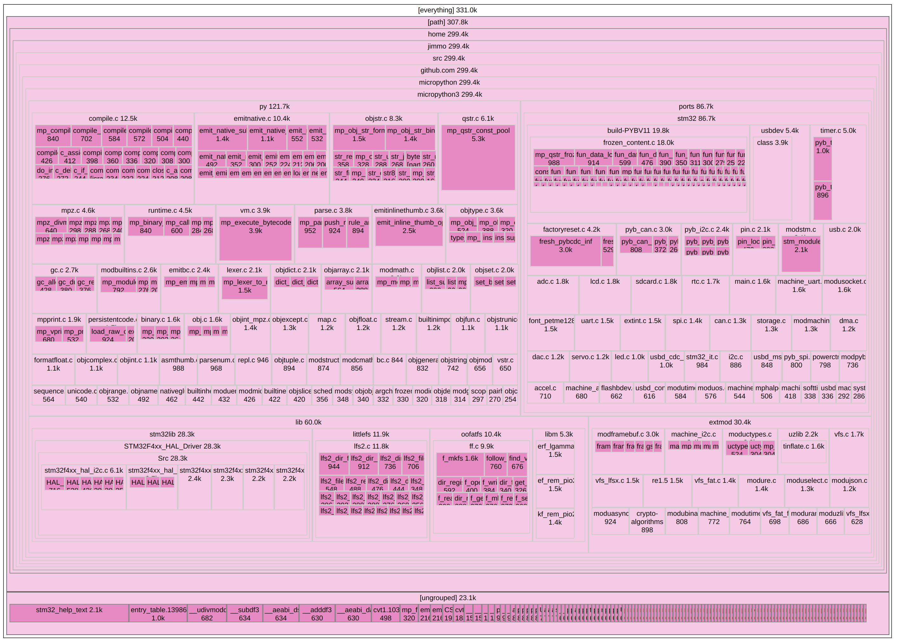

Bloat with Webtreemap
=====================

This directory contains a little tool to visualize code sizes hierarchically for the
purposes of figuring out which pieces of code consume all that flash. Here is a sample
"bloatmap" for an STM32 build:



For STM32 and ESP32 the tool is integrated in the Makefile: `make bloat` will produce the
bloatmap in `./$BUILD/bloat/index.html`.

To generate a bloatmap manually:

```
mkdir bloat
cp $MPYDIR/lib/bloat/* bloat
nm -C -S -l firmware.elf >bloat/nm.out
python2 bloat/bloat.py --nm-output bloat/nm.out \
    --strip-prefix=`cd $MPYDIR; pwd` syms bloat/bloat.json
open bloat/index.html
```

This tool originally came from https://github.com/evmar/bloat and 
https://github.com/evmar/webtreemap, and was adapted to work with MicroPython by @jimmo.
It carries an Apache 2.0 license (see ./LICENSE).
