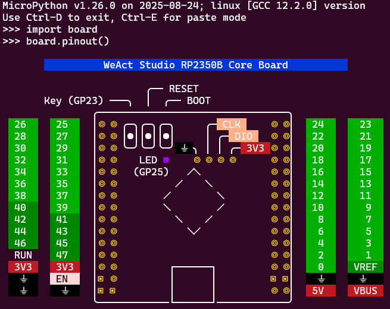

# Pinout diagram

Pinout diagrams can be a helpful tool to display the pin layout for a board.

Building them into a board's firmware means they are always conveniently
available.



## Overview
`pinout.py` generates a unicode pinout diagram that uses ANSI escape characters
to add colour. 

Display the output by executing the script:

```bash
python pinout.py
```


## Compression

`compress.py` uses zlib to _compress input_ and output a _byte string_. 

The output from `pinout.py` can be large but compresses efficiently, so the
intent is that the byte string output from `compress.py` can then be copied to
`../modules/board.py` so that the _compressed_ pinout will be included in the
firmware.

To execute:

```bash
python pinout.py | python compress.py
```
