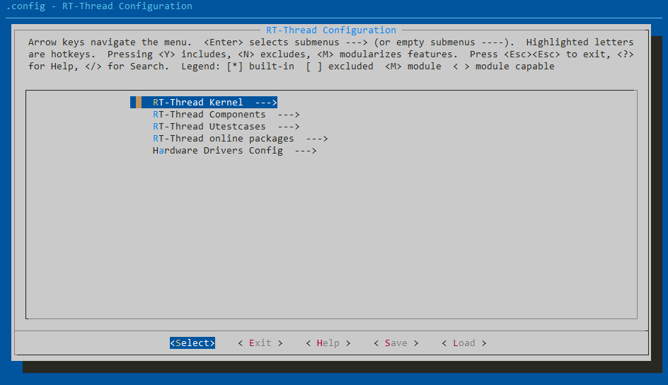
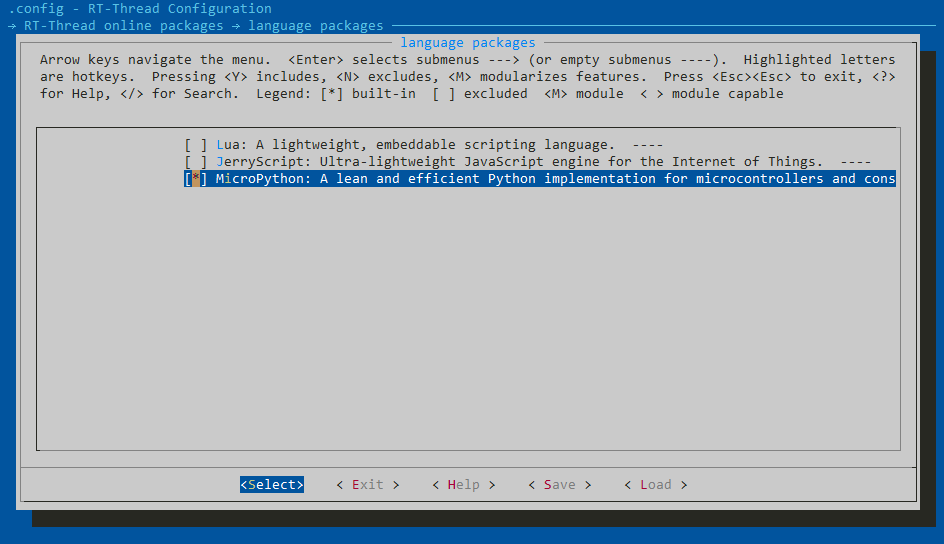
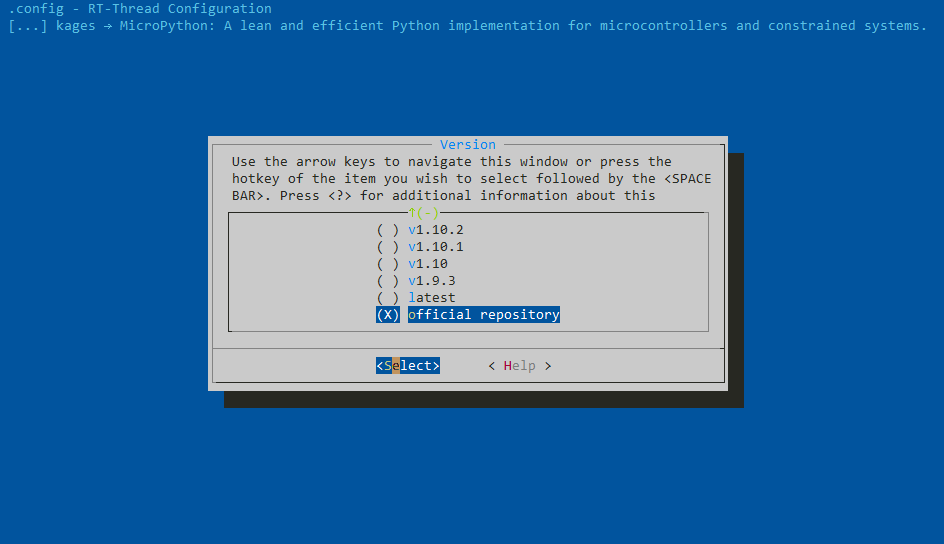

# MicroPython port to RT-Thread

This is a port of MicroPython to RT-Thread([RT-Thread | An Open Source Embedded Real-time Operating System](https://www.rt-thread.io/)), which can run on **RT-Thread 3.0** or higher. You can run MicroPython with RT-Thread by using this port.

If it is the first time to come into contact with RT-Thread MicroPython, it is recommended that you use RT-Thread officially supported development boards to get started quickly. These development boards have complete firmware functions and provide source code, suitable for introductory learning, and officially support development boards

There is been a MicroPython Package running on RT-Thread before(https://github.com/RT-Thread-packages/micropython), but now you can use the package with the latest version of micropython in this repository.

## Quick Start

### Software preparation

* RT-Thread Source Code
* RT-Thread env tools

#### RT-Thread Source Code

``` bash
git clone https://github.com/RT-Thread/rt-thread.git
```

You can also download the release version of RT-Thread From [RT-Thread | Download](https://www.rt-thread.io/download.html)

#### RT-Thread env tools

To download env tools, Please visit [RT-Thread | Download](https://www.rt-thread.io/download.html)

Please visit the official website for more usage of env.

### Config & build your project

* Fisrt, open the source code directory and enter the folder "bsp/YourBsp".

* Then open ENV tools in this folder.
* Run menuconfig in the bsp folder.

``` bash
> menuconfig
```



* Select RT-Thread online packages ---> language packages ---> MicroPython



* Then enter it.

* Switch the version to "official repository"(Or you can select others if you want to use the packages by rt-thread community). 

  

* Config other options if you need.

* Save and exit.

* Use pkgs tool to clone the online packages you selected.

  ``` bash
  > pkgs --update
  ```

* Use scons to build RT-Thread

  ``` bash
  > scons --target=YourPlatform
  ```

  the target can be  mdk, codelite, ses, makefile, cb, vs2012, cdk, cmake-armclang, vs, vsc, mdk4, mdk5, eclipse, cmake, ua, iar

* Now, you can open your project, build it and download it to your chip.

### Run Python Program on your chip

[RT-Thread MicroPython IDE](https://marketplace.visualstudio.com/items?itemName=RT-Thread.rt-thread-micropython) provides a powerful development environment for MicroPython, which can be directly searched and downloaded through the VScode application store. Examples are as follows:


------------

> RT-Thread global website: https://www.rt-thread.io/
>
> RT-Thread Club: [Homepage - RT-Thread Club](https://club.rt-thread.io/)

