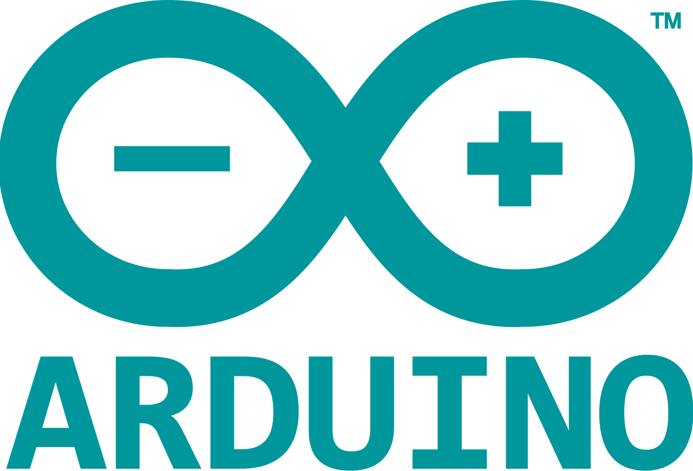

Installation
============

`Pumbaa` uses the `Simba` make based builds system to build
application and upload it to the baord. The Arduino IDE can be used to
build and upload the interactive interpreter example and write python
scripts to file on the board.

|arduino| Arduino IDE
---------------------

Install `Pumbaa` in the `Arduino IDE 1.6.10`_ as a third party board
using the Boards Manager.

1. Open `File` -> `Preferences`.

2. Add this URL to `Additional Boards Manager URLs` (click on the
   icon to the right of the text field) and press `OK`.

   .. code-block:: text

      https://sourceforge.net/projects/pumbaa-arduino/files/sam/package_pumbaa_sam_index.json

3. Open `Tools` -> `Board: ...` -> `Boards Manager...` and type
   `pumbaa` in the search box.

4. Click on `Pumbaa by Erik Moqivst version x.y.z` and click
   `Install` and press `Close`.

5. Open `Tools` -> `Board: ...` -> `Boards Manager...` and
   select one of the Pumbaa boards in the list.

6. Open `File` -> `Examples` -> `Pumbaa` -> `interactive`.

7. Select the Arduino serial port at `Tools` -> `Port: ...`.

8. Open `Tools` -> `Serial Monitor` and change the baudrate to
   38400 in the bottom right corner.

9. Verify and upload the sketch to your device.

10. Done!

|simba| Simba build system
--------------------------

The `Simba` development environment can be installed on `Windows
(Cygwin)`_ and `Linux (Ubuntu 14)`_. Just follow the steps below and
you'll be up and running in no time. =)

Windows (Cygwin)
^^^^^^^^^^^^^^^^

Download `Cygwin`_ and select the following packages for installation:

.. code-block:: text

   - gcc-core          (Devel -> gcc-core)
   - make              (Devel -> make)
   - python            (Python -> python)
   - python-setuptools (Python -> python-setuptools)
   - git               (Devel -> git)
   - doxygen           (Devel -> doxygen)

Start `Cygwin` and execute the one-liner below to install `Pumbaa`.

.. code-block:: text

   $ mkdir pumbaa && \
     cd pumbaa && \
     easy_install-2.7 pip && \
     pip install pyserial pyelftools xpect readchar sphinx breathe && \
     git clone https://github.com/eerimoq/arm-toolchain-windows && \
     git clone https://github.com/eerimoq/pumbaa --recursive

Linux (Ubuntu 14)
^^^^^^^^^^^^^^^^^

Execute the one-liner below to install `Pumbaa`.

.. code-block:: text

   $ mkdir pumbaa && \
     cd pumbaa && \
     sudo apt install ckermit valgrind cppcheck cloc python python-pip doxygen git lcov && \
     sudo apt install bossa-cli gcc-arm-none-eabi && \
     sudo apt install make unrar autoconf automake libtool gcc g++ gperf \
                          flex bison texinfo gawk ncurses-dev libexpat-dev \
                          python-serial sed libtool-bin && \
     sudo pip install pyserial pyelftools xpect sphinx breathe sphinx_rtd_theme && \
     git clone https://github.com/eerimoq/pumbaa --recursive

.. _Cygwin: https://cygwin.com/setup-x86.exe
.. _Arduino IDE 1.6.10: https://www.arduino.cc/en/Main/Software

.. _arduino: http://arduino.cc

.. _simba: http://github.com/eerimoq/simba
