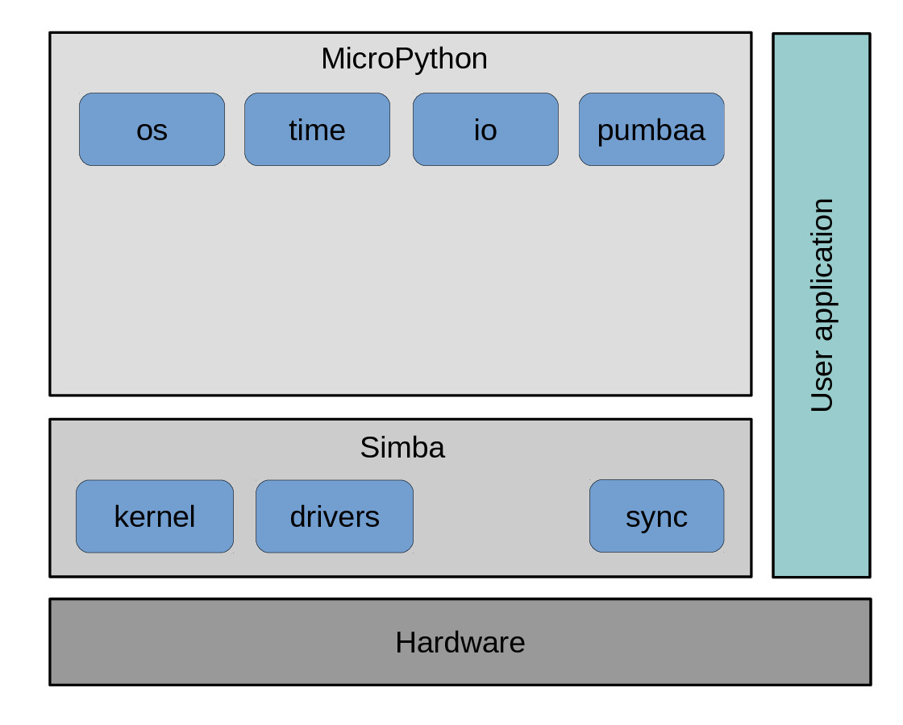

User Guide
==========

This guide is intended for users of the Pumbaa Embedded Programming
Platform.

The `Pumbaa` installation guide can be found on the
:doc:`installation` page.

Software architecture
---------------------

Below is a picture of the `Pumbaa` software architecture. At the
bottom is the hardware. On top of the hardware is the `Simba`
operating system, that implementes all low level functionality;
kernel, drivers, filesystems, networking, etc. `MicroPython`
implements the Python 3 language and a many Python standard library
modules. The user application on the right can be implemented in a mix
of Python and C code depending of the requirements. Normally the whole
application is implemnted in Python.

**Contents:**

.. toctree::
   :glob:
   :maxdepth: 1

   user-guide/environment-setup
   user-guide/hello-world-application
   user-guide/configuration
   user-guide/build-system
