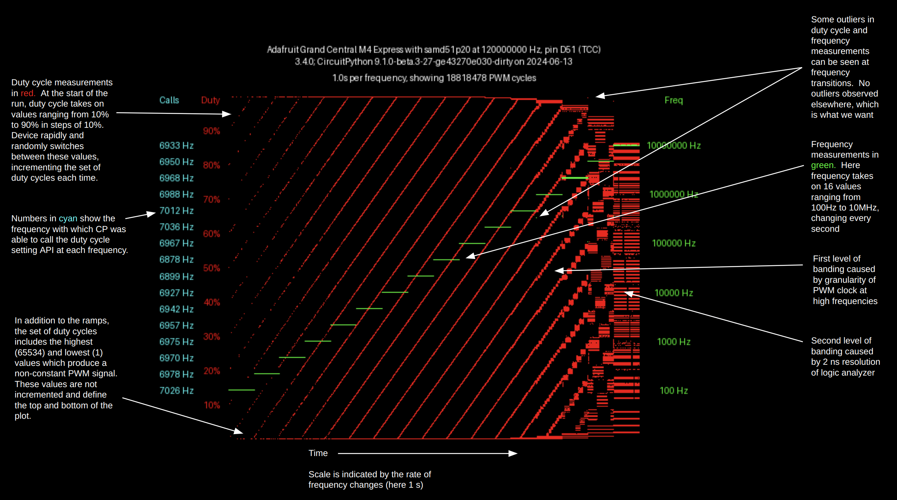
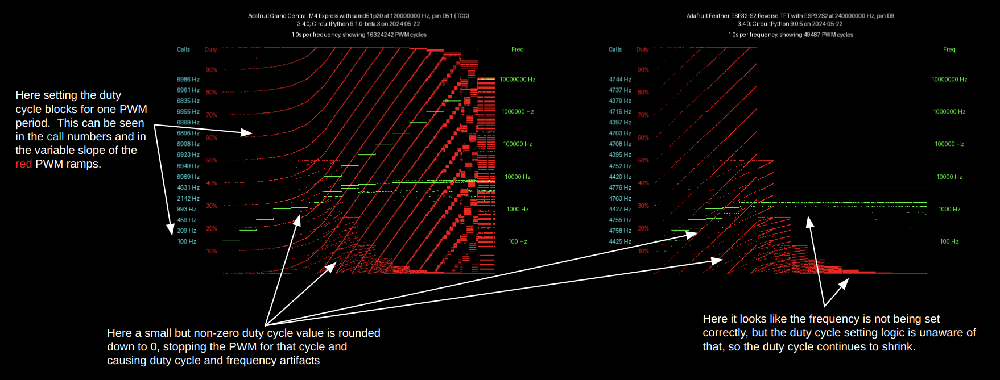
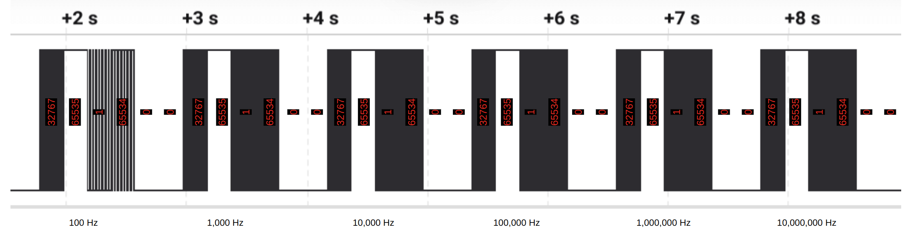

# PWM testing

This directory contains tools for testing CircuitPython's PWM API.  Running the tests involves three steps:

1.  [CircuitPython PWM test code `code_ramps.py`](code_ramps.py) is run on the board to be tested.
2.  As the code runs, the state of the PWM signal is logged by a logic analyzer (I used a Saleae Logic Pro 8).
3.  Data collected by the logic analyzer is analyzed and plotted into a PNG image by [CPython code `duty.py`](duty.py).

Here is a sample plot with key features annotated:

The CircuitPython code loops through a list of PWM frequencies ranging from 100 Hz to 10 MHz, staying at each frequency for one second.  At each frequency it repeatedly and randomly cycles through a list of duty cycles in a tight loop, updating the duty cycle as frequently as it is able.  The captured waveform is analyzed by `duty.py`, which calculates the duration and duty cycle of every observed PWM cycle and plots a point for each.

## PWM expected behavior

These tests can be used to assess how well the PWM API delivers expected behavior, as outlined below:

1.  A PWM signal has a period (defined as the time between rising edges) and a duty cycle (defined as the ratio of the time between a rising edge and the next falling edge, divided by the period).  In a typical application the PWM period will be constant while the duty cycle changes frequently.

2.  An exception to (1) is that CircuitPython explicitly supports duty cycles of 0% and 100%, where the signal stays constant at a low/high level.  In the CP API duty cycle is always specified as a 16-bit value, where 0 corresponds to 0%, 0xFFFF corresponds to 100%, and values in between scale accordingly.

3.  As a corollary to (2), PWM settings of 0 and 0xFFFF should be the ONLY settings which result in always low/always high PWM.  Other settings should always result in an oscillating signal.

4.  In the PWM API the duty cycle is specified as a 16-bit value and the period is specified by a 32-bit frequency value.  A given processor may not be able to provide a signal with that precision, but will do its best to approximate what is asked for.  The actual PWM duty and frequency settings resulting from the requested parameters can be obtained from the API.

5.  The user can set the duty cycle and frequency (if initialized with `variable_frequency=True`) at any time.  Changes in duty cycle and frequency should appear in the PWM signal as soon as possible after the setting function is invoked.  The execution time of API calls for setting PWM frequency and duty cycle should be as short as possible and should not depend on the frequency and duty cycle parameters.

6.  Changes in duty cycle should ideally never result in output glitches -- that is, the duty cycle of the PWM signal should never take on a value which has not been set by the user.

7.  Changes in frequency may (and will usually) result in a transient glitch in frequency and duty cycle.  PWM hardware is generally not designed for glitch-free frequency transitions.

8.  PWM frequency and duty cycle should be jitter-free.

## Examples of PWM flaws

The plot at the top of this page depicts data PWM gathered from a device with an API that displays all of the expected behavior listed above.  The plots below show how the tools reveal flaws in the behavior of PWM APIs that are not as complete.

## Testing always-off and always-on PWM extremes

The procedure described above does not test item 2 above, i.e. the ability of the API to support duty cycles of 0% and 100%.  A different code file, (code_extremes.py) provides for this.  This code cycles through PWM duty cycles of 32767, 65535, 1, 65534, and 0, repeating the sequence at six frequencies from 100 Hz to 10MHz.  When viewed on a logic analyzer, the PWM output should look like the figure below.  100% and 0% PWM result from duty cycle settings of 65535 and 0, (and only from those settings, in accordance with item 3 above.)

