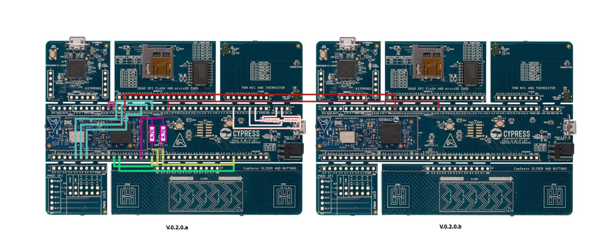
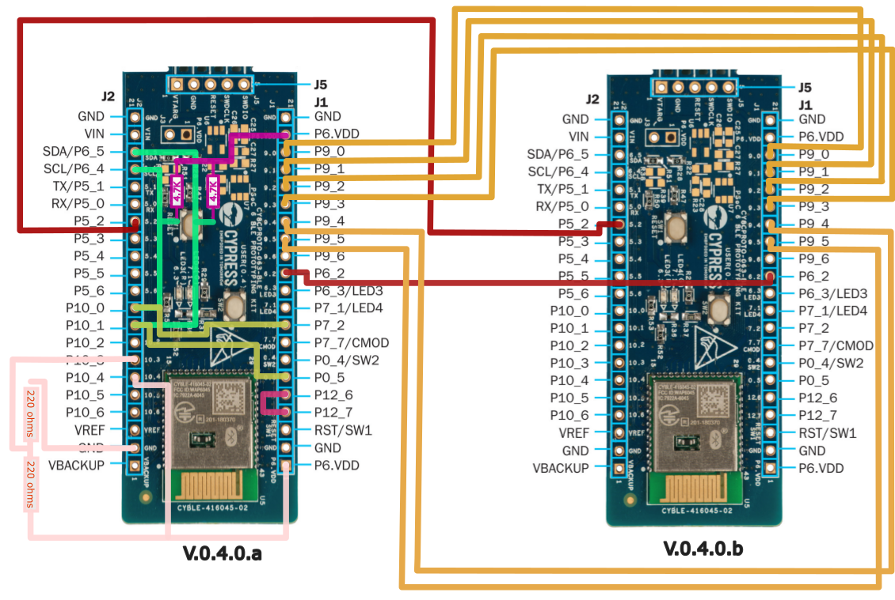

# Extended Hardware Setup Tests

The tests located in this folder implement the validation of hardware peripherals features (GPIO, I2C, SPI, etc.) which require additional or extended hardware configuration to the evaluation boards.

The extended setup is meant to provide the necessary circuitry, electronic system or interface for the tests to be performed. For example, interconnecting some pins (with simple cables) and/or attach some external circuit, device, or discrete electronic components. 

## Boards Setup Diagram

Find below the hardware diagrams for each of the supported boards:

### CY8CPROTO-062-4343W

### CY8CPROTO-063-BLE

## Developing Extended Hardware Setup Tests

The driving principle for designing these tests is to keep a **simple** (as simple as possible),  **reproducible** and **scalable** hardware-in-the-loop setup, by aiming for **self-contained** board setups using minimal or no hardware other than the board itself. 

Most of the MCU (and boards) provide a given feature and its complementary feature. What does we mean by a feature and its *complementary* feature? Conceptually, many protocols and system topologies are based on a complementary or opposite role interaction: input-output, master-slave, server-client or controller-peripheral, sender-receiver. Its operation is effective when they are interacting together. Thus, the evaluation of one of the is hardly achievable without each other. 

In our case, both roles are likely to be available and implementable in a single (or worst case, with a couple of) evaluation board. 
For example, testing a GPIO input API functionality can be done by using a GPIO output API, and physically connecting the 2 ports together with a cable.
Another example would be to validate an ADC by connecting it to a DAC in the same board. Or connecting an instance of a I2C master to a I2C slave, in the same board, with a few cables and pull-up resistors.

If this is the case, it will often simplify the whole testing hardware infrastructure by removing the need of external hardware devices and complex interfaces. For example, measuring equipment that is not always available, potentially expensive, and harder to reproduce and scale.

Sometimes the *complementary* feature might not be available. In that case, it is worth to evaluate which is the most convenient approach. Let´s imagine we have a master SPI API which could be easily tested with a SPI slave in the same micocontroller. If it is not available it will require to be developed for MicroPython. Sure, it is an effort, but keep in mind that such SPI slave mode is not just a testing utility, but an usable enablement for MicroPython end (primary) users. Besides, how simple, reproducible, scalalable and automatable re the other options? 

Yes, also automatable. As the rests of the PSoC6 folder tests, these tests need to be able to **run automatically** under the MicroPython testing suite tools, without the requiring visual inspections and manual checks. That way they can be added to the Continuous Integration testing pipelines, and reassuring quality after every affected or relevant code change. 