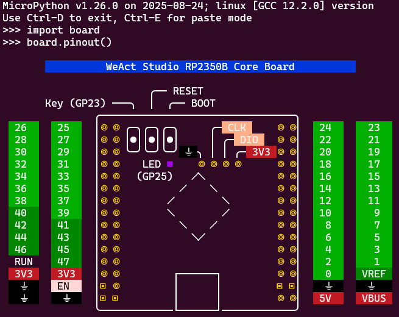

# Pinout diagram

Pinout diagrams can be a helpful tool to display the pin layout for a board.

Rendering them using ANSI and building them into a board's firmware means they
are always conveniently available, even over a serial connection.



## Overview

`pinout.py` generates a unicode pinout diagram that uses ANSI escape characters
to add colour. It currently generates the pinout diagram for the WeActStudio
RP2350B board but is an example that could be extended for any board.

Display the output by executing the script:

```bash
python pinout.py
```


## Compression

`compress.py` uses zlib to _compress input_ and output a _byte string_.

The output from `pinout.py` can be large but compresses efficiently, so the
intent is that the byte string output from `compress.py` can then be copied to
`../modules/board.py` so that the _compressed_ pinout will be included in the
firmware.

To execute:

```bash
python pinout.py | python compress.py
```

## Reference

[Build your own Command Line with ANSI escape
codes](https://www.lihaoyi.com/post/BuildyourownCommandLinewithANSIescapecodes.html)
provides a good reference of how to use ANSI codes, including helpful colour
lookups.
