# Fixing API delays and rounding in samd PWM

Blocking delays are observed when setting `duty_cycle` in the samd port of CircuitPython (see https://github.com/adafruit/circuitpython/issues/7653), behavior which interferes with some applications of PWM, and which differs from from that of other ports.  Here is a comparison of execution times of several basic operations on three different ports, showing the off-the-charts slowness of samd in setting PWM duty cycle:

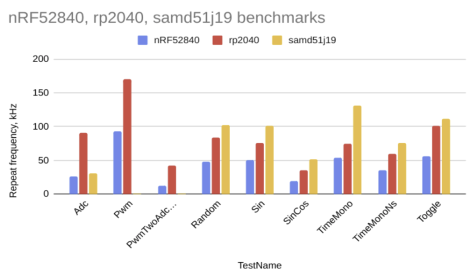

Investigation of this issue revealed another problem.  In some cases, the API will round a non-zero duty cycle down to zero, causing the PWM signal to stop cycling at all.  The cartoon below shows how for instance rounding can transform three PWM cycles, with the first almost 100% duty and the second two close to 0% duty, into one PWM cycle with three times the period and ~33% duty:

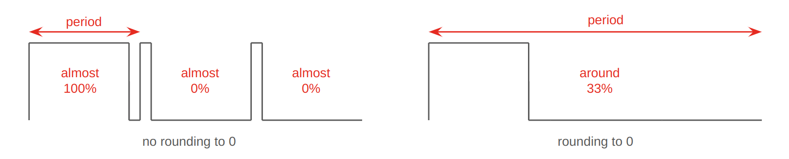

The changes proposed in this PR address both of these issues.

## Implementation

The CP samd21/51 port serves two different processor families, each of which have two different types of PWM peripherals (TC and TCC).  Moreover, the TC peripheral for the samd21 is not identical to that of the samd51, as is hinted at by the datasheet excerpts below.  The description of TC for the samd51 notably adds mention of double-buffering, while the samd21/51 descriptions for TCC are identical:

Datasheet summaries of samd21 and samd51 TC and TCC peripherals

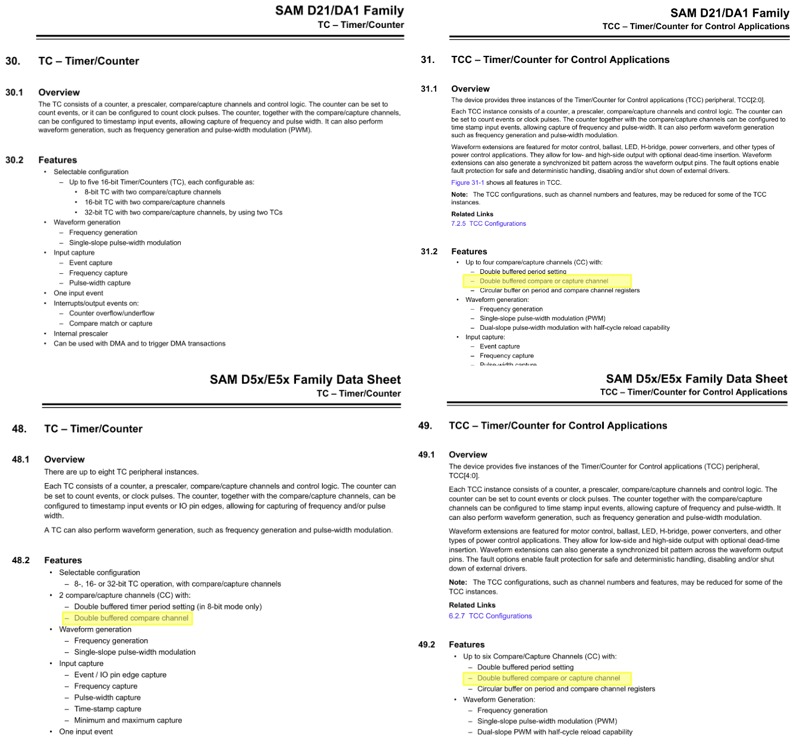

Conditional compilations and `if` statements in `PWMOUT.c` provide separate handling for each of the four combinations of samd21/samd51 and TC/TCC.  The code modifications consist of (1) removing synchronization delays and PWM configuration which were found to do more harm than good, and (2) adding `if` statements to disallow rounding down to zero.

## Testing

All combinations of samd21/samd51 and TC/TCC were tested separately by selecting board pins which support only one or the other of TC or TCC.  The boards and pins used (outlined in red) are shown in the diagram below:

Pins implementing TC and TCC on samd21/51

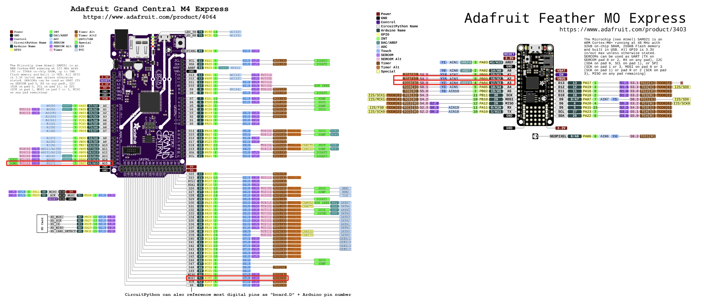

Data gathered from each of the four types of PWM peripheral before and after code modifications are shown below.  Details of the test tools and procedure are [here](/tools/pwm/README.md).

### samd51 TCC

| Before | After |
| ----------- | ---------- |
| 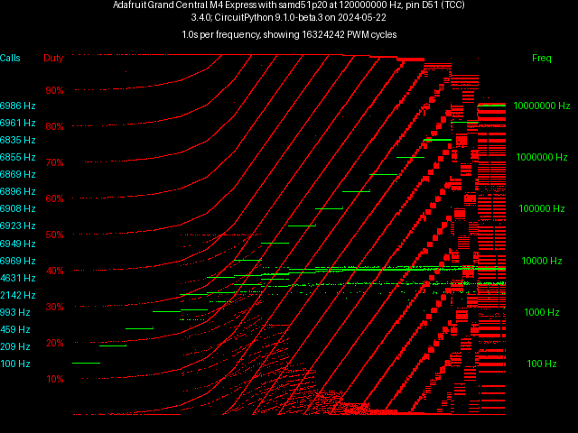 | 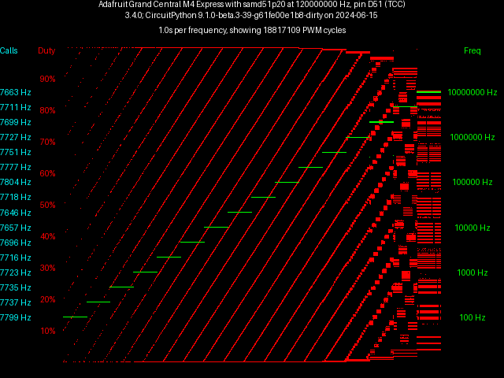  |

In the "before" plot, the variation with frequency of call throughput (shown in cyan) and PWM ramp slope points out the frequency-dependent delay found when setting duty cycle.  The clutter in duty cycle and frequency measurements results from zero-rounding.  Neither is seen in the "after" plot - the PWM ramp slope is nearly constant, and duty cycle and frequency measurements contain no outliers other than at frequency transitions.

### samd51 TC

| Before | After |
| ----------- | ---------- |
| 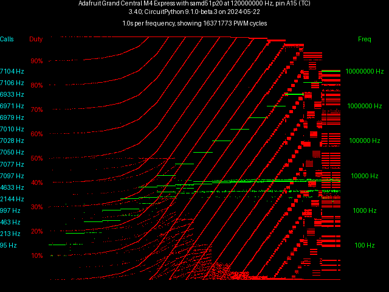 |   |

These results are very similar to those for TCC.  Both delay and rounding artifacts are seen in the "before" plot and not in the "after" plot.

### samd21 TCC

| Before | After |
| ----------- | ---------- |
| 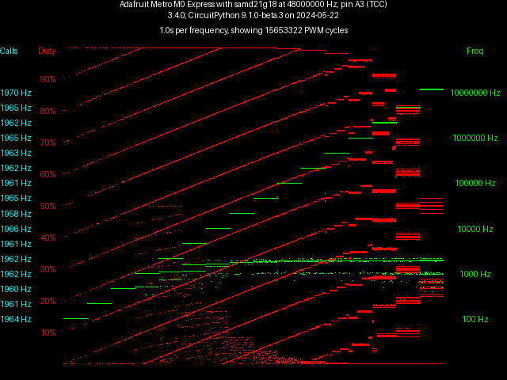 | 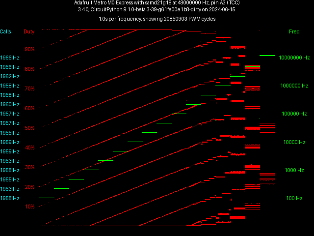  |

No frequency-dependent delay is seen for samd21 TCC, only rounding artifacts.  Compared to samd51, call throughput is ~4x slower (as would be expected for samd21's lower clock rate).  No rounding artifacts are seen in the "after" plot.

### samd21 TC

| Before | After |
| ----------- | ---------- |
| 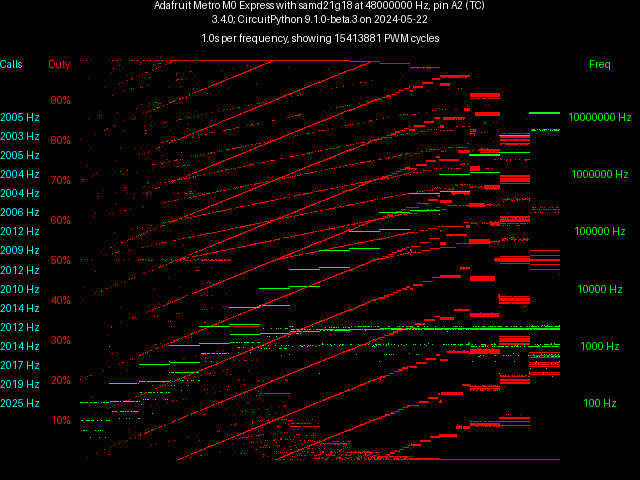 | 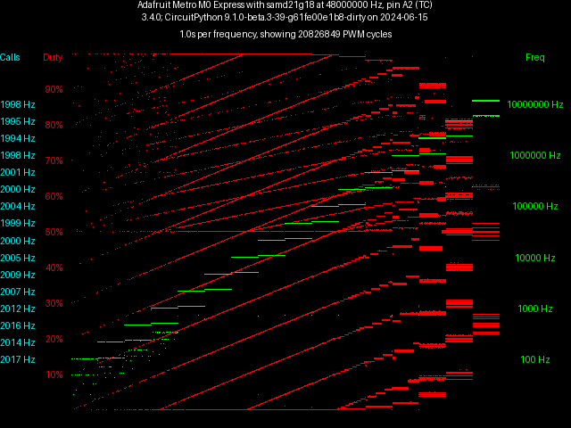  |

So, this is the problem child.  samd21 TC does not provide double buffering of duty cycle registers, so writing to registers may or may not induce duty cycle artifacts depending on when exactly the write happens.  My takeaway regarding samd21 TC is, don't expect too much of it, but it's fine for less demanding applications.  Here is samd21 tc updating once a second just fine:

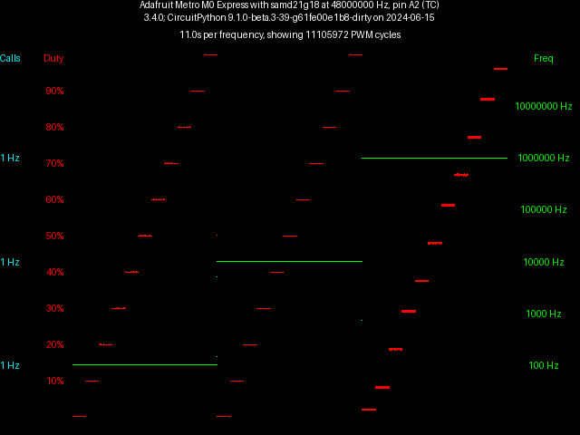

High-rate samd21 TC should work well if updated in a DMA/ISR framework like that implemented in `audiopwmio` in other ports.  A logical next step for samd21/51 is to implement `audiopwmio`.

## Other ports

This PR describes PWM fix-ups for samd21/51, but a quick look indicates that other ports could use some attention as well.  Here is some test data for three other ports.

### CircuitPython 9.04 on RP2040

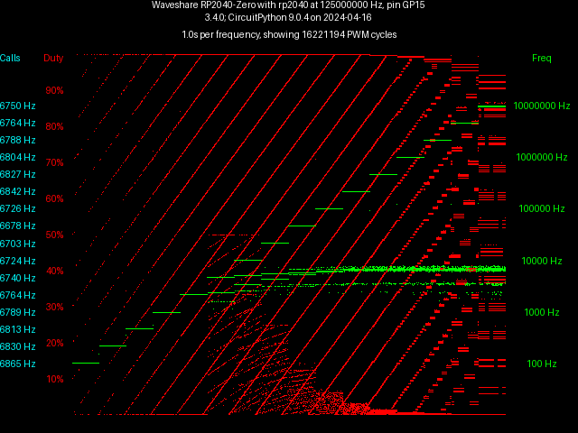

This looks pretty good except it shows the same rounding down to zero issue as samd51.  Probably all ports have this.

### CircuitPython 9.01 on nRF52840

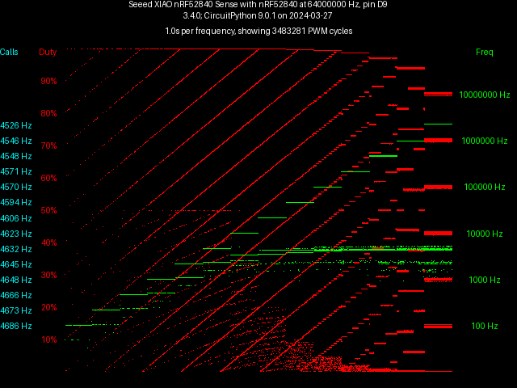

Similar to above, looks pretty good except for rounding to zero.  Tops out below 5 MHz due to lower clock speed.

### CircuitPython 9.05 on ESP32

This is more complicated - looks like frequency tops out at 10 kHz, but duty cycle continues to be adjusted downward as if frequency has increased.  Needs investigation.
